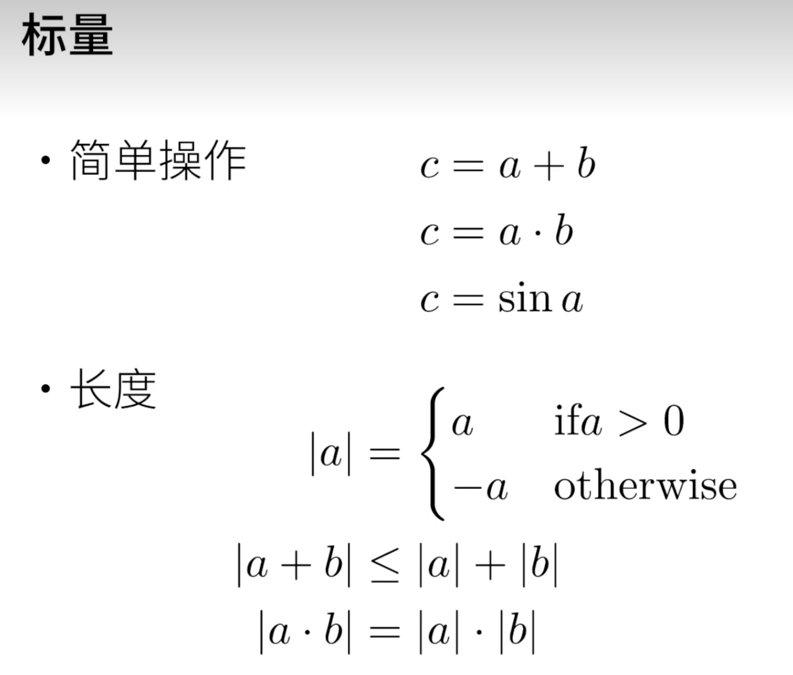
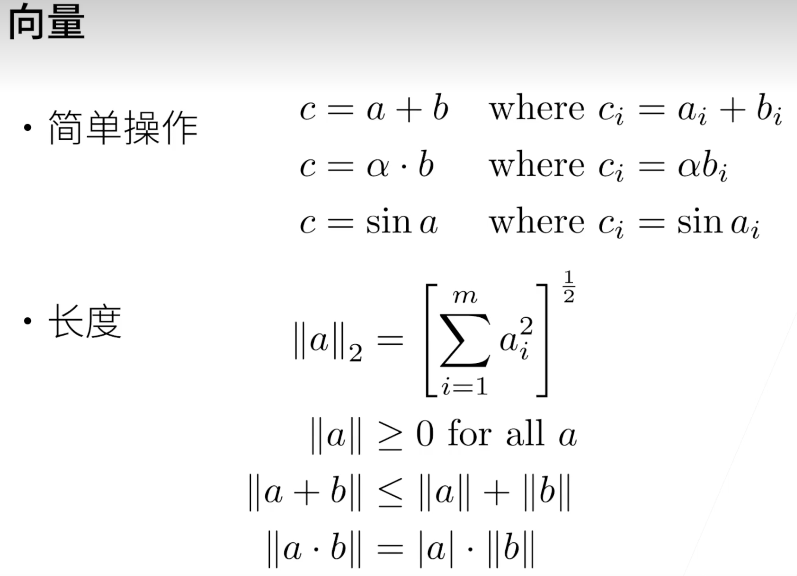
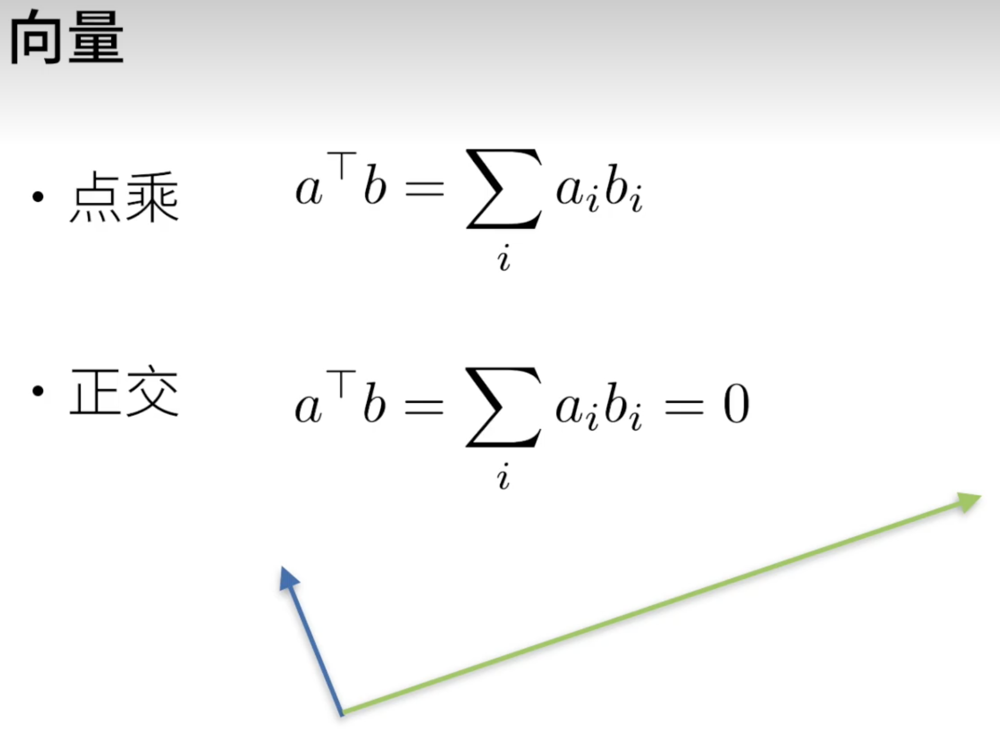
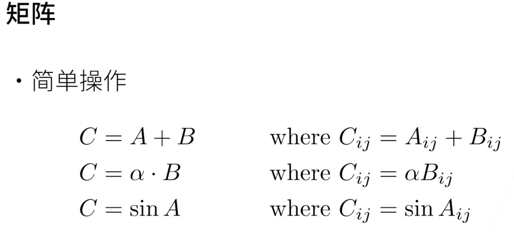
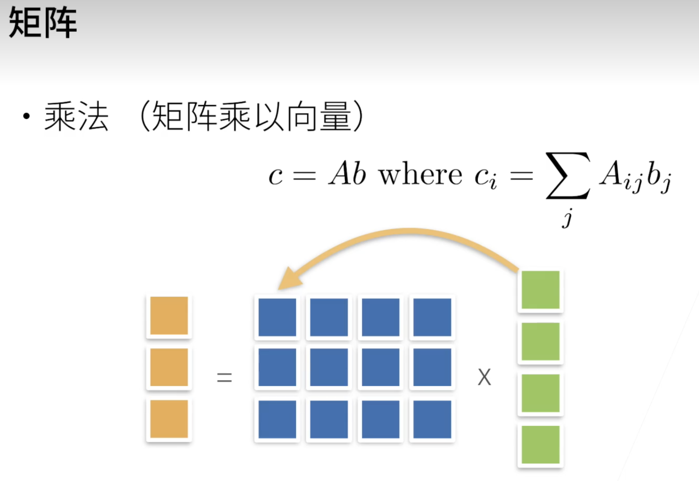

# 动手学深度学习

> create by nohi 20240724
>
> 学习视频：【01 课程安排【动手学深度学习v2】】https://www.bilibili.com/video/BV1oX4y137bC?vd_source=b9652d72e80476e11bfed7086c993097
>
> 课程主页：https://courses.d2l.ai/zh-v2
>
> 教材：https://zh-v2.d2l.ai/
>
> 课程论坛讨论：https://discuss.d2l.ai/c/16
>
> Pytorch论坛：http://discuss.pytorch.org
>
> ***课程需要很强的数据理论基础、再加上练习*** 

## 内容

* 深度学习基础-线性神经网络，多层感知机
* 卷积神经网络-LeNet，AlexNet,VGG,Inception,ResNet
* 循环神经网络-RNN,GRU,LSTM,seq2seq
* 注意力机制-Attention,Transformer
* 优化算法-SGD,Momentum,Adam
* 高性能计算-并行，多GPU，分布式
* 计算机视频-目标检测，语义分割
* 自然语言处理-词嵌入，BERT

### What&How&Why

* What: 深度学习里有哪些技术

* How: 如何实现和调参
* Why: 背后的原因（直觉、数学）

### 介绍

* 图像识别
* 图像生成、内容生成
* 广告点击、预测

* 预测与训练


## 环境安装

```
pyenv
python  3.8.19
minicoda
```

### miniconda

```shell
1. 官网拷贝 执行脚本`https://repo.anaconda.com/miniconda/Miniconda3-latest-Linux-x86_64.sh`
2. Linux服务下载脚本
   wget https://repo.anaconda.com/miniconda/Miniconda3-latest-Linux-x86_64.sh
3. 安装
  bash Miniconda3-latest-Linux-x86_64.sh
  # 中间同意协议、初始化环境
4. 进入conda环境
  bash
  >(base) nohi@ubunt22:~$
```

* 注意：默认conda对应python为3.12，出现如下问题

  ```shell
  AttributeError: module 'pkgutil' has no attribute 'ImpImporter'. Did you mean: 'zipimporter'?
  ```

  

### 安装依赖

```
pip install jupyter d2l torch torchvision
```

* 如果安装慢

  ```shell
   sudo vi ~/.pip/pip.conf 
   
  [global]
  index-url = https://pypi.tuna.tsinghua.edu.cn/simple
  [install]
  trusted-host=mirrors.aliyun.com
  ```

* 注意：默认conda对应python为3.12，出现如下问题

  ```shell
  AttributeError: module 'pkgutil' has no attribute 'ImpImporter'. Did you mean: 'zipimporter'?
  
  # conda 切换Python 3.8.19
  conda install python=3.7
  ```

### 下载代码并执行

* 下载代码

  ```shell
  git clone https://github.com/d2l-ai/d2l-zh-pytorch-slides 
  wget https://zh-v2.d2l.ai/d2l-zh.zip
  ```

* 运行记事本

  ```shell
  jupyter notebook
  # 此处会出现url连接
  ```

* 本地映射远程服务器端口

  ```shell
  ssh -L8888:localhost:8888 nohi@10.0.0.230
  # 使用本地地址打开
  ```

## 预备知识

### 数据操作

#### N维数组

* 标量：0-d  一个类别   1.0
* 向量：1-d   一个特征向量  [1.0， 2.7，3.7]
* 矩阵：2-3  一个样本-特征矩阵 [[1.0， 2.7，3.7]  [x,x,x] [...] ]
* 3-d  三维数组  RGB图片 (宽 x 高 x 通道)
* 4-d  一个RGB图片批量（批量大小 x 宽 x 高 x通道)
* 5-d 一个视频批量（批量大小 x 时间 x 宽 x 高 x通道)

#### 创建数组

* 需要

  * 形状： 例如 3 x 4 矩阵

  * 每个元素的数据类型： 例如32位浮点数

  * 每个元素的值，例如全是0，或者是随机数

    正态分布  均匀分布

#### 访问元素

* 一个元素：[1，2]
* 一行： [1,: ]
* 一列： [:,]
* 子区域: [1:3, 1:]  第一行和第二行，除了第0列，开区间 1:3 不包含第4列（3+1 索引从0开始）
* 子区域: [::3, ::2] 每三行取一行，每两列取第一列


#### 内容见：`https://zh-v2.d2l.ai/chapter_preliminaries/ndarray.html`

* 广播机制

  ```python
  a = torch.arange(3).reshape((3, 1))
  b = torch.arange(2).reshape((1, 2))
  a, b
  
  (tensor([[0],
           [1],
           [2]]),
   tensor([[0, 1]]))
  
  # a 与 b 维数相同(二维)、形状不同 a 三行一列  b 一行两列
  # 取最大，三行 二列
  # 不足的复制
  # 如果是 三行二列与二行三列， 则无法操作
  a + b
  tensor([[0, 1],
          [1, 2],
          [2, 3]])
  
  ```

* id

  ```python
  id(X)
  ```

* NumPy转换

  ```python
  A = X.numpy()
  B = torch.tensor(A)
  type(A), type(B)
  
  (numpy.ndarray, torch.Tensor)
  ```

### 数据预处理

>  `https://zh-v2.d2l.ai/chapter_preliminaries/pandas.html`

* 生成csv文件

  ```python
  import os
  
  os.makedirs(os.path.join('..', 'data'), exist_ok=True)
  data_file = os.path.join('..', 'data', 'house_tiny.csv')
  with open(data_file, 'w') as f:
      f.write('NumRooms,Alley,Price\n')  # 列名
      f.write('NA,Pave,127500\n')  # 每行表示一个数据样本
      f.write('2,NA,106000\n')
      f.write('4,NA,178100\n')
      f.write('NA,NA,140000\n')
  ```

* 读取数据集：pandas读取csv文件

  ```python
  # 如果没有安装pandas，只需取消对以下行的注释来安装pandas
  # !pip install pandas
  import pandas as pd
  
  data = pd.read_csv(data_file)
  print(data)
  ```

* 处理缺失值

  * 插值、删除

  * 类别值、离散值

    ```python
    inputs, outputs = data.iloc[:, 0:2], data.iloc[:, 2]
    # 这里inputs.mean()会报错，修改为： inputs = inputs.fillna(inputs.mean(numeric_only=True))
    inputs = inputs.fillna(inputs.mean())
    print(inputs)
    Copy to clipboard
    
    
    ```

    

###  线性代数

#### 标量



#### 向量






#### 矩阵





* 矩阵 x 矩阵
* 范数
* 特殊矩阵
  * 正交矩阵
  * 置换矩阵

* 特征向量和特征值
  * 不被矩阵改变方向的向量

### 矩阵计算

* 标量导数
  * 导数是切线的斜率

* 亚导数
* 梯度
  * 将导数拓展到向量

### 自动求导

#### 计算y

* 存储梯度

  ```python
  x.requires_grad_(True) # 等价于`x = torch.arange(4.0, requires_grad=True)`
  x.grad  # 默认值是None
  ```

* 计算y

  ```python
  y = 2 * torch.dot(x,x)
  y
  ```

### 线性回归

* 线性回归是对n维输入的加权，外加偏差
* 使用平方损失来衡量预测值和真实值的差异
* 线性回归有显示解
* 线性回归可以看做是单层神经网络


