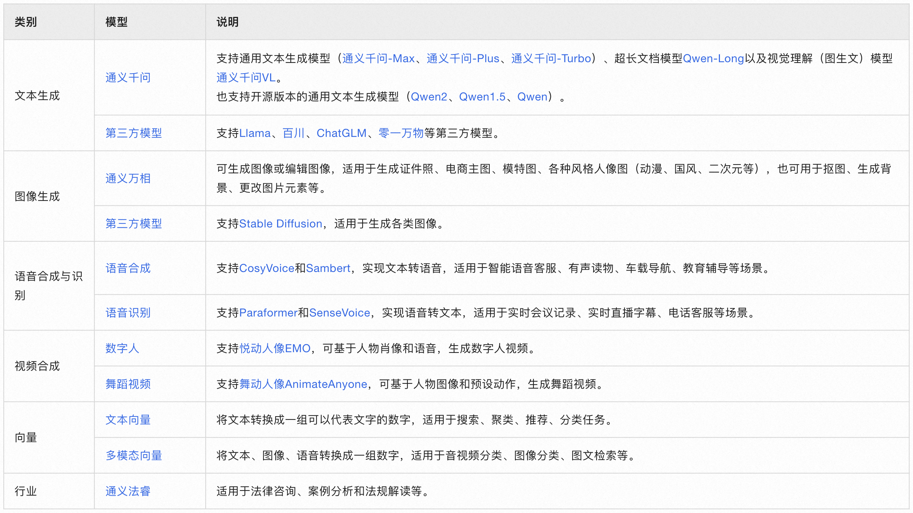

# 阿里千问

> 阿里出品
>
> 在线问答：https://qianwen.aliyun.com/

* 集成

## 初始

> 以下基于通义千问2.5  回答

### 功能

1. **知识查询**：
   - 提供跨领域的知识问答服务。
   - 解答各种问题，包括但不限于科学、技术、文化、历史等。
2. **信息检索**：
   - 帮助查找最新的新闻、数据和事实。
   - 提供关于特定主题的综合信息。
3. **语言翻译**：
   - 支持多种语言之间的文本翻译。
   - 可以帮助理解外语文档或进行跨语言沟通。
4. **代码生成与调试**：
   - 生成简单的代码片段来解决编程问题。
   - 提供编程建议和错误调试指导。
5. **创意写作**：
   - 协助创作故事、诗歌或其他类型的文学作品。
   - 为写作项目提供灵感和构思建议。
6. **学术支持**：
   - 帮助撰写论文摘要、文献综述等学术相关内容。
   - 提供科学研究方法和数据分析方面的建议。
7. **个性化建议**：
   - 根据用户的偏好和需求提供建议。
   - 比如推荐书籍、电影或旅游目的地。
8. **情感交流**：
   - 进行日常对话，提供陪伴和支持。
   - 帮助用户排解压力或分享心情。
9. **实用工具**：
   - 提供日期计算、单位换算等实用工具。
   - 支持创建待办事项列表、提醒设置等功能。

### 集成

1. **API 接口集成**：
   - **注册账号**：首先需要注册一个账号并获得API密钥。
   - **了解文档**：查阅API文档以了解可用的端点、请求格式和响应结构。
   - **编写代码**：使用支持HTTP请求的编程语言编写代码，向API发送请求并处理返回的数据。
   - **测试与部署**：在开发环境中测试功能，并在一切正常后部署到生产环境。
2. **SDK 集成**：
   - 如果提供了软件开发套件（SDK），您可以直接下载并按照官方指南安装SDK。
   - SDK通常包含了预定义的方法和类，简化了与API交互的过程。
3. **Webhooks 或回调**：
   - 对于某些需要实时通信的应用场景，可以设置webhooks来接收来自API的通知。
4. **前端集成**：
   - 在前端应用中，可以通过JavaScript调用API，实现与用户的交互。
5. **聊天机器人集成**：
   - 如果您计划将AI助手集成到聊天机器人中，可以利用专门针对聊天机器人的API接口。
   - 例如，通过识别用户输入并生成响应，可以实现实时对话功能。
6. **语音助手集成**：
   - 如果您的应用支持语音交互，可以考虑集成语音识别和语音合成功能，使得用户可以通过语音与AI助手互动。


## 大模型服务平台百炼

文档：`https://help.aliyun.com/zh/model-studio/getting-started/activate-alibaba-cloud-model-studio?spm=a2c4g.11186623.0.0.6d29224fUUzxVi`

控制台：`https://bailian.console.aliyun.com`

### :airplane:[0代码构建知识库问答助手](https://help.aliyun.com/zh/model-studio/getting-started/build-knowledge-base-qa-assistant-without-coding?spm=a2c4g.11186623.0.0.2a0b4df2GqBL9J)


### 调用

#### OPENAI方式调用

```python
from openai import OpenAI
import os

def get_response():
    client = OpenAI(
        api_key=os.getenv("DASHSCOPE_API_KEY"), # 如果您没有配置环境变量，请在此处用您的API Key进行替换
        base_url="https://dashscope.aliyuncs.com/compatible-mode/v1",  # 填写DashScope服务的base_url
    )
    completion = client.chat.completions.create(
        model="qwen-turbo",
        messages=[
            {'role': 'system', 'content': 'You are a helpful assistant.'},
            {'role': 'user', 'content': '你是谁？'}],
        temperature=0.8,
        top_p=0.8
        )
    print(completion.model_dump_json())
    print(completion.choices[0].message.content, end='')

if __name__ == '__main__':
    get_response()
```

#### dashscope方式调用

> 环境变量中添加：DASHSCOPE_API_KEY

```python
# Refer to the document for workspace information: https://help.aliyun.com/document_detail/2746874.html

from http import HTTPStatus
import dashscope


def call_with_stream():
    messages = [{'role': 'user', 'content': '你与开源的版本有什么区别'}]
    # 模型
    model = 'qwen-max'
    model = 'qwen-plus'
    responses = dashscope.Generation.call(model,
                                          messages=messages,
                                          result_format='message',  # set the result to be "message"  format.
                                          stream=True,  # set streaming output
                                          incremental_output=True  # get streaming output incrementally
                                          )
    for response in responses:
        if response.status_code == HTTPStatus.OK:
            print(response.output.choices[0]['message']['content'], end='')
        else:
            print('Request id: %s, Status code: %s, error code: %s, error message: %s' % (
                response.request_id, response.status_code,
                response.code, response.message
            ))


if __name__ == '__main__':
    call_with_stream()
```


### 模型列表

> :airplane: [参考](https://help.aliyun.com/zh/model-studio/getting-started/models?spm=a2c4g.11186623.0.0.50877677tO7Ch3)


#### 旗舰模型

| **官方旗舰大模型**<br>**文本生成** | **通义千问-Max**<br>适合复杂任务，推理能力最强 | **通义千问-Plus**<br>效果、速度、成本均衡，介于Max和Turbo之间 | **通义千问-Turbo**<br>适合简单任务，速度快、成本低 | **Qwen-Long**<br>支持长达千万字文档，且成本极低 |
| ---------------------------------- | ---------------------------------------------- | ------------------------------------------------------------ | -------------------------------------------------- | ----------------------------------------------- |
| 上下文长度（Token数）              | 8k或30k                                        | 32k                                                          | 8k                                                 | 10000k                                          |
| 输入（每千Token）                  | 0.04元                                         | 0.004元                                                      | 0.002元                                            | 0.0005元                                        |
| 输出（每千Token）                  | 0.12元                                         | 0.012元                                                      | 0.006元                                            | 0.002元                                         |

#### 模型总览

