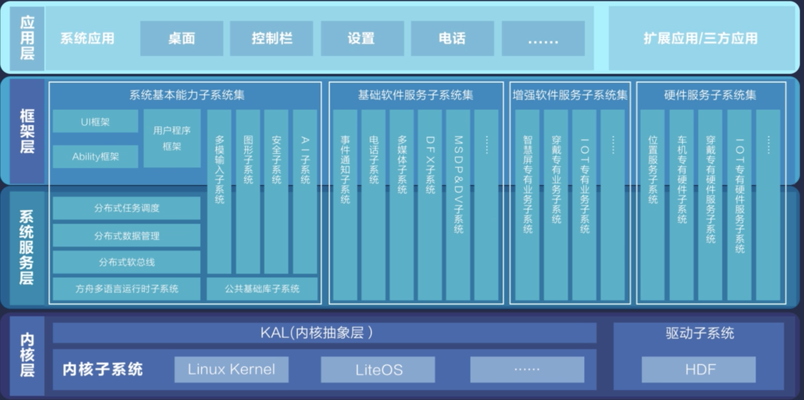
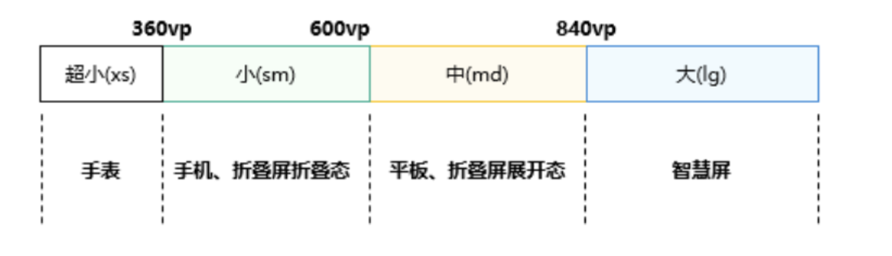
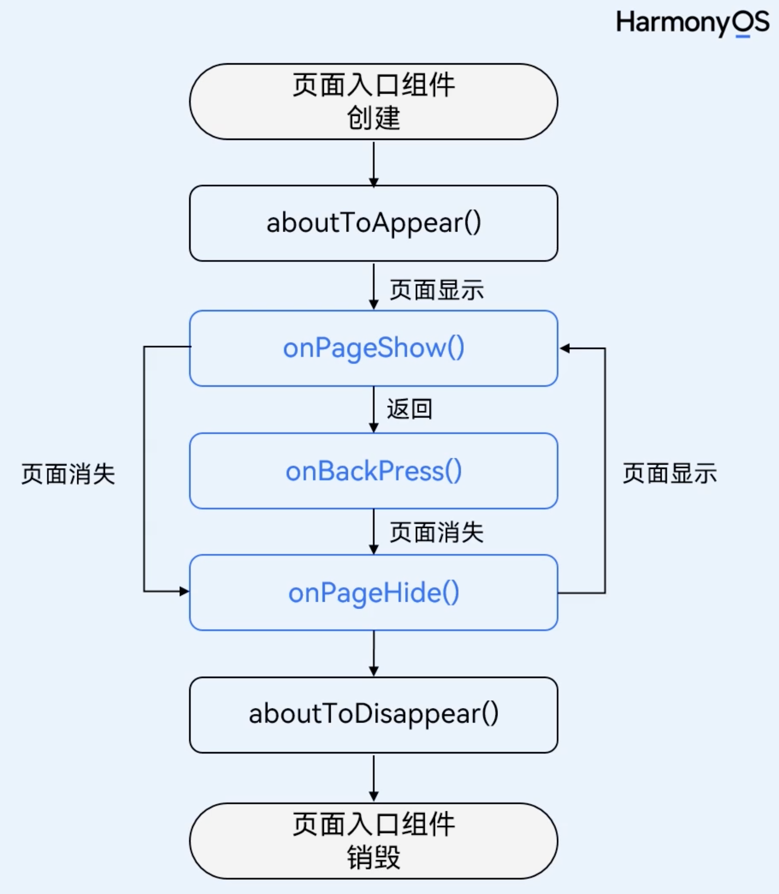
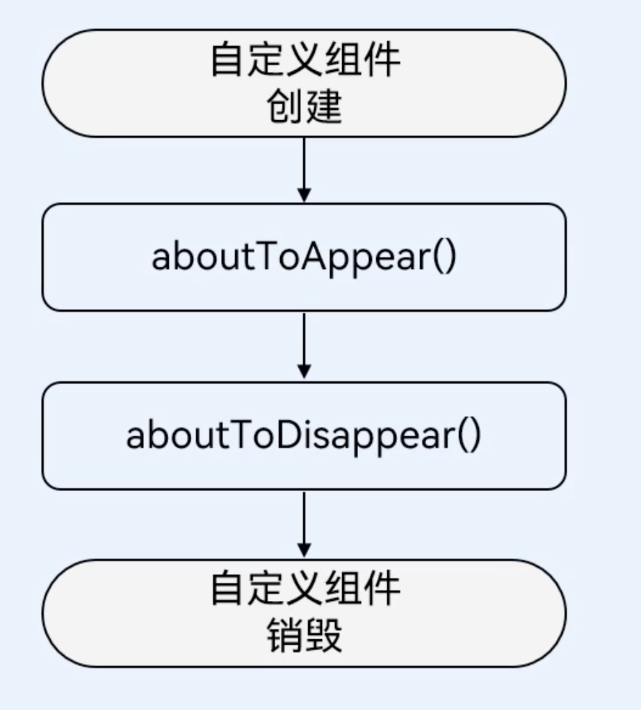
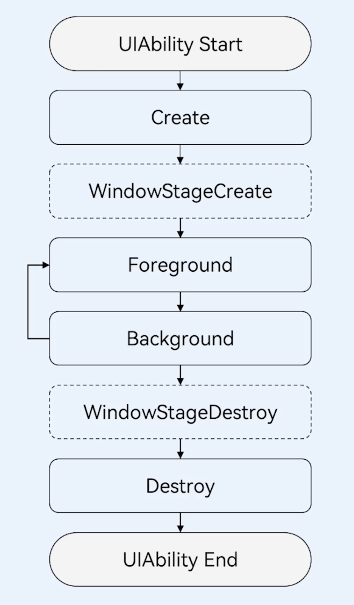

# HarmonyOS

> create by nohi 20240317

## 参考：

* 系统课程：`https://developer.huawei.com/consumer/cn/training/study-path/101660823576639948`
* 三方库资源汇总：https://gitee.com/openharmony-tpc/tpc_resource
* OpenHarmony三方库中心仓：[https://ohpm.openharmony.cn](https://ohpm.openharmony.cn/)
* @ohos/lottie的使用：https://gitee.com/openharmony-tpc/lottieETS

## 过程

### 架构




## 小知识

* Vp:虚拟像素

  * 超小：xs 
  * 小：sm
  * 中：md
  * 大:  lg

  

* svg无法填充颜色

  ```
  svg 添加fill="currentColor"
  ```

  


### 布局

自适应而已：拉伸、均分、占比、缩放、延伸、隐藏、折行能力 

响应式布局：断点、媒体查询、栅格布局、

* grid
  * columnsTemplate: 列布局，单位fr,按比例划分， 1fr 2fr 1fr  四等 份，三块。中间一块点2 等份
  * rowsTemplate: 行布局，单位fr 
  * columnsGap 列间距
  * rowsGap 行间距

### 页面

* 修改首页

  ```
  1. src/main/ets/entryability/EntryAbility.ts
     windowStage.loadContent('test_pages/text'
  2. src/main/resources/base/profile/main_pages.json
     {
      "src": [
        "test_pages/text"
      ]
    }
  ```


### 生命周期

* `@Entry`

  

* `@Component`

  

* UIAbility生命周期

  


### 组件状态

* 组件内的状态管理：`@State`
* 从父组件单向同步状态：`@Prop`
* 父子组件双向同步状态和监听：`@Link`、`@Watch`
* 跨组件层级双向同步状态： `@Provide和@Consume`

### 弹窗

* 确认类： AlertDialog
* 选择类
  * TextPickerDialog
  * DatePickerDiallog


