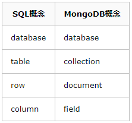
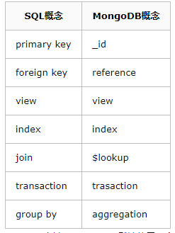

# MongoDB

> create nohi 20230814

* 支持acid


## 文档数据库

MongoDB 中的记录是一个文档，它是由字段和值对组成的数据结构。MongoDB 文档类似于 JSON 对象。字段值可以包含其他文档、数组和文档数组。


使用文档的优点是：

- 文档对应于许多编程语言中的原生数据类型。
- 嵌入式文档和数组可以减少成本高昂的的连接操作。
- 动态模式支持流畅的多态性。

### 集合/视图/按需物化视图


MongoDB是一款为web应用程序和互联网基础设施设计的数据库管理系统。没错MongoDB就是数据库，是NoSQL类型的数据库

### 特性：

- 面向文档存储，基于JSON/BSON 可表示灵活的数据结构
- 动态 DDL能力，没有强Schema约束，支持快速迭代
- 高性能计算，提供基于内存的快速数据查询
- 容易扩展，利用数据分片可以支持海量数据存储
- 丰富的功能集，支持二级索引、强大的聚合管道功能，为开发者量身定做的功能，如数据自动老化、固定集合等等。
- 跨平台版本、支持多语言SDK.


### 概念



- database 数据库，与SQL的数据库(database)概念相同，一个数据库包含多个集合(表)
- collection 集合，相当于SQL中的表(table)，一个集合可以存放多个文档(行)。 不同之处就在于集合的结构(schema)是动态的，不需要预先声明一个严格的表结构。更重要的是，默认情况下 MongoDB 并不会对写入的数据做任何schema的校验。
- document 文档，相当于SQL中的行(row)，一个文档由多个字段(列)组成，并采用bson(json)格式表示。
- field 字段，相当于SQL中的列(column)，相比普通column的差别在于field的类型可以更加灵活，比如支持嵌套的文档、数组。
  此外，MongoDB中字段的类型是固定的、区分大小写、并且文档中的字段也是有序的。




- _id 主键，MongoDB 默认使用一个_id 字段来保证文档的唯一性。
- reference 引用，勉强可以对应于 外键(foreign key) 的概念，之所以是勉强是因为 reference 并没有实现任何外键的约束，而只是由客户端(driver)自动进行关联查询、转换的一个特殊类型。
- view 视图，MongoDB 3.4 开始支持视图，和 SQL 的视图没有什么差异，视图是基于表/集合之上进行动态查询的一层对象，可以是虚拟的，也可以是物理的(物化视图)。 
- index 索引，与SQL 的索引相同。
- $lookup，这是一个聚合操作符，可以用于实现类似 SQL-join 连接的功能
- transaction 事务，从 MongoDB 4.0 版本开始，提供了对于事务的支持
- aggregation 聚合，MongoDB 提供了强大的聚合计算框架，group by 是其中的一类聚合操作。

## Mongosh

MongoDB Shell 是 MongoDB 提供的官方交互式界面，允许用户与 MongoDB 数据库进行交互、执行命令和操作数据库。

MongoDB Shell 是基于 JavaScript 的，允许用户直接在命令行或者脚本中使用 JavaScript 语言来操作 MongoDB 数据库。

### 命令

```shell
-- 查看版本
mongosh --version
-- 连接本地：默认使用端口27017
mongosh
mongosh --host <hostname>:<port>
-- 使用用户身份登录
mongosh --host <hostname> --port <port> -u "testuser" -p "password123" --authenticationDatabase "<database_name>"
```

### **执行基本操作：**

连接成功后，可以执行各种 MongoDB 数据库操作。例如：

- 查看当前数据库：`db`
- 显示数据库列表：`show dbs`
- 切换到指定数据库：`use <database_name>`
- 显示集合(类似表)列表：`show collections`
- 执行查询操作：`db.<collection_name>.find()`
- 插入文档：`db.<collection_name>.insertOne({ ... })`
- 更新文档：`db.<collection_name>.updateOne({ ... })`
- 删除文档：`db.<collection_name>.deleteOne({ ... })`
- 退出 MongoDB Shell：`quit()` 或者 `exit`


## 用户权限管理

#### **MongoDB添加用户命令说明**

- user字段，为新用户的名字。
- pwd字段，用户的密码。
- cusomData字段，为任意内容，例如可以为用户全名介绍。
- roles字段，指定用户的角色，可以用一个空数组给新用户设定空角色。在roles字段,可以指定内置角色和用户定义的角色。
- 超级用户的role有两种，userAdmin或者userAdminAnyDatabase(比前一种多加了对所有数据库的访问,仅仅是访问而已)。
- db是指定数据库的名字，admin是管理数据库。
- 不能用admin数据库中的用户登录其他数据库。注：只能查看当前数据库中的用户，哪怕当前数据库admin数据库，也只能查看admin数据库中创建的用户。

#### **创建admin超级管理员用户**

> 指定用户的角色和数据库：
> (注意此时添加的用户都只用于admin数据库，而非你存储业务数据的数据库)
> (在cmd中敲多行代码时，直接敲回车换行，最后以分号首尾)

```shell
db.createUser({ user: "admin", pwd: "admin", 
  customData:{description:"superuser"},
	roles: [ { role: "userAdminAnyDatabase", db: "admin" } ] } )
```

#### **创建一个不受访问限制的超级用户**

> 拥有所有权限，不受任何限制

```shell 
db.createUser({ user:"root", pwd:"123456", 
	roles:[{role:"root",db:"admin"}] });
```

#### 创建一个业务数据用户

> 只允许访问特定数据库
>
> 数据库在操作过程中，会自动创建
>
> use demodb
>
> -- 插入数据后自动创建demodb
>
> db.runoob.insertOne({"name":"菜鸟教程"})
>
> 然后在库：demodb下创建用户，此用户才能在demodb下使用、操作demodb

```shell 
db.createUser({ user:"demouser", pwd:"123456", 
	roles:[{role:"readWrite",db:"demodb"},{role:"dbAdmin",db:"demodb"}] });
```

#### 验证用户

```shell
db.auth("demouser", "demouser")

-- 启用身份验证 mongod.conf添加
security:
  authorization: "enabled"
```

#### 删除用户

```shell
db.dropUser("demouser")
```


### 数据库角色说明

- 数据库用户角色：read、readWrite；
- 数据库管理角色：dbAdmin、dbOwner、userAdmin;
- 集群管理角色：clusterAdmin、clusterManager、4. clusterMonitor、hostManage；
- 备份恢复角色：backup、restore；
- 所有数据库角色：readAnyDatabase、readWriteAnyDatabase、userAdminAnyDatabase、dbAdminAnyDatabase
- 超级用户角色：root
- 内部角色：__system

#### **MongoDB中的role详解**

- read：允许用户读取指定数据库
- readWrite：允许用户读写指定数据库
- dbAdmin：允许用户在指定数据库中执行管理函数，如索引创建、删除，查看统计或访问system.profile
- userAdmin：允许用户向system.users集合写入，可以在指定数据库里创建、删除和管理用户
- clusterAdmin：只在admin数据库中可用，赋予用户所有分片和复制集相关函数的管理权限
- readAnyDatabase：只在admin数据库中可用，赋予用户所有数据库的读权限
- readWriteAnyDatabase：只在admin数据库中可用，赋予用户所有数据库的读写权限
- userAdminAnyDatabase：只在admin数据库中可用，赋予用户所有数据库的userAdmin权限
- dbAdminAnyDatabase：只在admin数据库中可用，赋予用户所有数据库的dbAdmin权限
- root：只在admin数据库中可用。超级账号，超级权限

## **三、操作语法**

* 新增

  ```json
  db.book.insert(
  {
    title: "My first blog post",
    published: new Date(),
    tags: [ "NoSQL", "MongoDB" ],
    type: "Work",
    author : "James",
    viewCount: 25,
    commentCount: 2
  }
  )
  ```

* 查询

  ```json
  db.book.find({author : "James"})
  ```

  * 限定显示字段

    ```text
    -- 限定显示字段
    db.book.find({"author": "James"}, 
        {"_id": 1, "title": 1, "author": 1})
    ```

  * 简单的分页查询

    ```
    db.book.find({})
        .sort({"viewCount" : -1})
        .skip(10).limit(5)
    ```

* 更新

  ```json
  db.book.update({author:"James"},{$set:{viewCount: 3}})
  db.book.findOneAndUpdate({author:"James"},{$set:{viewCount: 4}});
  db.book.updateMany({author:"A"},{$set:{viewCount: +1}});
  ```

* 删除

  ```json 
  db.book.remove({"_id":
       ObjectId("64dc74234f21f508dfffeeef")})
  ```

