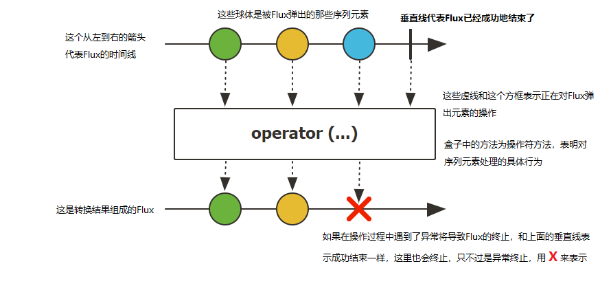
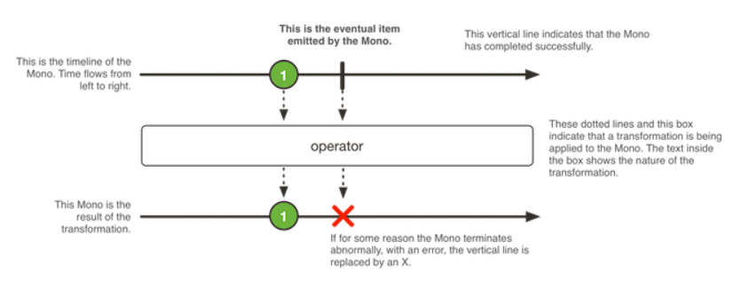

# ReactorNettyTcpServer


参考：[Reactor Netty参考指南 - 3.TCP服务端](https://juejin.cn/post/6938730694721929247)

[带管道的Reactor Netty TcpServer](https://www.javaroad.cn/questions/52653)

参考：https://projectreactor.io/docs/netty/release/reference/index.html#_starting_and_stopping

[Reactor Netty(三)](https://www.cnblogs.com/holddie/p/reactor-netty-san.html)


## 一、概念

### 1. Flux`和`Mono

> https://www.cnblogs.com/felordcn/p/13747262.html

```java
// 生产
Flux<DataMeta> flux =  Flux.just(new DataMeta("1", "1"), new DataMeta("2", "2"));
// 消费
flux.subscribe( data -> {
  log.info("消费 data:{}", data);
});
```


#### 响应流的特点

响应流规范。它是响应式编程的基石。他具有以下特点：

* 响应流必须是无阻塞的。
* 响应流必须是一个数据流。
* 它必须可以异步执行。
* 并且它也应该能够处理背压。

#### Publisher、Subscriber

**Reactive Stream**，`Publisher<T>`是一个可以提供0-N个序列元素的提供者，并根据其订阅者`Subscriber<? super T>`的需求推送元素。一个`Publisher<T>`可以支持多个订阅者，并可以根据订阅者的逻辑进行推送序列元素。**当没有订阅时发布者什么也不做**

而`Flux`和`Mono`都是`Publisher<T>`在**Reactor 3**实现。`Publisher<T>`提供了`subscribe`方法，允许消费者在有结果可用时进行消费。如果没有消费者`Publisher<T>`不会做任何事情，他根据消费情况进行响应。 `Publisher<T>`可能返回零或者多个，甚至可能是无限的，为了更加清晰表示期待的结果就引入了两个实现模型`Mono`和`Flux`。

#### Flux

`Flux` 是一个发出(emit)`0-N`个元素组成的异步序列的`Publisher<T>`,可以被`onComplete`信号或者`onError`信号所终止。在响应流规范中存在三种给下游消费者调用的方法 `onNext`, `onComplete`, 和`onError`。下面这张图表示了Flux的抽象模型：



#### Mono

`Mono` 是一个发出(emit)`0-1`个元素的`Publisher<T>`,可以被`onComplete`信号或者`onError`信号所终止。




## 生命周期回调

TcpServer

| Callback          | Description                           |
| ----------------- | ------------------------------------- |
| `doOnBind`        | 当服务器channel即将被绑定的时候调用。 |
| `doOnBound`       | 当服务器channel已经被绑定的时候调用。 |
| `doOnChannelInit` | 当channel初始化的时候被调用。         |
| `doOnConnection`  | 当一个远程客户端连接上的时候被调用。  |
| `doOnUnbound`     | 当服务器channel解绑的时候被调用。     |


TcpClient

| Callback           | Description                        |
| ------------------ | ---------------------------------- |
| `doAfterResolve`   | 在成功解析远程地址之后调用。       |
| `doOnChannelInit`  | 在初始化channel的时候调用。        |
| `doOnConnect`      | 当channel将要连接的时候调用。      |
| `doOnConnected`    | 当channel已经连接上的时候调用。    |
| `doOnDisconnected` | 当channel断开的时候被调用。        |
| `doOnResolve`      | 当远程地址将要被解析的时候被调用。 |
| `doOnResolveError` | 在远程地址解析失败的情况下被调用。 |


## TcpServer 读取指定长度报文

> TCP 报文存在分段发送情况（比如按1024字节一段一段发送），TcpServer可能读取报文需要按长度多次读取
>
> Reactor.netty TcpServer为事件驱动，需要在读取完整报文后处理报文，再进行响应报文返回
>
> 这里采用takeUntil（读取到完整报文后返回true,否则等待报文，直到超时）
>
> 再通过reduce合并报文
>
> 合并完成后通过reduce后的map方法进行完整报文解析、业务处理，返回Mono对象。

```java 
TcpServer tcpServer = TcpServer.create()
                .port(8888)
                .wiretap(true)  // 开启线路记录
                .doOnConnection(conn -> conn.addHandler(new ReadTimeoutHandler(15, TimeUnit.SECONDS)))
                .handle((inbound, outbound) -> {
                    // 计数器
                    AtomicInteger i = new AtomicInteger();
                    // 完整报文
                    ByteArrayOutputStream bos = new ByteArrayOutputStream();

                    Mono<byte[]> mono = inbound.receive().asByteArray()
                            .takeUntil(data -> {
                                log.info("takeUntil..[{}]:{}", i.get(), data);
                                try {
                                    bos.write(data);
                                } catch (IOException e) {
                                    throw new RuntimeException(e);
                                }
                                // 获取长度

                                // 判断长度报文长度是否完整  完成后返回true
                                // TODO 需要按规则修改判断
                                if (i.getAndIncrement() == 1) {
                                    return true;
                                } else {
                                    return false;
                                }
                            })
                            .map(data -> {
                                log.info("===>接收到数据:{}", data);
                                return data;
                            })
                            .reduce((a, b) -> {
                                log.info("============合并请求数据>a[{}] b[{}]", a.length, b.length);
                                byte[] result = new byte[a.length + b.length];
                                System.arraycopy(a, 0, result, 0, a.length);
                                System.arraycopy(b, 0, result, a.length, b.length);
                                return result;
                            })
                            .map(data -> {
                                log.info("===>处理数据:[{}]{}", data.length, new String(data));
                                String str = new String(data) + "++++++ this is over";
                                outbound.sendString(Mono.just(str + "===========")).then();
                                return str.getBytes();
                            })
                            .log("xxxxxxxxxxxx")
                    ;
                    return outbound.sendByteArray(mono).neverComplete();
                });
```


