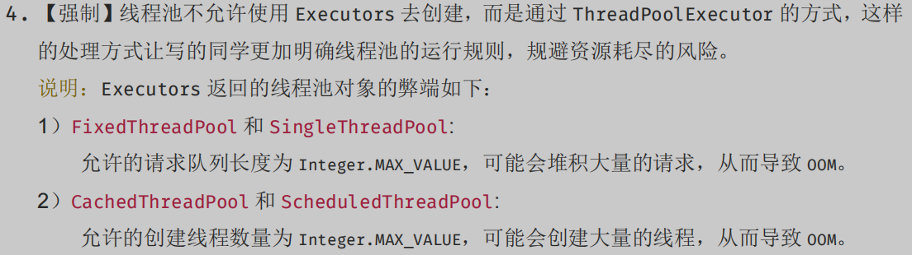

# Thread

> create by nohi 20221012

## 创建线程的几种方式

* 继承Thread类创建线程类

* 通过Runnable接口创建线程类

* 通过Callable和Future创建线程

  Runnable接口中的run()方法的返回值是void，它做的事情只是纯粹地去执行run()方法中的代码而已；
  Callable接口中的call()方法是有返回值的，是一个泛型，和Future、FutureTask配合可以用来获取异步执行的结果。

## 样例

> 参见：SpringCloud2022/nohi-web/src/test/java/nohi/_java/_thread/TestThreadPool.java

* Thread、Runnable

  ```
   // lambda表达式
   Runnable runnable1 = () -> {
     System.out.println("lambda Runnable");
   };
   new Thread(runnable1).start();
  ```

* Callable

  ```
   Callable<Integer> callable = new Callable<Integer>() {
     @Override
     public Integer call() throws Exception {
       Thread.sleep(6000);
       return new Random().nextInt();
     }
   };
   FutureTask<Integer> future = new FutureTask<>(callable);
   new Thread(future).start();
  ```

## 线程池

> 参考：https://zhuanlan.zhihu.com/p/65556060
>
> /nohi-web/src/test/java/nohi/_java/_thread/TestExecutors.java
>
> :warning: 不建议使用Executors



### Executors

```
/* 该方法返回一个固定线程数量的线程池，该线程池池中的线程数量始终不变。
 * 当有一个新的任务提交时，线程池中若有空闲线程，则立即执行。
 * 若没有，则新的任务会被暂存在一个任务队列中，待有线程空闲时，便处理在任务队列中的任务 
 * 默认等待队列长度为Integer.MAX_VALUE
 */
ExecutorService fixedThreadPool = Executors.newFixedThreadPool(1);
/* 该方法返回一个只有一个线程的线程池。
 * 若多余一个任务被提交到线程池，任务会被保存在一个任务队列中，等待线程空闲，按先入先出顺序执行队列中的任务
 * 默认等待队列长度为Integer.MAX_VALUE
 */
ExecutorService singleThreadExecutor = Executors.newSingleThreadExecutor();
/* 
 * 该方法返回一个可根据实际情况调整线程数量的线程池。
 * 线程池的线程数量不确定，但若有空闲线程可以复用，则会优先使用可复用的线程。
 * 若所有线程均在工作，又有新任务的提交，则会创建新的线程处理任务。
 * 所有线程在当前任务执行完毕后，将返回线程池进行复用
 */
ExecutorService newCachedThreadPool = Executors.newCachedThreadPool();
/* 该方法返回一个ScheduledExecutorService对象，线程池大小为1。
 * ScheduledExecutorService接口在ExecutorService接口之上扩展了在给定时间内执行某任务的功能，
 * 如在某个固定的延时之后执行，或者周期性执行某个任务
 */
ExecutorService newSingleThreadScheduledExecutor = Executors.newSingleThreadScheduledExecutor();
/*
 * 该方法也返回一个ScheduledExecutorService对象，但该线程池可以指定线程数量
 */
ExecutorService newScheduledThreadPool = Executors.newScheduledThreadPool(1);
```

以上的工具类的具体实现都是基于ThreadPoolExecutor类，处理策略都是AbortPolicy（直接抛出异常，阻止系统正常工作）

Executors 返回的线程池对象的弊端如下：

1） FixedThreadPool 、SingleThreadPool:

​	  允许的请求队列长度为 Integer.MAX_VALUE，可能会堆积大量的请求，从而导致 OOM。

2） CachedThreadPool 、 ScheduledThreadPool、SingleThreadScheduledExecutor:

​	  允许的创建线程数量为 Integer.MAX_VALUE， 可能会创建大量的线程，从而导致 OOM。

通常情况下，线程池不允许使用 Executors 去创建，而是通过 ThreadPoolExecutor 的方式，这样的处理方式让写的同学更加明确线程池的运行规则，规避资源耗尽的风险。

### ThreadPoolExecutor

> nohi-web/src/test/java/nohi/_java/_thread/TestThreadPoolExecutor.java

```
// ThreadPoolExecutor的全参构造方法
public ThreadPoolExecutor(int corePoolSize,int maximumPoolSize,long keepAliveTime, TimeUnit unit,
 BlockingQueue<Runnable> workQueue,ThreadFactory threadFactory,RejectedExecutionHandler handler) 
{
        if (corePoolSize < 0 ||
            maximumPoolSize <= 0 ||
            maximumPoolSize < corePoolSize ||
            keepAliveTime < 0)
            throw new IllegalArgumentException();
        if (workQueue == null || threadFactory == null || handler == null)
            throw new NullPointerException();
        this.corePoolSize = corePoolSize;
        this.maximumPoolSize = maximumPoolSize;
        this.workQueue = workQueue;
        this.keepAliveTime = unit.toNanos(keepAliveTime);
        this.threadFactory = threadFactory;
        this.handler = handler;
}
```

* corePoolSize 表示 核心线程数
      1. 创建线程池时, 在线程池中常驻的线程, 当corePoolSize <= 0 销毁线程池
      2. 当corePoolSize > 0 线程池中常驻的线程数 = corePoolSize.
      3. corePoolSize选择: 应该根据实际情况选择 , 如果corePoolSize 太小会存在频繁创建线程和销毁线程的行为

* maximumPoolSize表示 线程池最大线程数    

  1. 该数值必须在满足corePoolSize条件的情况下 大于当corePoolSize的数值    

  2. 当提交的线程数大于corePoolSize时 , 那么线程池就会创建新的线程 
  3. 这个线程的数量一定是在 corePoolSize <=线程数<= maximumPoolSize

* keepAliveTime 表示空闲的线程存活时间      

  当线程池中的线程空闲时间大于 keepAliveTime时,    那么就会销毁多余的线程 , 到等于corePoolSize的 数值

  TimeUnit 表示线程存活的时间单位

* workQueue 线程任务队列 
      1. 当线程池中的所有任务队列都在执行任务时,那么新的线程任务就会存入到队列中 ,  等待被消费

* threadFactory 创建线程的工厂
  一般使用默认..Executors.defaultThreadFactory()

* handler 表示线程池的拒绝策略
  当线程池中的线程数 = maximumPoolSize , workQueue = Integer.MAX_VALUE时

  1. AbortPolicy：直接抛出异常，阻止系统正常工作。
  2. CallerRunsPolicy：只要线程未关闭，该策略直接在调用者线程中，运行当前被丢弃的任务。
  3. DiscardOldestPolicy：该策略将丢弃最老的一个请求，也就是即将被执行的一个人任务，并尝试再次提交当前任务。
  4. DiscardPolicy：该策略默默的丢弃无法处理对
  5. 当然也可以根据应用场景需要来实现RejectedExecutionHandler接口自定义策略。

* DEMO

  ```
  ThreadPoolExecutor executor = new ThreadPoolExecutor(
                  10 ,
                  20 ,
                  60,
                  TimeUnit.SECONDS,
                  new ArrayBlockingQueue<Runnable>(10),  // 指定队列大小
                  Executors.defaultThreadFactory(),
                  new ThreadPoolExecutor.AbortPolicy()
  );
  ```

## CompletableFuture

>   :point_right: [参考](https://juejin.cn/post/6970558076642394142)

### Future

- Future.get() 就是阻塞调用，在线程获取结果之前**get方法会一直阻塞**。
- Future提供了一个isDone方法，可以在程序中**轮询这个方法查询**执行结果。

```
@Test
public void testFutureCallable() throws InterruptedException {
    FutureTask<FutureVO> ft = new FutureTask(new Callable<FutureVO>() {
        long sleep = 10l;
        @Override
        public FutureVO call() throws Exception {
            System.out.println("callable do something then return...");
            FutureVO vo = new FutureVO();
            vo.setMsgId(new SecureRandom().nextLong());
            vo.setTitle("FUTURE");
            vo.setMsg("TEST future");
            if (sleep > 0) {
                TimeUnit.SECONDS.sleep(sleep);
            }
            return vo;
        }
    });
    executor.submit(ft);

    try {
        System.out.println("isDone:" + ft.isDone());
        System.out.println("isDone:" + ft.isDone());
        System.out.println("isDone:" + ft.isDone());

        FutureVO futureVO = ft.get();
        System.out.println(JSON.toJSONString(futureVO));
    } catch (ExecutionException e) {
        e.printStackTrace();
    }
}
```

### 创建异步任务

- supplyAsync执行CompletableFuture任务，支持返回值

- runAsync执行CompletableFuture任务，没有返回值。

  #### supplyAsync方法

  ```swift
  //使用默认内置线程池ForkJoinPool.commonPool()，根据supplier构建执行任务
  public static <U> CompletableFuture<U> supplyAsync(Supplier<U> supplier)
  //自定义线程，根据supplier构建执行任务
  public static <U> CompletableFuture<U> supplyAsync(Supplier<U> supplier, Executor executor)
  复制代码
  ```

  #### runAsync方法

  ```java
  //使用默认内置线程池ForkJoinPool.commonPool()，根据runnable构建执行任务
  public static CompletableFuture<Void> runAsync(Runnable runnable) 
  //自定义线程，根据runnable构建执行任务
  public static CompletableFuture<Void> runAsync(Runnable runnable,  Executor executor)
  ```

* DEMO

```
ExecutorService executor = Executors.newFixedThreadPool(2);
@Test
public void testCompletableFuture() {
    long sleep = 10l;

    CompletableFuture<FutureVO> cf = CompletableFuture.supplyAsync(() -> {
        System.out.println("CompletableFuture.supplyAsync do something then return...");
        FutureVO vo = new FutureVO();
        vo.setMsgId(new SecureRandom().nextLong());
        vo.setTitle("FUTURE");
        vo.setMsg("TEST future");
        if (sleep > 0) {
            try {
                TimeUnit.SECONDS.sleep(sleep);
            } catch (InterruptedException e) {
                throw new RuntimeException(e);
            }
        }
        return vo;
    }, executor);

    try {
        FutureVO vo = cf.get(1, TimeUnit.SECONDS);
        System.out.println("1:" + JSONObject.toJSONString(vo));
        return;
    } catch (Exception e) {
        e.printStackTrace();
        System.out.println("get with 1s error " + e.getMessage());
    }

    try {
        FutureVO vo = cf.get(2, TimeUnit.SECONDS);
        System.out.println("2:" + JSONObject.toJSONString(vo));
        return;
    } catch (Exception e) {
        System.out.println("get with 2s error " + e.getMessage());
    }

    try {
        FutureVO vo = cf.get();
        System.out.println("3:" + JSONObject.toJSONString(vo));
    } catch (Exception e) {
        System.out.println("get error " + e.getMessage());
    }
}
```

### 任务异步回调

#### 1. thenRun/thenRunAsync

CompletableFuture的thenRun方法，通俗点讲就是，**做完第一个任务后，再做第二个任务**。某个任务执行完成后，执行回调方法；但是前后两个任务**没有参数传递，第二个任务也没有返回值**

- 调用thenRun方法执行第二个任务时，则第二个任务和第一个任务是**共用同一个线程池**。

- 调用thenRunAsync执行第二个任务时，则第一个任务使用的是你自己传入的线程池，**第二个任务使用的是ForkJoin线程池**

- DEMO

  ```
  @Test
  public void testThenRun() throws ExecutionException, InterruptedException {
      CompletableFuture<String> orgFuture = CompletableFuture.supplyAsync(() -> {
          System.out.println("先执行第一个CompletableFuture方法任务");
          return "捡田螺的小男孩";
      });
  
      CompletableFuture thenRunFuture = orgFuture.thenRun(() -> {
          System.out.println("接着执行第二个任务");
      });
  
      System.out.println(thenRunFuture.get());
  }
  
  # 执行结果
  先执行第一个CompletableFuture方法任务
  接着执行第二个任务
  null
  ```

#### 2.thenAccept/thenAcceptAsync

CompletableFuture的thenAccept方法表示，第一个任务执行完成后，执行第二个回调方法任务，会将该任务的执行结果，作为入参，传递到回调方法中，但是回调方法是**没有返回值**的。

```
@Test
public void testThenAccept() throws ExecutionException, InterruptedException {
    CompletableFuture<String> orgFuture = CompletableFuture.supplyAsync(() -> {
        System.out.println("原始CompletableFuture方法任务");
        return "捡田螺的小男孩";
    });
    System.out.println("orgFuture:" + orgFuture.get());
    CompletableFuture thenAcceptFuture = orgFuture.thenAccept((a) -> {
        if ("捡田螺的小男孩".equals(a)) {
            System.out.println("关注了");
        }
        System.out.println("先考虑考虑");
    });
    System.out.println("thenAcceptFuture:" + thenAcceptFuture.get());
}

# 执行结果
原始CompletableFuture方法任务
orgFuture:捡田螺的小男孩
关注了
先考虑考虑
thenAcceptFuture:null
```

#### 3. thenApply/thenApplyAsync

CompletableFuture的thenApply方法表示，第一个任务执行完成后，执行第二个回调方法任务，会将该任务的执行结果，作为入参，传递到回调方法中，并且回调方法是有返回值的。

#### 4. exceptionally

CompletableFuture的exceptionally方法表示，某个任务执行异常时，执行的回调方法;并且有**抛出异常作为参数**，传递到回调方法。

#### 5. whenComplete方法

CompletableFuture的whenComplete方法表示，某个任务执行完成后，执行的回调方法，**无返回值**；并且whenComplete方法返回的CompletableFuture的**result是上个任务的结果**。

#### 6. handle方法

CompletableFuture的handle方法表示，**某个任务执行完成后，执行回调方法，并且是有返回值的**;并且handle方法返回的CompletableFuture的result是**回调方法**执行的结果。

### 多个任务组合处理

#### AND组合关系

thenCombine / thenAcceptBoth / runAfterBoth都表示：**将两个CompletableFuture组合起来，只有这两个都正常执行完了，才会执行某个任务**。

区别在于：

- thenCombine：会将两个任务的执行结果作为方法入参，传递到指定方法中，且**有返回值**
- thenAcceptBoth: 会将两个任务的执行结果作为方法入参，传递到指定方法中，且**无返回值**
- runAfterBoth 不会把执行结果当做方法入参，且没有返回值。

#### OR 组合的关系

applyToEither / acceptEither / runAfterEither 都表示：将两个CompletableFuture组合起来，只要其中一个执行完了,就会执行某个任务。

区别在于：

- applyToEither：会将已经执行完成的任务，作为方法入参，传递到指定方法中，且有返回值
- acceptEither: 会将已经执行完成的任务，作为方法入参，传递到指定方法中，且无返回值
- runAfterEither： 不会把执行结果当做方法入参，且没有返回值。

#### AllOf

所有任务都执行完成后，才执行 allOf返回的CompletableFuture。如果任意一个任务异常，allOf的CompletableFuture，执行get方法，会抛出异常

### AnyOf

任意一个任务执行完，就执行anyOf返回的CompletableFuture。如果执行的任务异常，anyOf的CompletableFuture，执行get方法，会抛出异常

### thenCompose

thenCompose方法会在某个任务执行完成后，将该任务的执行结果,作为方法入参,去执行指定的方法。该方法会返回一个新的CompletableFuture实例

- 如果该CompletableFuture实例的result不为null，则返回一个基于该result新的CompletableFuture实例；
- 如果该CompletableFuture实例为null，然后就执行这个新任务

### CompletableFuture使用有哪些注意点

CompletableFuture 使我们的异步编程更加便利的、代码更加优雅的同时，我们也要关注下它，使用的一些注意点。

#### 1. Future需要获取返回值，才能获取异常信息

Future需要获取返回值，才能获取到异常信息。如果不加 get()/join()方法，看不到异常信息。小伙伴们使用的时候，注意一下哈,考虑是否加try...catch...或者使用exceptionally方法。

#### 2. CompletableFuture的get()方法是阻塞的。

CompletableFuture的get()方法是阻塞的，如果使用它来获取异步调用的返回值，需要添加超时时间~

#### 3. 默认线程池的注意点

CompletableFuture代码中又使用了默认的线程池，处理的线程个数是电脑CPU核数-1。在**大量请求过来的时候，处理逻辑复杂的话，响应会很慢**。一般建议使用自定义线程池，优化线程池配置参数。

#### 4. 自定义线程池时，注意饱和策略

CompletableFuture的get()方法是阻塞的，我们一般建议使用`future.get(3, TimeUnit.SECONDS)`。并且一般建议使用自定义线程池。

但是如果线程池拒绝策略是`DiscardPolicy`或者`DiscardOldestPolicy`，当线程池饱和时，会直接丢弃任务，不会抛弃异常。因此建议，CompletableFuture线程池策略**最好使用AbortPolicy**，然后耗时的异步线程，做好**线程池隔离**哈。

 
