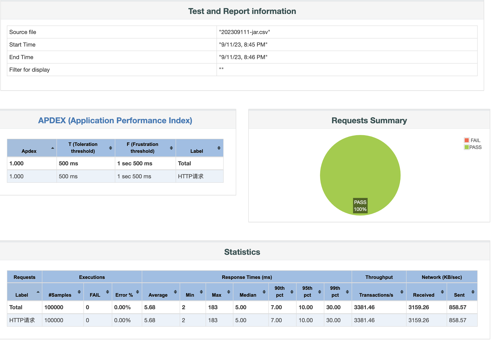
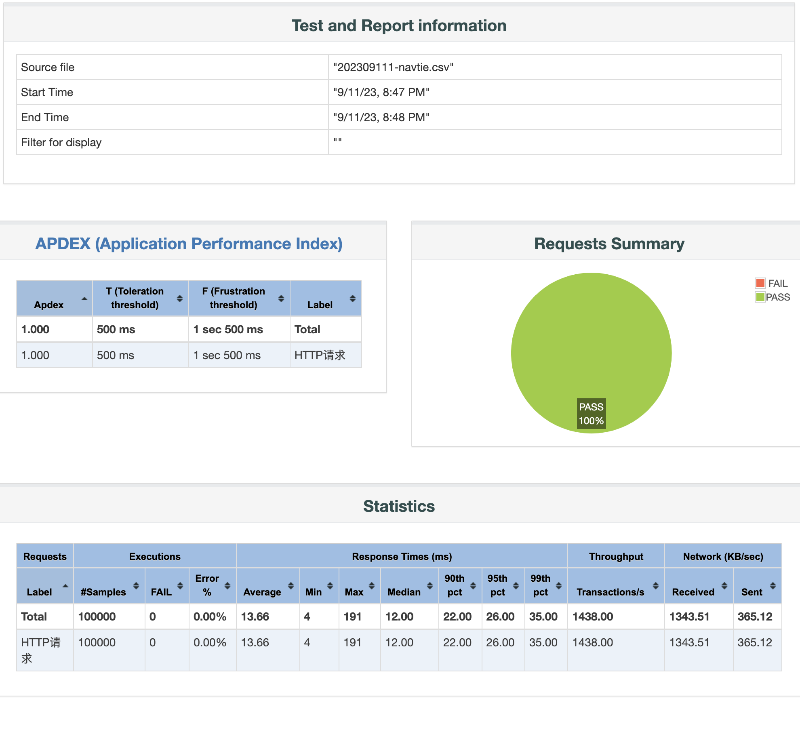

# HTTP Test

> create by nohi 20230911

* 测试Springboot 并发情况，tomcat/webflux
* 测试普通jar和native情况

## 环境

* java version "17.0.7" 2023-04-18 LTS

* SpringBoot3 

* OS: Darwin nohis-MacBook-Pro.local 22.6.0

* 代码：`https://github.com/thisisnohi/SpringCloud2022.git`  分支：feature-demo

  * 工程：nohi-web-native

  * Native:`mvn -Pnative -Dmaven.test.skip=true clean package`

  * 普通Springboot Jar:  '替换build'

    ```xml
    <build>
        <plugins>
          <plugin>
            <groupId>org.springframework.boot</groupId>
            <artifactId>spring-boot-maven-plugin</artifactId>
          </plugin>
        </plugins>
      </build>
    ```


## 服务说明

* 测试RSA加密加签

  ```
  URL /rsa/encode  POST application/json
  请求：
  {
    "traceId": "20230618000011110001",
    "acctNo": "6225888811112222",
    "acctName": "测试账号"
  }
  
  响应
  {
    "retCode": "SUC",
    "retMsg": "",
    "time": null,
    "acctNo": "6225888811112222",
    "acctName": null,
    "data": "FMdbytHD4pCiVLu0LTJe3bUgI+JQUGDST1sXfF6WBlheJ+FcSpSrZ1xCzp6iLrnbVf/50zl/QLoyVo7pLn/OA7kPYISL41N8/Bl3bGA+tKabIRyD1+CAD0KuoRP6k0AxwqK6clUkyrALzfM1QysexHpyLTh+8yxGZbjhyg2drWF8rE5Fitt7tTWUVqopMnroZWITWrlyRZptA4jpDK+y0ZyY7EJyn3A0R+Wk4M+eB2kw5ZaQUGdbUscqS00UwtEtC01J2phjzFsK2vCIyPjtT+mpw5o3XB9FlDpwtDnWsCdduHYXk9KOSRF0OEHcE7AYJcNqkMqXH0pz1b3E8FBoxw==",
    "sign": "MkatX8p9RMmxw1fcw3gtGN3XGKbsdUAKb2B+dQmfR4EZc1Su8FphgFHgi6mOxyHg0PhyMAoqgblSqShgzAW4rRPLW+4Kh8sAS64Rud53fV8cVADD5OzJajRZ/wtV/VAsRwr1H1Hy7h+EDF5mKJJi0myCLxWO5cDyWdzfoTtt0fnQeIxgVyL7QpQsdEA6MnK2LfcEkEAfX2RXY1aoMT7qnrNNXGipTc4StvQHFGcmo8va5PFKEf+T4loPsvhFAljsToCHJH+OOmo7RiDM+lyJmY+AtEW676ZSY3RrRCnmj4s22LA9EmNnlSW/twa4Y0grMvx8ucdjJJazOTkqe1NlkQ=="
  }
  ```

* `/rsa/testJson`

  ```
  /rsa/testJson POST application/json
  请求：
  {
    "traceId": "20230618000011110001",
    "acctNo": "6225888811112222",
    "acctName": "测试账号"
  }
  
  响应：
  {
    "retCode": "SUC",
    "retMsg": "",
    "time": null,
    "acctNo": null,
    "acctName": null,
    "data": "[{\"acctNo\":\"1\",\"acctName\":\"2\",\"dateTime\":\"2023-09-11T13:06:01.719630\",\"amt\":0,\"balance\":100},{\"acctNo\":\"1\",\"acctName\":\"2\",\"dateTime\":\"2023-09-11T13:06:01.719677\",\"amt\":1,\"balance\":99},{\"acctNo\":\"1\",\"acctName\":\"2\",\"dateTime\":\"2023-09-11T13:06:01.719685\",\"amt\":2,\"balance\":98},{\"acctNo\":\"1\",\"acctName\":\"2\",\"dateTime\":\"2023-09-11T13:06:01.719691\",\"amt\":3,\"balance\":97},{\"acctNo\":\"1\",\"acctName\":\"2\",\"dateTime\":\"2023-09-11T13:06:01.719696\",\"amt\":4,\"balance\":96},{\"acctNo\":\"1\",\"acctName\":\"2\",\"dateTime\":\"2023-09-11T13:06:01.719701\",\"amt\":5,\"balance\":95},{\"acctNo\":\"1\",\"acctName\":\"2\",\"dateTime\":\"2023-09-11T13:06:01.719706\",\"amt\":6,\"balance\":94},{\"acctNo\":\"1\",\"acctName\":\"2\",\"dateTime\":\"2023-09-11T13:06:01.719711\",\"amt\":7,\"balance\":93},{\"acctNo\":\"1\",\"acctName\":\"2\",\"dateTime\":\"2023-09-11T13:06:01.719723\",\"amt\":8,\"balance\":92},{\"acctNo\":\"1\",\"acctName\":\"2\",\"dateTime\":\"2023-09-11T13:06:01.719728\",\"amt\":9,\"balance\":91}]",
    "sign": null
  }
  ```

## 测试

###  `/rsa/encode`

```
-- jar
jmeter -n -t /Users/nohi/work/jemeter/20230911-httptest/压测RSA.jmx -l /Users/nohi/work/jemeter/20230911-httptest/report/202309111-jar.csv -e -o /Users/nohi/work/jemeter/20230911-httptest/report/20230911-jar

-- natvie
jmeter -n -t /Users/nohi/work/jemeter/20230911-httptest/压测RSA.jmx -l /Users/nohi/work/jemeter/20230911-httptest/report/202309111-navtie.csv -e -o /Users/nohi/work/jemeter/20230911-httptest/report/20230911-navtie
```

#### 结果

* jar

  

* native

  

