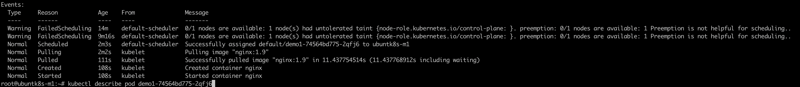
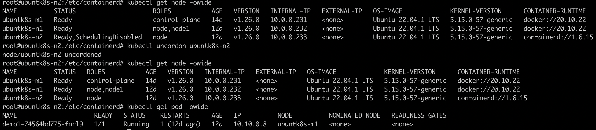
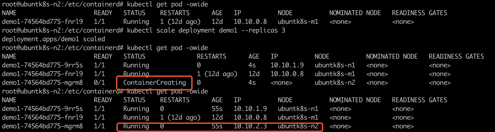

# Kubeadm安装K8s-1.26.0(docker+containerd+CRI-O)

> create by nohi 20230112 
>
> :point_right: [Kubeadm安装K8s-1.26.0（docker+containerd+CRI-O)](https://www.bilibili.com/video/BV1V8411N78a/?spm_id_from=333.788&vd_source=9004ce053a52d5930f71e230579961e7)
>
> 视频章节顺序有点乱，按数据自行播放

## 参数

* 机器

  ```
  10.0.0.231 ubuntk8s-m1
  10.0.0.232 ubuntk8s-n1
  10.0.0.233 ubuntk8s-n2
  ```

* 修改ip

  `vi /etc/netplan/00-installer-config.yaml`

  ```
  默认安装后为：
  network:
    ethernets:
      ens160:
        addresses:
        - 10.0.0.233/24
        gateway4: 255.255.255.0
        nameservers:
          addresses: []
          search:
          - 10.0.0.1
    version: 2
    
  # 修改为如下：addresses为每台机器Ip 
  network:
    ethernets:
      ens160:
        dhcp4: false
        addresses:
          - 10.0.0.231/24
        routes:
          - to: default
            via: 10.0.0.1
        nameservers:
          addresses: [10.0.0.1]
    version: 2
  ```

  

* ip生效`sudo netplan apply`

## 环境准备

需要用root执行下列命令，sudo xxx 为其他用户下以root身份运行命令

以下操作如果没有sudo 建议切换为root后操作

### 1 hosts

* hostname设置: `vi /etc/hostname`

  10.0.0.231 设置为：ubuntk8s-m1
  10.0.0.232 设置为：ubuntk8s-n1
  10.0.0.233 设置为：ubuntk8s-n3

* `vi /etc/hosts`

  ```
  10.0.0.231 ubuntk8s-m1
  10.0.0.232 ubuntk8s-n1
  10.0.0.233 ubuntk8s-n2
  ```

### 2 关闭swap

```
临时关闭: sudo swapoff -a
永久关闭：
sudo vi /etc/fstab 注释 swap所在行，即swap所在行前增加 # 即可
```

### 3 关闭防火墙

```
ufw disable  / sudo ufw disable
```

### 4 加载ipvs模块

```
modprobe -- ip_vs
modprobe -- ip_vs_rr
modprobe -- ip_vs_wrr
modprobe -- ip_vs_sh
modprobe -- nf_conntrack
lsmod | grep ip_vs
lsmod | grep nf_conntrack
```

### 5 内核参数修改

```
cat > /etc/sysctl.d/k8s.conf << EOF
net.bridge.bridge-nf-call-ip6tables=1
net.bridge.bridge-nf-call-iptables=1
net.ipv4.ip_forward=1
EOF
```

ip_forward 转发功能

* 生效

  ```
  modprobe br_netfilter
  sysctl -p /etc/sysctl.d/k8s.conf
  ```

* 配置模块加载永久生效(重启之后也生效)

  ```
  cat <<EOF | tee /etc/modules-load.d/k8s.conf
  br_netfilter
  EOF
  ```

### 6 增加一些工具软件

```
apt install -y ipvsadm ipset
```


## 4-1 Docker安装

### 1. Docker安装

#### 1 环境准备

* 查看可用docker-ce版本

  ```
  apt-cache madison docker-ce
  ```

  如果没有出现，执行2、3步骤

#### 2 更新docker源

* 卸载原有docker以及containerd

  ```
  apt-get remove docker docker-engine docker.io containerd runc
  apt remove docker-ce docker-ce-cli containerd.io -y
  ```

* 安装系统工具

  ```
  apt -y install apt-transport-https ca-certificates curl gnupg-agent software-properties-common curl gnupg lsb-release
  ```

* 添加Docker官方GPG密钥

  ```
  curl -fsSL https://download.docker.com/linux/ubuntu/gpg | sudo gpg --dearmor -o /usr/share/keyrings/docker-archive-keyring.gpg
  ```

* 使用以下命令设置稳定存储库

  ```
  echo "deb [arch=amd64 signed-by=/usr/share/keyrings/docker-archive-keyring.gpg]  https://download.docker.com/linux/ubuntu $(lsb_release -cs) stable" | sudo tee /etc/apt/sources.list.d/container.list > /dev/null
  ```

* 更新apt包索引

  ```
  apt-get update
  ```

#### 3 安装最新版本

* 最新版本

  ```
  apt-get install docker-ce docker-ce-cli containerd.io -y
  ```

    * 安装指定版本

      ```
      apt-get install docker-ce=5:20.10.21~3-0~ubuntu-jammy docker-ce-cli=5:20.10.21~3-0~ubuntu-jammy containerd.io
      ```

* 启动docker

  ```
  systemctl start docker
  ```

* 查看版本等

  ```
  docker version
  docker info
  ```

* 修改docker配置，适应kubelet `vi /etc/docker/daemon.json`

  ```
  {
   "registry-mirrors": ["https://registry.cn-hangzhou.aliyuncs.com"],
   "exec-opts": ["native.cgroupdriver=systemd"]
  }
  ```

  * 生效配置

    ```
    systemctl daemon-reload
    systemctl restart docker
    ```

### 2 安装cri-dockerd

> v1.24 后, k8s连接docker需要，cri-dockerd: https://github.com/Mirantis/cri-dockerd

#### 1 下载安装启动

* 下载最新包：

  ```
  wget https://github.com/Mirantis/cri-dockerd/releases/download/v0.3.0/cri-dockerd_0.3.0.3-0.ubuntu-jammy_amd64.deb
  ```

* 安装

  ```
  dpkg -i cri-dockerd_0.3.0.3-0.ubuntu-jammy_amd64.deb
  
  root@ubuntk8s-m1:~# dpkg -i cri-dockerd_0.3.0.3-0.ubuntu-jammy_amd64.deb
  Selecting previously unselected package cri-dockerd.
  (Reading database ... 109132 files and directories currently installed.)
  Preparing to unpack cri-dockerd_0.3.0.3-0.ubuntu-jammy_amd64.deb ...
  Unpacking cri-dockerd (0.3.0~3-0~ubuntu-jammy) ...
  Setting up cri-dockerd (0.3.0~3-0~ubuntu-jammy) ...
  Created symlink /etc/systemd/system/multi-user.target.wants/cri-docker.service → /lib/systemd/system/cri-docker.service.
  Created symlink /etc/systemd/system/sockets.target.wants/cri-docker.socket → /lib/systemd/system/cri-docker.socket.
  ```

* 启动

  ```
   systemctl start cri-docker.service cri-docker.socket
  ```

  * 查看服务状态

    ```
    systemctl status cri-docker.service
    
    root@ubuntk8s-m1:~# systemctl status cri-docker.service
    ● cri-docker.service - CRI Interface for Docker Application Container Engine
         Loaded: loaded (/lib/systemd/system/cri-docker.service; enabled; vendor preset: enabled)
         Active: active (running) since Sun 2023-01-15 13:42:21 UTC; 4min 44s ago
    TriggeredBy: ● cri-docker.socket
           Docs: https://docs.mirantis.com
       Main PID: 23114 (cri-dockerd)
          Tasks: 9
         Memory: 10.0M
            CPU: 157ms
         CGroup: /system.slice/cri-docker.service
                 └─23114 /usr/bin/cri-dockerd --container-runtime-endpoint fd://
    
    Jan 15 13:42:21 ubuntk8s-m1 cri-dockerd[23114]: time="2023-01-15T13:42:21Z" level=info msg="The binary conntrack is not installed, this can cause failures in network>
    Jan 15 13:42:21 ubuntk8s-m1 cri-dockerd[23114]: time="2023-01-15T13:42:21Z" level=info msg="The binary conntrack is not installed, this can cause failures in network>
    Jan 15 13:42:21 ubuntk8s-m1 cri-dockerd[23114]: time="2023-01-15T13:42:21Z" level=info msg="Loaded network plugin cni"
    Jan 15 13:42:21 ubuntk8s-m1 cri-dockerd[23114]: time="2023-01-15T13:42:21Z" level=info msg="Docker cri networking managed by network plugin cni"
    Jan 15 13:42:21 ubuntk8s-m1 cri-dockerd[23114]: time="2023-01-15T13:42:21Z" level=info msg="Docker Info: &{ID:5ETS:4EQ5:KUAI:AXA6:5CZO:PSIS:G73L:DCOJ:X4C5:2EMN:5W2G:>
    Jan 15 13:42:21 ubuntk8s-m1 cri-dockerd[23114]: time="2023-01-15T13:42:21Z" level=info msg="Setting cgroupDriver systemd"
    Jan 15 13:42:21 ubuntk8s-m1 cri-dockerd[23114]: time="2023-01-15T13:42:21Z" level=info msg="Docker cri received runtime config &RuntimeConfig{NetworkConfig:&NetworkC>
    Jan 15 13:42:21 ubuntk8s-m1 cri-dockerd[23114]: time="2023-01-15T13:42:21Z" level=info msg="Starting the GRPC backend for the Docker CRI interface."
    Jan 15 13:42:21 ubuntk8s-m1 cri-dockerd[23114]: time="2023-01-15T13:42:21Z" level=info msg="Start cri-dockerd grpc backend"
    Jan 15 13:42:21 ubuntk8s-m1 systemd[1]: Started CRI Interface for Docker Application Container Engine.
    ```

#### 2 设置和启动

* 修改配置文件`vi /usr/lib/systemd/system/cri-docker.service`

  ```
  ExecStart=/usr/bin/cri-dockerd --container-runtime-endpoint=unix:///var/run/cri-dockerd.sock --network-plugin=cni --pod-infra-container-image=registry.aliyuncs.com/google_containers/pause:3.9
  ```

  * 重新启动

    ```
    systemctl daemon-reload
    systemctl start cri-docker.service cri-docker.socket
    systemctl restart cri-docker
    systemctl restart cri-docker.socket
    ```

* 设置开机启动

  ```
  systemctl enable cri-docker.service cri-docker.socket
  ```

* 查看启动状态

  ```
  systemctl status cri-docker.service cri-docker.socket
  ```

* 启动服务

  ```
  systemctl daemon-reload
  systemctl enable cri-docker.service cri-docker.socket
  systemctl enable --now cri-docker.service cri-docker.socket
  ```


### 3 CRI-O安装

使用第三种容器运行时，cri-o

**说明**：视频中使用新镜像安装，我使用了ubuntk8s-n1节点安装

```
# 卸载docker、containerd
apt remove docker-ce docker-ce-cli containerd -y
# 卸载cri-dockerd
dpkg -P cri-dockerd
```

参考：https://cri-o.io/

#### 1 启用内核模块

```
modprobe overlay
modprobe br_netfilter
```

#### 2. 在线安装（见https://cri-o.io/）

`Ubuntu 20.04	xUbuntu_20.04`

```
export OS=xUbuntu_20.04
export VERSION=1.26
```

* 安装源

  ```
  echo "deb http://deb.debian.org/debian buster-backports main" > /etc/apt/sources.list.d/backports.list
  apt update
  apt install -y -t buster-backports libseccomp2 || apt update -y -t buster-backports libseccomp2
  ```

  * 运行报错：未解决

* root身份运行

  一起拷贝执行可能报错，按条执行

  ```shell
  echo "deb https://download.opensuse.org/repositories/devel:/kubic:/libcontainers:/stable/$OS/ /" > /etc/apt/sources.list.d/devel:kubic:libcontainers:stable.list
  
  echo "deb http://download.opensuse.org/repositories/devel:/kubic:/libcontainers:/stable:/cri-o:/$VERSION/$OS/ /" > /etc/apt/sources.list.d/devel:kubic:libcontainers:stable:cri-o:$VERSION.list
  
  curl -L https://download.opensuse.org/repositories/devel:/kubic:/libcontainers:/stable:/cri-o:/$VERSION/$OS/Release.key | apt-key add -
  
  curl -L https://download.opensuse.org/repositories/devel:/kubic:/libcontainers:/stable/$OS/Release.key | apt-key add -
  
  apt-get update
  apt-get install cri-o cri-o-runc
  ```

* 修改cri-o配置

  ```
  vi /etc/crio/crio.conf
  
  增加/修改pause_image
  pause_image = "registry.aliyuncs.com/google_containers/pause:3.9"
  ```

* 启动、查看运行情况

  ```
  systemctl daemon-reload
  systemctl enable crio
  systemctl restart crio
  systemctl status crio
  
  root@ubuntk8s-n1:~# crictl version
  Version:  0.1.0
  RuntimeName:  cri-o
  RuntimeVersion:  1.26.1
  RuntimeApiVersion:  v1
  ```

#### 3 修改kubelet配置

CRI-O运行时使用cgroup driver为systemd，因此需要设置kubelet参数保持一致

```
root@ubuntk8s-n1:~# cat /etc/default/kubelet
KUBELET_EXTRA_ARGS=--cgroup-driver=systemd --fail-swap-on=false

# 在kubelet启动文件 / 
```

* kubelet设置容器运行时

  ```
  vi /var/lib/kubelet/kubeadm-flags.env
  
  KUBELET_KUBEADM_ARGS="--container-runtime=remote --container-runtime-endpoint=unix:///var/run/crio/crio.sock --pod-infra-container-image=registry.aliyuncs.com/google_containers/pause:3.9"
  ```

* 重启

  ```
  systemctl daemon-reload
  systemctl enable kubelet
  systemctl restart kubelet
  ```

  * 这时`systemctl status kubelet`，服务是未运行的，需要使用kubeadm join后使用

#### 4 节点加入集群

* master节点，通过`kubeadm token create --print-join-command`获取加入的token及命令，在需要加入的节点上执行

  增加`--cri-socket unix:///var/run/crio/crio.sock`

```
kubeadm join 10.0.0.231:6443 --token o0x4pl.gnik30ytnhoq68yp \
	--discovery-token-ca-cert-hash sha256:860106236c8db3945b567c88f69f518ad0c2543e6bd9e430f121757fbda0d7a6 --cri-socket unix:///var/run/crio/crio.sock
```


## 5 Kubeadm Kubelet Kubectl安装(master and node)

### 1 kubeadm 简介

kubeadm 是K8s的集群安装工具，能够快速安装k8s。能完成下面的拓扑安装

* 单节点k8s
* 单master和多node
* Master HA 和 多node （m*1 + n)

### 2 kubeamd常用命令

* `kubeadm init` 启动一个k8s主节点
* `kubeadm join`启动一个K8s工作节点并且将加入到集群
* `kubeadm upgrade` 更新一个k8s集群到新版本
* `kubeadm config` 
* `kubeadm token` 使用kubeadm join来管理令牌 https
* `kubeadm reset` 还原之前使用kubeadm init 或者 kubeadm join对节点产生的改变
* `kubeadm version` 打印出版本
* `kubeadm alpha`预览一组可用的新功能以便从社区搜集反馈

### 3 Kubeadm kubelet and kubectl 安装

* 添加阿里云k8s源

  ```
  curl -fsSL https://mirrors.aliyun.com/kubernetes/apt/doc/apt-key.gpg | sudo apt-key add - 
  
  vi /etc/apt/sources.list
  deb https://mirrors.aliyun.com/kubernetes/apt/  kubernetes-xenial main
  apt update -y
  ```

* 查看可用版本

  ```
  apt-cache madison kubeadm 
  ```

* 安装最新版本

  ```
  apt -y install kubectl kubelet kubeadm
  ```

  * 安装指定版本

    ```
    apt install -y kubelet=1.23.2-00 kubeadm=1.23.2-00 kubectl=1.23.2-00
    ```

* 使用命令
  * 查看版本`kubectl version`

### 4 启动kubelet

* 修改cgroup

  ```
  cat > /etc/default/kubelet <<EOF
  KUBELET_EXTRA_ARGS=--cgroup-driver=systemd --fail-swap-on=false
  EOF
  ```

  * 重新加载

    ```
    systemctl daemon-reload
    systemctl start kubelet.service
    systemctl enable kubelet.service
    systemctl status kubelet.service
    ```

* 查看出错日志`journalctl -xefu kubelet`
  * -x --catalog 
  * -e --pageer-end
  * -f  --follow
  * -u  --unit=UNIT

## 6 集群安装

* 命令行直接安装
* 配置文件安装


### 1. 命令行直接安装

* kubelet设置容器运行时

  ```
  vi /var/lib/kubelet/kubeadm-flags.env
  
  KUBELET_KUBEADM_ARGS="--container-runtime=remote --container-runtime-endpoint=unix:///var/run/cri-dockerd.sock --pod-infra-container-image=registry.aliyuncs.com/google_containers/pause:3.9"
  ```

* 重启

  ```
  systemctl daemon-reload
  systemctl restart kubelet
  ```

* 拉镜像

  ```
  kubeadm config images pull --image-repository registry.aliyuncs.com/google_containers
  ```

* init

  ```
  # 早期写法 v1.24前，不需要cri-dockerd
  kubeadm init --image-repository registry.aliyuncs.com/google_containers --pod-network-cidr=10.10.0.0/16 --service-cidr=10.20.0.0/16 --apiserver-advertise-address=10.0.0.231 --kubernetes-version=v1.26.0
  
  # 指定cri-dockerd 连接 docker
  kubeadm init --image-repository registry.aliyuncs.com/google_containers --pod-network-cidr=10.10.0.0/16 --service-cidr=10.20.0.0/16 --apiserver-advertise-address=10.0.0.231 --kubernetes-version=v1.26.0 --cri-socket unix:///var/run/cri-dockerd.sock
  
  # 指定containerd
  kubeadm init --image-repository registry.aliyuncs.com/google_containers --pod-network-cidr=/16 --service-cidr=10.20.0.0/16 --apiserver-advertise-address=10.0.0.231 --kubernetes-version=v1.26.0 --cri-socket unix:///var/containerd/containerd.sock
  ```

  * 本次使用`指定cri-dockerd 连接 docker`

    ```
    kubeadm init --image-repository registry.aliyuncs.com/google_containers --pod-network-cidr=10.10.0.0/16 --service-cidr=10.20.0.0/16 --apiserver-advertise-address=10.0.0.231 --kubernetes-version=v1.26.0 --cri-socket unix:///var/run/cri-dockerd.sock
    ```

    * pod-network-cidr 窗口ip地址，默认10.224.0.0
    * apiserver-advertise-address   masterip

  * 输出

    ```
    root@ubuntk8s-m1:~# kubeadm init --image-repository registry.aliyuncs.com/google_containers --pod-network-cidr=10.10.0.0/16 --service-cidr=10.20.0.0/16 --apiserver-advertise-address=10.0.0.231 --kubernetes-version=v1.26.0 --cri-socket unix:///var/run/cri-dockerd.sock
    [init] Using Kubernetes version: v1.26.0
    [preflight] Running pre-flight checks
    [preflight] Pulling images required for setting up a Kubernetes cluster
    [preflight] This might take a minute or two, depending on the speed of your internet connection
    [preflight] You can also perform this action in beforehand using 'kubeadm config images pull'
    [certs] Using certificateDir folder "/etc/kubernetes/pki"
    [certs] Generating "ca" certificate and key
    [certs] Generating "apiserver" certificate and key
    [certs] apiserver serving cert is signed for DNS names [kubernetes kubernetes.default kubernetes.default.svc kubernetes.default.svc.cluster.local ubuntk8s-m1] and IPs [10.20.0.1 10.0.0.231]
    [certs] Generating "apiserver-kubelet-client" certificate and key
    [certs] Generating "front-proxy-ca" certificate and key
    [certs] Generating "front-proxy-client" certificate and key
    [certs] Generating "etcd/ca" certificate and key
    [certs] Generating "etcd/server" certificate and key
    [certs] etcd/server serving cert is signed for DNS names [localhost ubuntk8s-m1] and IPs [10.0.0.231 127.0.0.1 ::1]
    [certs] Generating "etcd/peer" certificate and key
    [certs] etcd/peer serving cert is signed for DNS names [localhost ubuntk8s-m1] and IPs [10.0.0.231 127.0.0.1 ::1]
    [certs] Generating "etcd/healthcheck-client" certificate and key
    [certs] Generating "apiserver-etcd-client" certificate and key
    [certs] Generating "sa" key and public key
    [kubeconfig] Using kubeconfig folder "/etc/kubernetes"
    [kubeconfig] Writing "admin.conf" kubeconfig file
    [kubeconfig] Writing "kubelet.conf" kubeconfig file
    [kubeconfig] Writing "controller-manager.conf" kubeconfig file
    [kubeconfig] Writing "scheduler.conf" kubeconfig file
    [kubelet-start] Writing kubelet environment file with flags to file "/var/lib/kubelet/kubeadm-flags.env"
    [kubelet-start] Writing kubelet configuration to file "/var/lib/kubelet/config.yaml"
    [kubelet-start] Starting the kubelet
    [control-plane] Using manifest folder "/etc/kubernetes/manifests"
    [control-plane] Creating static Pod manifest for "kube-apiserver"
    [control-plane] Creating static Pod manifest for "kube-controller-manager"
    [control-plane] Creating static Pod manifest for "kube-scheduler"
    [etcd] Creating static Pod manifest for local etcd in "/etc/kubernetes/manifests"
    [wait-control-plane] Waiting for the kubelet to boot up the control plane as static Pods from directory "/etc/kubernetes/manifests". This can take up to 4m0s
    [apiclient] All control plane components are healthy after 5.503836 seconds
    [upload-config] Storing the configuration used in ConfigMap "kubeadm-config" in the "kube-system" Namespace
    [kubelet] Creating a ConfigMap "kubelet-config" in namespace kube-system with the configuration for the kubelets in the cluster
    [upload-certs] Skipping phase. Please see --upload-certs
    [mark-control-plane] Marking the node ubuntk8s-m1 as control-plane by adding the labels: [node-role.kubernetes.io/control-plane node.kubernetes.io/exclude-from-external-load-balancers]
    [mark-control-plane] Marking the node ubuntk8s-m1 as control-plane by adding the taints [node-role.kubernetes.io/control-plane:NoSchedule]
    [bootstrap-token] Using token: o0x4pl.gnik30ytnhoq68yp
    [bootstrap-token] Configuring bootstrap tokens, cluster-info ConfigMap, RBAC Roles
    [bootstrap-token] Configured RBAC rules to allow Node Bootstrap tokens to get nodes
    [bootstrap-token] Configured RBAC rules to allow Node Bootstrap tokens to post CSRs in order for nodes to get long term certificate credentials
    [bootstrap-token] Configured RBAC rules to allow the csrapprover controller automatically approve CSRs from a Node Bootstrap Token
    [bootstrap-token] Configured RBAC rules to allow certificate rotation for all node client certificates in the cluster
    [bootstrap-token] Creating the "cluster-info" ConfigMap in the "kube-public" namespace
    [kubelet-finalize] Updating "/etc/kubernetes/kubelet.conf" to point to a rotatable kubelet client certificate and key
    [addons] Applied essential addon: CoreDNS
    [addons] Applied essential addon: kube-proxy
    
    Your Kubernetes control-plane has initialized successfully!
    
    To start using your cluster, you need to run the following as a regular user:
    
      mkdir -p $HOME/.kube
      sudo cp -i /etc/kubernetes/admin.conf $HOME/.kube/config
      sudo chown $(id -u):$(id -g) $HOME/.kube/config
    
    Alternatively, if you are the root user, you can run:
    
      export KUBECONFIG=/etc/kubernetes/admin.conf
    
    You should now deploy a pod network to the cluster.
    Run "kubectl apply -f [podnetwork].yaml" with one of the options listed at:
      https://kubernetes.io/docs/concepts/cluster-administration/addons/
    
    Then you can join any number of worker nodes by running the following on each as root:
    
    kubeadm join 10.0.0.231:6443 --token o0x4pl.gnik30ytnhoq68yp \
    	--discovery-token-ca-cert-hash sha256:860106236c8db3945b567c88f69f518ad0c2543e6bd9e430f121757fbda0d7a6
    ```

    

### 2 配置文件安装

* 生成文件

  ```
  kubeadm config print
  ```

### 3 kubectl准备

* 下面的命令是配置xxx,用kubectl访问集群的方式

  ```
  mkdir -p $HOME/.kube
  sudo cp -i /etc/kubernetes/admin.conf $HOME/.kube/config
  sudo chown $(id -u):$(id -g) $HOME/.kube/config
  ```

* 检查状态

  ```
  kubectl get cs/node/pod
  cs: ComponentStatus
  node 
  ```

  * nodes notReady

  ```
  root@ubuntk8s-m1:~# kubectl get nodes
  NAME          STATUS     ROLES           AGE   VERSION
  ubuntk8s-m1   NotReady   control-plane   29m   v1.26.0
  ```

  * 这里notReady别急，继续安装 4 pod，成功后即可

### 4 安装POD network flannel

* 下载

  ```
  wget https://raw.githubusercontent.com/flannel-io/flannel/master/Documentation/kube-flannel.yml
  
  修改network与执行kubeadm init一致
  net-conf.json: |
      {
        "Network": "10.10.0.0/16",
        "Backend": {
          "Type": "vxlan"
        }
      }
  ```

* 启动pod

  ```
  kubectl apply -f kube-flannel.yml
  ```

  

### 5 卸载安装

```
kubeadm reset --cri-socket unix:///var/run/cri-dockerd.sock
```

```
ip link delete cni0
ip link delete flannel.1
rm -rf /var/lib/cni
rm -rf /etc/kubernetes
rm -rf /root/.kube/config
rm -rf /var/lib/etcd
ipvsadm -C
```


### 6 测试集群

* 创建pod

```
kubectl create deployment demo1 --image=nginx:1.9
```

* 查看pod状态

  ```
  root@ubuntk8s-m1:~# kubectl get pod
  NAME                     READY   STATUS    RESTARTS   AGE
  demo1-74564bd775-2qfj6   0/1     Pending   0          23s
  ```

  status pending

  * 查看pod描述信息

    ```
    kubectl describe pod
    ```

    ```
    Events:
      Type     Reason            Age   From               Message
      ----     ------            ----  ----               -------
      Warning  FailedScheduling  3m5s  default-scheduler  0/1 nodes are available: 1 node(s) had untolerated taint {node-role.kubernetes.io/control-plane: }. preemption: 0/1 nodes are available: 1 Preemption is not helpful for scheduling..
    ```

  * nodes描述信息

    ```
    kubectl describe node
    
    Taints:             node-role.kubernetes.io/control-plane:NoSchedule
    ```

  * 修改key

    ```
    kubectl taint node ubuntk8s-m1 node-role.kubernetes.io/control-plane-
    root@ubuntk8s-m1:~# kubectl taint node ubuntk8s-m1 node-role.kubernetes.io/control-plane-
    node/ubuntk8s-m1 untainted
    ```

  * 再查看pod状态

    ```
    root@ubuntk8s-m1:~# kubectl get pod
    NAME                     READY   STATUS    RESTARTS   AGE
    demo1-74564bd775-2qfj6   1/1     Running   0          13m
    ```

  * 查看pod描述信息

    ```
    root@ubuntk8s-m1:~# kubectl describe pod demo1-74564bd775-2qfj6
    ```

    

    * 查看pod

      ```
      root@ubuntk8s-m1:~# kubectl get pod -owide
      NAME                     READY   STATUS    RESTARTS   AGE   IP          NODE          NOMINATED NODE   READINESS GATES
      demo1-74564bd775-2qfj6   1/1     Running   0          18m   10.10.0.4   ubuntk8s-m1   <none>           <none>
      ```

## 7 Master node配置

### 1 master节点参与工作负载

> 6集群安装 6测试集群出现的问题

使用kubeadm 初始化的集群，Pod不会被调度到Master Node上，也就是说Master Node不参与工作负载。这是因为当前的master节点node1被打上了node-role.kubernetes.io/master:NoSchedule的污点：

```
root@ubuntk8s-m1:~# kubectl describe node ubuntk8s-m1 | grep Taints
Taints:             node-role.kubernetes.io/control-plane:NoSchedule
```

* 测试环境，去掉这个污点，使node1参与负载：

  ```
  kubectl taint node ubuntk8s-m1 node-
  ```

### 2 修改使用ipvs转发流量

> 负载均衡通常采用ipvs、iptables
>
> iptables很难支持上万级的service，因为iptables纯粹是为防火墙而设计的，并且底层数据结构是内核规则的列表。
>
> 1 IPVS为大型集群提供了更好的可扩展性和性能。
> 2 IPVS支持比iptables更复杂的负载平衡算法（最小负载，最少连接，位置，加权等）。
> 3 IPVS支持服务器健康检查和连接重试等


* 修改kube-proxy模式为ipvs

  ```
  kubectl edit cm -n kube-system kube-proxy
  修改mode: "ipvs"
  ```

* 删除旧pod

  ```
  kubectl delete pod -n kube-system kube-proxy-2kwmz
  ```

  `kube-proxy-2kwmz`，可能通过`kubectl get pods -A`查看

  

### 3 node加入集群

* 获取tocken

  ```
  kubeadm init 成功后输出的 kubeadm join 内容。或者下方master节点执行
  root@ubuntk8s-m1:~# kubeadm token create --print-join-command
  kubeadm join 10.0.0.231:6443 --token tyzflc.j3up0lsuutnm4jeq --discovery-token-ca-cert-hash sha256:860106236c8db3945b567c88f69f518ad0c2543e6bd9e430f121757fbda0d7a6
  ```

* 节点执行

  ```
  kubeadm join 10.0.0.231:6443 --token tyzflc.j3up0lsuutnm4jeq --discovery-token-ca-cert-hash sha256:860106236c8db3945b567c88f69f518ad0c2543e6bd9e430f121757fbda0d7a6
  ```

  * 直接执行会报错，如下：

    ```
    root@ubuntk8s-n1:~# kubeadm join 10.0.0.231:6443 --token tyzflc.j3up0lsuutnm4jeq --discovery-token-ca-cert-hash sha256:860106236c8db3945b567c88f69f518ad0c2543e6bd9e430f121757fbda0d7a6
    Found multiple CRI endpoints on the host. Please define which one do you wish to use by setting the 'criSocket' field in the kubeadm configuration file: unix:///var/run/containerd/containerd.sock, unix:///var/run/cri-dockerd.sock
    To see the stack trace of this error execute with --v=5 or higher
    ```

  * 修改参数：增加--cri-socket及后面内容，如下：

    ```
    kubeadm join 10.0.0.231:6443 --token tyzflc.j3up0lsuutnm4jeq --discovery-token-ca-cert-hash sha256:860106236c8db3945b567c88f69f518ad0c2543e6bd9e430f121757fbda0d7a6 --cri-socket unix:///var/run/cri-dockerd.sock
    ```

* node1查看节点情况

  ```
  root@ubuntk8s-n1:~# kubectl get nodes
  E0118 14:09:05.366882  234276 memcache.go:238] couldn't get current server API group list: Get "http://localhost:8080/api?timeout=32s": dial tcp 127.0.0.1:8080: connect: connection refused
  ```

  * 因为node1没有kubenetes配置文件

    ```
    # node1节点执行
    mkdir -p $HOME/.kube
    # 拷贝master节点 ./kube/config 至node1节点机器  root用户目录下，再授权
    sudo chown $(id -u):$(id -g) $HOME/.kube/config
    ```

### 4 kubectl 准备

* 安装POD network flannel

  * 下载

    ```
    wget https://raw.githubusercontent.com/flannel-io/flannel/master/Documentation/kube-flannel.yml
    
    修改network与执行kubeadm init一致
    net-conf.json: |
        {
          "Network": "10.10.0.0/16",
          "Backend": {
            "Type": "vxlan"
          }
        }
    ```

  * 启动pod

    ```
    kubectl apply -f kube-flannel.yml
    ```

* 启动kubelet

  * 修改cgroup

    ```
    cat > /etc/default/kubelet <<EOF
    KUBELET_EXTRA_ARGS=--cgroup-driver=systemd --fail-swap-on=false
    EOF
    ```

    * 重新加载

      ```
      systemctl daemon-reload
      systemctl start kubelet.service
      systemctl enable kubelet.service
      systemctl status kubelet.service
      ```

  * 查看出错日志`journalctl -xefu kubelet`
    * -x --catalog 
    * -e --pageer-end
    * -f  --follow
    * -u  --unit=UNIT

### 5 状态检查 

```shell 
root@ubuntk8s-n1:~# kubectl get node
NAME          STATUS   ROLES           AGE   VERSION
ubuntk8s-m1   Ready    control-plane   2d    v1.26.0
ubuntk8s-n1   Ready    node            40m   v1.26.0
```

* 如果node节点为notready,则从头到尾检查配置，重新启动、加载服务

  特别注意：`cri-docker.service cri-docker.socket`

  查看服务状态为：`systemctl status cri-docker.service cri-docker.socket`，不应出现异常 EROR

  否则一一排查

### 6 node 角色设置

`kubectl label nodes <节点名称> node-role.kubernetes.io/node=`

```
kubectl label nodes ubuntk8s-n1 node-role.kubernetes.io/node1=
```

### 7 扩容nginx

```
kubectl scale deployment demo1 --replicas 5
```

* 查看分布情况`kubectl get pod -owide`

  > 由scheduler控制分配

  ```
  root@ubuntk8s-n1:~# kubectl get pod -owide
  NAME                     READY   STATUS    RESTARTS   AGE    IP          NODE          NOMINATED NODE   READINESS GATES
  demo1-74564bd775-2qfj6   1/1     Running   0          120m   10.10.0.4   ubuntk8s-m1   <none>           <none>
  demo1-74564bd775-6zxqd   1/1     Running   0          50s    10.10.1.4   ubuntk8s-n1   <none>           <none>
  demo1-74564bd775-dljmf   1/1     Running   0          50s    10.10.1.2   ubuntk8s-n1   <none>           <none>
  demo1-74564bd775-fnrl9   1/1     Running   0          50s    10.10.0.5   ubuntk8s-m1   <none>           <none>
  demo1-74564bd775-wf6nx   1/1     Running   0          50s    10.10.1.3   ubuntk8s-n1   <none>           <none>
  root@ubuntk8s-n1:~#
  ```


## 8 node切换CRI到containerd

### 1 查看节点后，剥离

* 剥离节点n2 `kubectl drain ubuntk8s-n2  --ignore-daemonsets`

```
root@ubuntk8s-m1:~# kubectl get pod -owide
NAME                     READY   STATUS    RESTARTS        AGE   IP           NODE          NOMINATED NODE   READINESS GATES
demo1-74564bd775-2qfj6   1/1     Running   2 (8m3s ago)    23h   10.10.0.10   ubuntk8s-m1   <none>           <none>
demo1-74564bd775-7crpd   1/1     Running   0               31s   10.10.1.7    ubuntk8s-n1   <none>           <none>
demo1-74564bd775-fnrl9   1/1     Running   1 (8m14s ago)   21h   10.10.0.8    ubuntk8s-m1   <none>           <none>
demo1-74564bd775-rrsh7   1/1     Running   0               31s   10.10.2.2    ubuntk8s-n2   <none>           <none>
demo1-74564bd775-v8v67   1/1     Running   1 (8m38s ago)   21h   10.10.1.6    ubuntk8s-n1   <none>           <none>
root@ubuntk8s-m1:~# kubectl get pod -A
NAMESPACE      NAME                                  READY   STATUS    RESTARTS      AGE
default        demo1-74564bd775-2qfj6                1/1     Running   2 (11m ago)   23h
default        demo1-74564bd775-7crpd                1/1     Running   0             4m5s
default        demo1-74564bd775-fnrl9                1/1     Running   1 (11m ago)   21h
default        demo1-74564bd775-rrsh7                1/1     Running   0             4m5s
default        demo1-74564bd775-v8v67                1/1     Running   1 (12m ago)   21h
kube-flannel   kube-flannel-ds-8fc46                 1/1     Running   1 (12m ago)   22h
kube-flannel   kube-flannel-ds-vbcjv                 1/1     Running   0             21m
kube-flannel   kube-flannel-ds-wrrgb                 1/1     Running   1 (11m ago)   2d22h
kube-system    coredns-5bbd96d687-k48rd              1/1     Running   1 (11m ago)   2d22h
kube-system    coredns-5bbd96d687-x292j              1/1     Running   2 (11m ago)   2d22h
kube-system    etcd-ubuntk8s-m1                      1/1     Running   1 (11m ago)   2d22h
kube-system    kube-apiserver-ubuntk8s-m1            1/1     Running   1 (11m ago)   2d22h
kube-system    kube-controller-manager-ubuntk8s-m1   1/1     Running   1 (11m ago)   2d22h
kube-system    kube-proxy-7hc8h                      1/1     Running   0             21m
kube-system    kube-proxy-df8fq                      1/1     Running   1 (11m ago)   23h
kube-system    kube-proxy-px75c                      1/1     Running   1 (12m ago)   22h
kube-system    kube-scheduler-ubuntk8s-m1            1/1     Running   3 (66s ago)   2d22h
root@ubuntk8s-m1:~# kubectl get pod -A -owide
NAMESPACE      NAME                                  READY   STATUS    RESTARTS      AGE     IP           NODE          NOMINATED NODE   READINESS GATES
default        demo1-74564bd775-2qfj6                1/1     Running   2 (11m ago)   23h     10.10.0.10   ubuntk8s-m1   <none>           <none>
default        demo1-74564bd775-7crpd                1/1     Running   0             4m8s    10.10.1.7    ubuntk8s-n1   <none>           <none>
default        demo1-74564bd775-fnrl9                1/1     Running   1 (11m ago)   21h     10.10.0.8    ubuntk8s-m1   <none>           <none>
default        demo1-74564bd775-rrsh7                1/1     Running   0             4m8s    10.10.2.2    ubuntk8s-n2   <none>           <none>
default        demo1-74564bd775-v8v67                1/1     Running   1 (12m ago)   21h     10.10.1.6    ubuntk8s-n1   <none>           <none>
kube-flannel   kube-flannel-ds-8fc46                 1/1     Running   1 (12m ago)   22h     10.0.0.232   ubuntk8s-n1   <none>           <none>
kube-flannel   kube-flannel-ds-vbcjv                 1/1     Running   0             21m     10.0.0.233   ubuntk8s-n2   <none>           <none>
kube-flannel   kube-flannel-ds-wrrgb                 1/1     Running   1 (11m ago)   2d22h   10.0.0.231   ubuntk8s-m1   <none>           <none>
kube-system    coredns-5bbd96d687-k48rd              1/1     Running   1 (11m ago)   2d22h   10.10.0.9    ubuntk8s-m1   <none>           <none>
kube-system    coredns-5bbd96d687-x292j              1/1     Running   2 (11m ago)   2d22h   10.10.0.12   ubuntk8s-m1   <none>           <none>
kube-system    etcd-ubuntk8s-m1                      1/1     Running   1 (11m ago)   2d22h   10.0.0.231   ubuntk8s-m1   <none>           <none>
kube-system    kube-apiserver-ubuntk8s-m1            1/1     Running   1 (11m ago)   2d22h   10.0.0.231   ubuntk8s-m1   <none>           <none>
kube-system    kube-controller-manager-ubuntk8s-m1   1/1     Running   1 (11m ago)   2d22h   10.0.0.231   ubuntk8s-m1   <none>           <none>
kube-system    kube-proxy-7hc8h                      1/1     Running   0             21m     10.0.0.233   ubuntk8s-n2   <none>           <none>
kube-system    kube-proxy-df8fq                      1/1     Running   1 (11m ago)   23h     10.0.0.231   ubuntk8s-m1   <none>           <none>
kube-system    kube-proxy-px75c                      1/1     Running   1 (12m ago)   22h     10.0.0.232   ubuntk8s-n1   <none>           <none>
kube-system    kube-scheduler-ubuntk8s-m1            1/1     Running   3 (69s ago)   2d22h   10.0.0.231   ubuntk8s-m1   <none>           <none>
root@ubuntk8s-m1:~# kubectl get pod -A -owide | grep node1
root@ubuntk8s-m1:~# kubectl get pod -A -owide | grep n1
default        demo1-74564bd775-7crpd                1/1     Running   0             4m29s   10.10.1.7    ubuntk8s-n1   <none>           <none>
default        demo1-74564bd775-v8v67                1/1     Running   1 (12m ago)   21h     10.10.1.6    ubuntk8s-n1   <none>           <none>
kube-flannel   kube-flannel-ds-8fc46                 1/1     Running   1 (12m ago)   22h     10.0.0.232   ubuntk8s-n1   <none>           <none>
kube-system    kube-proxy-px75c                      1/1     Running   1 (12m ago)   22h     10.0.0.232   ubuntk8s-n1   <none>           <none>
root@ubuntk8s-m1:~# kubectl get pod -A -owide | grep n2
default        demo1-74564bd775-rrsh7                1/1     Running   0               7m11s   10.10.2.2    ubuntk8s-n2   <none>           <none>
kube-flannel   kube-flannel-ds-vbcjv                 1/1     Running   0               24m     10.0.0.233   ubuntk8s-n2   <none>           <none>
kube-system    kube-proxy-7hc8h                      1/1     Running   0               24m     10.0.0.233   ubuntk8s-n2   <none>           <none>
root@ubuntk8s-m1:~# kubectl get node
NAME          STATUS   ROLES           AGE     VERSION
ubuntk8s-m1   Ready    control-plane   2d22h   v1.26.0
ubuntk8s-n1   Ready    node,node1      22h     v1.26.0
ubuntk8s-n2   Ready    node            26m     v1.26.0

### 删除ubuntk8s-n2节点
root@ubuntk8s-m1:~# kubectl drain ubuntk8s-n2
node/ubuntk8s-n2 cordoned
error: unable to drain node "ubuntk8s-n2" due to error:cannot delete DaemonSet-managed Pods (use --ignore-daemonsets to ignore): kube-flannel/kube-flannel-ds-vbcjv, kube-system/kube-proxy-7hc8h, continuing command...
There are pending nodes to be drained:
 ubuntk8s-n2
cannot delete DaemonSet-managed Pods (use --ignore-daemonsets to ignore): kube-flannel/kube-flannel-ds-vbcjv, kube-system/kube-proxy-7hc8h
root@ubuntk8s-m1:~# kubectl drain ubuntk8s-n2  --ignore-daemonsets
node/ubuntk8s-n2 already cordoned
Warning: ignoring DaemonSet-managed Pods: kube-flannel/kube-flannel-ds-vbcjv, kube-system/kube-proxy-7hc8h
evicting pod default/demo1-74564bd775-rrsh7
pod/demo1-74564bd775-rrsh7 evicted
node/ubuntk8s-n2 drained
root@ubuntk8s-m1:~# kubectl get node
NAME          STATUS                     ROLES           AGE     VERSION
ubuntk8s-m1   Ready                      control-plane   2d22h   v1.26.0
ubuntk8s-n1   Ready                      node,node1      22h     v1.26.0
ubuntk8s-n2   Ready,SchedulingDisabled   node            28m     v1.26.0
root@ubuntk8s-m1:~# kubectl get pod -A -owide
NAMESPACE      NAME                                  READY   STATUS    RESTARTS       AGE     IP           NODE          NOMINATED NODE   READINESS GATES
default        demo1-74564bd775-25vp8                1/1     Running   0              64s     10.10.1.8    ubuntk8s-n1   <none>           <none>
default        demo1-74564bd775-2qfj6                1/1     Running   2 (19m ago)    24h     10.10.0.10   ubuntk8s-m1   <none>           <none>
default        demo1-74564bd775-7crpd                1/1     Running   0              12m     10.10.1.7    ubuntk8s-n1   <none>           <none>
default        demo1-74564bd775-fnrl9                1/1     Running   1 (19m ago)    22h     10.10.0.8    ubuntk8s-m1   <none>           <none>
default        demo1-74564bd775-v8v67                1/1     Running   1 (20m ago)    22h     10.10.1.6    ubuntk8s-n1   <none>           <none>
kube-flannel   kube-flannel-ds-8fc46                 1/1     Running   1 (20m ago)    22h     10.0.0.232   ubuntk8s-n1   <none>           <none>
kube-flannel   kube-flannel-ds-vbcjv                 1/1     Running   0              29m     10.0.0.233   ubuntk8s-n2   <none>           <none>
kube-flannel   kube-flannel-ds-wrrgb                 1/1     Running   1 (19m ago)    2d22h   10.0.0.231   ubuntk8s-m1   <none>           <none>
kube-system    coredns-5bbd96d687-k48rd              1/1     Running   1 (19m ago)    2d22h   10.10.0.9    ubuntk8s-m1   <none>           <none>
kube-system    coredns-5bbd96d687-x292j              1/1     Running   2 (19m ago)    2d22h   10.10.0.12   ubuntk8s-m1   <none>           <none>
kube-system    etcd-ubuntk8s-m1                      1/1     Running   1 (19m ago)    2d22h   10.0.0.231   ubuntk8s-m1   <none>           <none>
kube-system    kube-apiserver-ubuntk8s-m1            1/1     Running   1 (19m ago)    2d22h   10.0.0.231   ubuntk8s-m1   <none>           <none>
kube-system    kube-controller-manager-ubuntk8s-m1   1/1     Running   1 (19m ago)    2d22h   10.0.0.231   ubuntk8s-m1   <none>           <none>
kube-system    kube-proxy-7hc8h                      1/1     Running   0              29m     10.0.0.233   ubuntk8s-n2   <none>           <none>
kube-system    kube-proxy-df8fq                      1/1     Running   1 (19m ago)    23h     10.0.0.231   ubuntk8s-m1   <none>           <none>
kube-system    kube-proxy-px75c                      1/1     Running   1 (20m ago)    22h     10.0.0.232   ubuntk8s-n1   <none>           <none>
kube-system    kube-scheduler-ubuntk8s-m1            1/1     Running   3 (9m1s ago)   2d22h   10.0.0.231   ubuntk8s-m1   <none>           <none>
```


### 2切换引擎至containerd

* 停止docker、cri-docker

  ```
  systemctl stop docker
  systemctl stop docker.socket
  systemctl disable docker
  systemctl stop cri-docker.service cri-docker.socket
  systemctl disable cri-docker.service cri-docker.socket
  ```

* 检查containerd

  ```
  systemctl status containerd
  ```

### 3 修改配置文件

pause镜像设置阿里云镜像仓库地址

cgroups驱动设置为systemd

拉取docker-hub镜像配置加速地址设置为阿里云镜像仓库地址

```
mkdir -p /etc/containerd
containerd config default > /etc/containerd/config.toml
```

* 修改前面生成的配置文件`/etc/containerd/config.toml`：

  ```
  [plugins."io.containerd.grpc.v1.cri".containerd.runtimes.runc]  
  ...  
  [plugins."io.containerd.grpc.v1.cri".containerd.runtimes.runc.options]    
  SystemdCgroup = true
  ```

* 再修改`/etc/containerd/config.toml`中的

  ```
  [plugins."io.containerd.grpc.v1.cri"]  
   ...  
   # sandbox_image = "k8s.gcr.io/pause:3.6"  
   sandbox_image = "registry.aliyuncs.com/google_containers/pause:3.9" 
  ```

* 未按视频配置如下

  

### 4 配置containerd开机启动，并启动containerd

```
systemctl enable containerd --now
systemctl daemon-reload
systemctl restart containerd.service
```

* 使用crictl测试一下，确保可以打印出版本信息并且没有错误信息输出:

  ```
  crictl version
  
  Version:  0.1.0
  RuntimeName:  containerd
  RuntimeVersion:  v1.6.14
  RuntimeApiVersion:  v1
  ```

  * 出现如下错误「runtime connect using default endpoints」

    ```
    root@ubuntk8s-n2:/etc/containerd# crictl pods
    WARN[0000] runtime connect using default endpoints: [unix:///var/run/dockershim.sock unix:///run/containerd/containerd.sock unix:///run/crio/crio.sock unix:///var/run/cri-dockerd.sock]. As the default settings are now deprecated, you should set the endpoint instead.
    ERRO[0000] unable to determine runtime API version: rpc error: code = Unavailable desc = connection error: desc = "transport: Error while dialing dial unix /var/run/dockershim.sock: connect: no such file or directory"
    ```

  * 解决

    `crictl config runtime-endpoint unix:///var/run/containerd/containerd.sock`

    ```
    参考：https://www.orchome.com/16616
    
    kubernetes 1.24+ 之后，如果dockershim已经变成了cri-docker，所以你需要执行：
    crictl config runtime-endpoint unix:///var/run/cri-dockerd.sock
    如果你的容器运行时，已经换成了containerd，则换成containerd的，如：
    crictl config runtime-endpoint unix:///var/run/containerd/containerd.sock
    之后，你在执行就好了。
    另外：生成的配置在cat /etc/crictl.yaml，可以随时修改。
    ```

    

### 5 配置kubelet使用containerd

```
vi /var/lib/kubelet/kubeadm-flags.env

# 文件内容，主要修改endpoint为containerd
KUBELET_KUBEADM_ARGS="--container-runtime-endpoint=unix:///var/run/containerd/containerd.sock --pod-infra-container-image=registry.aliyuncs.com/google_containers/pause:3.9"
```

* 重启

  ```
  systemctl daemon-reload
  systemctl restart kubelet
  ```

### 6 恢复节点

```
# kubectl uncordon ubuntk8s-n2
root@ubuntk8s-n2:/etc/containerd# kubectl uncordon ubuntk8s-n2
node/ubuntk8s-n2 uncordoned
```

结果如下：



* 查看结点情况`kubectl get node -owide`
* 查看pod情况`kubectl get pod -owide`

### 7 扩容



* 扩容3份`kubectl scale deployment demo1 --replicas 3`

  

