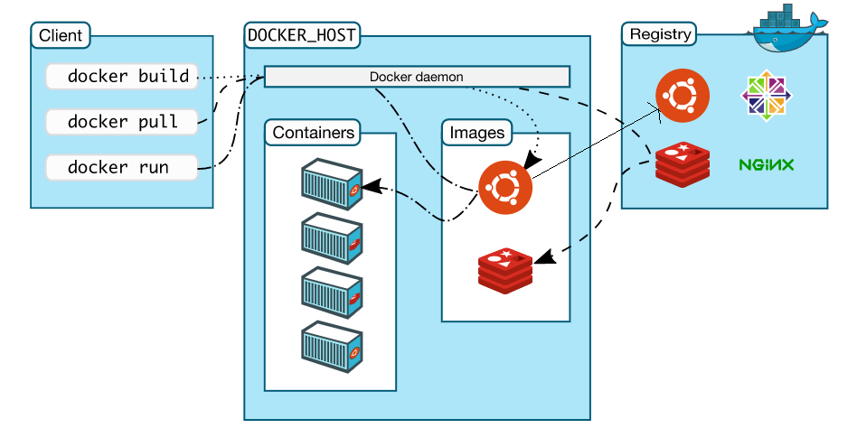
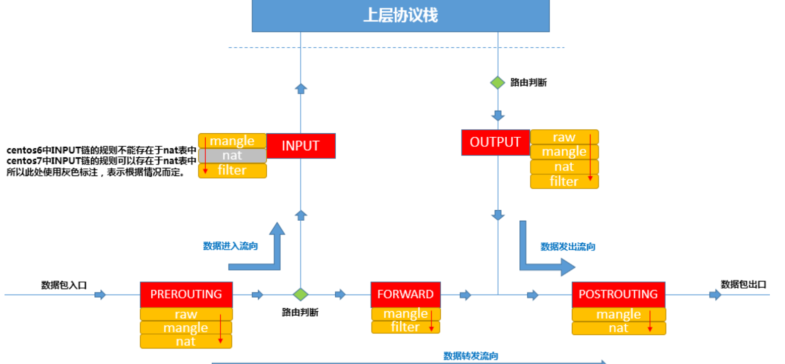
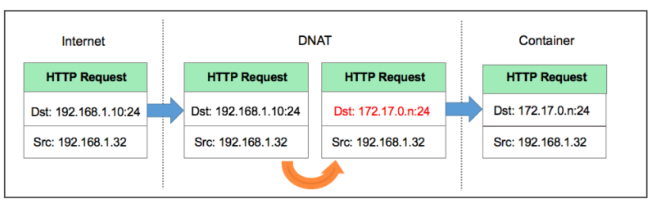
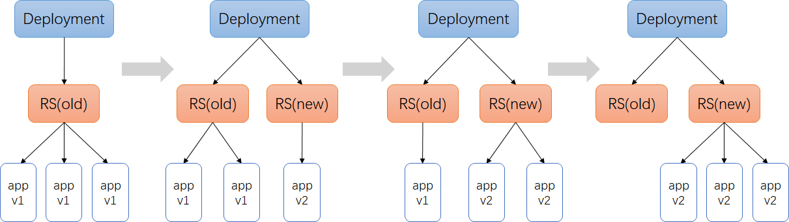
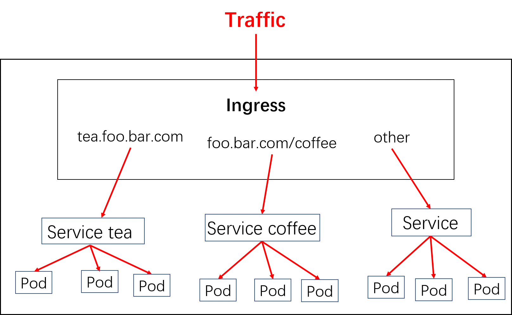

# 【Docker+k8s教程】

> create by nohi 20230204
>
> :link:[Docker+k8s教程](https://www.bilibili.com/video/BV1Fv4y1v7CE/?t=639.8&vd_source=9004ce053a52d5930f71e230579961e7)
>
> :minidisc:  [课件](https://pan.baidu.com/s/1-bGAHDmt9F8gO5cngaNn7w )  提取码：9z5h 


## 一、Docker

### 1 认识docker


也就是说

- runC（libcontainer）是符合OCI标准的一个实现，与底层系统交互
- containerd是实现了OCI之上的容器的高级功能，比如镜像管理、容器执行的调用等
- Dockerd目前是最上层与CLI交互的进程，接收cli的请求并与containerd协作

#### 小结

1. 为了提供一种更加轻量的虚拟化技术，docker出现了
2. 借助于docker容器的轻、快等特性，解决了软件交付过程中的环境依赖问题，使得docker得以快速发展
3. Docker是一种CS架构的软件产品，可以把代码及依赖打包成镜像，作为交付介质，并且把镜像启动成为容器，提供容器生命周期的管理
4. docker-ce，每季度发布stable版本。18.06，18.09，19.03
5. 发展至今，docker已经通过制定OCI标准对最初的项目做了拆分，其中runC和containerd是docker的核心项目，理解docker整个请求的流程，对我们深入理解docker有很大的帮助


### 2 配置宿主机网卡转发

```
## 若未配置，需要执行如下
$ cat <<EOF >  /etc/sysctl.d/docker.conf
net.bridge.bridge-nf-call-ip6tables = 1
net.bridge.bridge-nf-call-iptables = 1
net.ipv4.ip_forward=1
EOF

# 加载配置生效
$ sysctl -p /etc/sysctl.d/docker.conf
```

* 出现如下错误

  ```
  [root@centos8 ~]# sysctl -p /etc/sysctl.d/docker.conf
  sysctl: cannot stat /proc/sys/net/bridge/bridge-nf-call-ip6tables: 没有那个文件或目录
  sysctl: cannot stat /proc/sys/net/bridge/bridge-nf-call-iptables: 没有那个文件或目录
  
  # 执行
  modprobe br_netfilter
  # 再执行 sysctl -p /etc/sysctl.d/docker.conf
  ```

### 3 Yum安装配置docker

```
## 下载阿里源repo文件
# centos8.5 运行以下命令下载最新的repo文件。
wget http://mirrors.aliyun.com/repo/Centos-vault-8.5.2111.repo -O /etc/yum.repos.d/Centos-vault-8.5.2111.repo
wget http://mirrors.aliyun.com/repo/epel-archive-8.repo -O /etc/yum.repos.d/epel-archive-8.repo

wget https://mirrors.aliyun.com/docker-ce/linux/centos/docker-ce.repo -O /etc/yum.repos.d/docker-ce.repo

$ yum clean all && yum makecache
## yum安装最新版本
$ yum install docker-ce -y --allowerasing
## 查看源中可用版本
$ yum list docker-ce --showduplicates | sort -r
	## 安装指定版本
	##yum install -y docker-ce-18.09.9

## 配置源加速
## https://cr.console.aliyun.com/cn-hangzhou/instances/mirrors
mkdir -p /etc/docker
vi /etc/docker/daemon.json
{
  "registry-mirrors" : [
    "https://registry.cn-hangzhou.aliyuncs.com"
  ]
}

## 设置开机自启
systemctl enable docker  
systemctl daemon-reload

## 启动docker
systemctl start docker 

## 查看docker信息
docker info

## docker-client
which docker
## docker daemon
ps aux |grep docker
## containerd
ps aux|grep containerd
systemctl status containerd
```


### 4核心要素及常用操作详解



#### 三大核心要素：镜像(Image)、容器(Container)、仓库(Registry)

###### 镜像（Image）

打包了业务代码及运行环境的包，是静态的文件，不能直接对外提供服务。

###### 容器（Container）

镜像的运行时，可以对外提供服务。

###### 仓库（Registry）

存放镜像的地方

- 公有仓库，Docker Hub，阿里，网易...
- 私有仓库，企业内部搭建
  - Docker Registry，Docker官方提供的镜像仓库存储服务
  - Harbor, 是Docker Registry的更高级封装，它除了提供友好的Web UI界面，角色和用户权限管理，用户操作审计等功能 
- 镜像访问地址形式 registry.devops.com/demo/hello:latest,若没有前面的url地址，则默认寻找Docker Hub中的镜像，若没有tag标签，则使用latest作为标签。 比如，docker pull nginx，会被解析成docker.io/library/nginx:latest
- 公有的仓库中，一般存在这么几类镜像
  - 操作系统基础镜像（centos，ubuntu，suse，alpine）
  - 中间件（nginx，redis，mysql，tomcat）
  - 语言编译环境（python，java，golang）
  - 业务镜像（django-demo...）

容器和仓库不会直接交互，都是以镜像为载体来操作。

#### DEMO

1. 查看镜像列表

   ```powershell
   $ docker images
   ```

2. 如何获取镜像

   - 从远程仓库拉取

     ```powershell
     $ docker pull nginx:alpine
     $ docker images
     ```

   - 使用tag命令

     ```powershell
     $ docker tag nginx:alpine 10.0.0.181:5000/nginx:alpine
     $ docker images
     ```

   - 本地构建

     ```powershell
     $ docker build . -t my-nginx:ubuntu -f Dockerfile
     ```

3. 如何通过镜像启动容器

   ```powershell
   $ docker run --name my-nginx-alpine -d nginx:alpine
   ```

4. 如何知道容器内部运行了什么程序？

   ```powershell
   # 进入容器内部,分配一个tty终端
   $ docker exec -ti my-nginx-alpine /bin/sh
   # ps aux
   ```

5. docker怎么知道容器启动后该执行什么命令？

   通过docker build来模拟构建一个nginx的镜像，

   - 创建Dockerfile

     ```dockerfile
     # 告诉docker使用哪个基础镜像作为模板，后续命令都以这个镜像为基础 
     FROM ubuntu
     
     # RUN命令会在上面指定的镜像里执行命令 
     #RUN sed -i 's#http://archive.ubuntu.com/#http://mirrors.tuna.tsinghua.edu.cn/#' /etc/apt/sources.list;
     RUN cat 'nameserver 8.8.8.8' > /
     RUN apt-get update && apt install -y nginx
     
     #告诉docker，启动容器时执行如下命令
     CMD ["/usr/sbin/nginx", "-g","daemon off;"]
     ```

   - 构建本地镜像

     ```powershell
     $ docker build . -t my-nginx:ubuntu -f Dockerfile
     ```

     * 出现异常：

       ```
       Temporary failure resolving 'archive.ubuntu.com'
       ...
       ERROR: failed to solve: process "/bin/sh -c apt-get update && apt install -y nginx" did not complete successfully: exit code: 100
       ```

     * 解决:（一般为dns问题）

       ```
       [root@centos8 docker]# cat /etc/resolv.conf
       # Generated by NetworkManager
       search 5
       #nameserver fe80::b239:56ff:fe96:ff09%ens192
       nameserver 8.8.8.8
       nameserver 10.0.0.1
       ```

- 使用新镜像启动容器

  ```powershell
  $ docker run --name my-nginx-ubuntu -d my-nginx:ubuntu
  ```

- 进入容器查看进程

  ```powershell
  $ docker exec -ti my-nginx-ubuntu /bin/sh
  # ps aux 
  ```

6. 如何访问容器内服务

   ```powershell
   # 进入容器内部
   $ docker exec -ti my-nginx-alpine /bin/sh
   # ps aux|grep nginx
   # curl localhost:80
   
   ```

7. 宿主机中如何访问容器服务

   ```powershell
   # 删掉旧服务,重新启动
   $ docker rm -f my-nginx-alpine
   $ docker run --name my-nginx-alpine -d -p 8080:80 nginx:alpine
   $ curl 10.0.0.181:8080
   ```

8. docker client如何与daemon通信

   ```powershell
   # /var/run/docker.sock
   $ docker run --name portainer -d -p 9001:9000 -v /var/run/docker.sock:/var/run/docker.sock portainer/portainer
   ```


#### 操作演示


2. 查看所有镜像：

```powershell
$ docker images
```

2. 拉取镜像:

```powershell
$ docker pull nginx:alpine
```

3. 如何唯一确定镜像:

- image_id
- repository:tag

```powershell
$ docker images
REPOSITORY    TAG                 IMAGE ID            CREATED             SIZE
nginx         alpine              377c0837328f        2 weeks ago         19.7MB
```

4. 导出镜像到文件中

   ```powershell
   $ docker save -o nginx-alpine.tar nginx:alpine
   ```

5. 从文件中加载镜像

   ```powershell
   $ docker load -i nginx-alpine.tar
   ```

6. 部署镜像仓库

   https://docs.docker.com/registry/ 

   ```powershell
   ## 使用docker镜像启动镜像仓库服务
   $ docker run -d -p 5000:5000 --restart always --name registry registry:2
   
   ## 默认仓库不带认证，若需要认证，参考https://docs.docker.com/registry/deploying/#restricting-access
   ```

7. 推送本地镜像到镜像仓库中

   ```powershell
   # 本地镜像打标签
   $ docker tag nginx:alpine 10.0.0.181:5000/nginx:alpine
   # 推着镜像至localhost:5000镜像仓库
   $ docker push 10.0.0.181:5000/nginx:alpine
   
   ## 查看仓库内元数据
   $ curl -X GET http://10.0.0.181:5000/v2/_catalog
   $ curl -X GET http://10.0.0.181:5000/v2/nginx/tags/list
   
   ## 镜像仓库给外部访问，不能通过localhost，尝试使用内网地址10.0.0.181:5000/nginx:alpine
   $ docker tag nginx:alpine 10.0.0.181:5000/nginx:alpine
   $ docker push 10.0.0.181:5000/nginx:alpine
   The push refers to repository [10.0.0.181:5000/nginx]
   Get https://10.0.0.181:5000/v2/: http: server gave HTTP response to HTTPS client
   ## docker默认不允许向http的仓库地址推送，如何做成https的，参考：https://docs.docker.com/registry/deploying/#run-an-externally-accessible-registry
   ## 我们没有可信证书机构颁发的证书和域名，自签名证书需要在每个节点中拷贝证书文件，比较麻烦，因此我们通过配置daemon的方式，来跳过证书的验证：
   $ cat /etc/docker/daemon.json
   {
     "registry-mirrors": [
       "https://8xpk5wnt.mirror.aliyuncs.com"
     ],
     "insecure-registries": [
        "10.0.0.181:5000"
     ]
   }
   $ systemctl restart docker
   $ docker push 10.0.0.181:5000/nginx:alpine
   $ docker images	# IMAGE ID相同，等于起别名或者加快捷方式
   REPOSITORY               TAG                 IMAGE ID            CREATED             SIZE
   10.0.0.181:5000/nginx   alpine              377c0837328f        4 weeks ago         
   nginx                    alpine              377c0837328f        4 weeks ago         
   localhost:5000/nginx     alpine              377c0837328f        4 weeks ago         
   registry                 2                   708bc6af7e5e        2 months ago       
   
   ```

8. 删除镜像

   ```powershell
   docker rmi nginx:alpine
   ```

9. 查看容器列表

   ```powershell
   ## 查看运行状态的容器列表
   $ docker ps
   
   ## 查看全部状态的容器列表
   $ docker ps -a
   
   ```

10. 启动容器

    ```powershell
    ## 后台启动
    $ docker run --name nginx -d nginx:alpine
    
    ## 映射端口,把容器的端口映射到宿主机中,-p <host_port>:<container_port>
    $ docker run --name nginx -d -p 8080:80 nginx:alpine
    
    ## 资源限制,最大可用内存500M
    $ docker run --memory=500m nginx:alpine
    ```

    

11. 容器数据持久化

    ```powershell
    ## 挂载主机目录
    $ docker run --name nginx -d  -v /opt:/opt  nginx:alpine
    $ docker run --name mysql -e MYSQL_ROOT_PASSWORD=123456  -d -v /opt/mysql/:/var/lib/mysql mysql:5.7
    ```

12. 进入容器或者执行容器内的命令

    ```powershell
    $ docker exec -ti <container_id_or_name> /bin/sh
    $ docker exec <container_id_or_name> hostname
    ```

13. 主机与容器之间拷贝数据

    ```powershell
    ## 主机拷贝到容器
    $ echo '123'>/tmp/test.txt
    $ docker cp /tmp/test.txt nginx:/tmp
    $ docker exec -ti nginx cat /tmp/test.txt
    123
    
    ## 容器拷贝到主机
    $ docker cp nginx:/tmp/test.txt ./
    ```

14. 挂载已有的数据，重新创建镜像仓库容器

    ```powershell
    ## 解压离线镜像文件
    $ tar zxf registry.tar.gz -C /opt
    
    ## 删除当前镜像仓库容器
    $ docker rm -f registry
    ## 使用docker镜像启动镜像仓库服务
    $ docker run -d -p 5000:5000 --restart always -v /opt/registry:/var/lib/registry --name registry registry:2
    ```

    假设启动镜像仓库服务的主机地址为10.0.0.181，该目录中已存在的镜像列表：

    | 现镜像仓库地址                                               | 原镜像仓库地址                                               |
    | ------------------------------------------------------------ | ------------------------------------------------------------ |
    | 10.0.0.181:5000/coreos/flannel:v0.11.0-amd64                 | quay.io/coreos/flannel:v0.11.0-amd64                         |
    | 10.0.0.181:5000/mysql:5.7                                    | mysql:5.7                                                    |
    | 10.0.0.181:5000/nginx:alpine                                 | nginx:alpine                                                 |
    | 10.0.0.181:5000/centos:centos7.5.1804                        | centos:centos7.5.1804                                        |
    | 10.0.0.181:5000/elasticsearch/elasticsearch:7.4.2            | docker.elastic.co/elasticsearch/elasticsearch:7.4.2          |
    | 10.0.0.181:5000/fluentd-es-root:v1.6.2-1.0                   | quay.io/fluentd_elasticsearch/fluentd:v2.5.2                 |
    | 10.0.0.181:5000/kibana/kibana:7.4.2                          | docker.elastic.co/kibana/kibana:7.4.2                        |
    | 10.0.0.181:5000/kubernetesui/dashboard:v2.0.0-beta5          | kubernetesui/dashboard:v2.0.0-beta5                          |
    | 10.0.0.181:5000/kubernetesui/metrics-scraper:v1.0.1          | kubernetesui/metrics-scraper:v1.0.1                          |
    | 10.0.0.181:5000/kubernetes-ingress-controller/nginx-ingress-controller:0.30.0 | quay.io/kubernetes-ingress-controller/nginx-ingress-controller:0.30.0 |
    | 10.0.0.181:5000/jenkinsci/blueocean:latest                   | jenkinsci/blueocean:latest                                   |
    | 10.0.0.181:5000/sonarqube:7.9-community                      | sonarqube:7.9-community                                      |
    | 10.0.0.181:5000/postgres:11.4                                | postgres:11.4                                                |

     

15. 查看容器日志

    ```powershell
    ## 查看全部日志
    $ docker logs nginx
    
    ## 实时查看最新日志
    $ docker logs -f nginx
    
    ## 从最新的100条开始查看
    $ docker logs --tail=100 -f nginx
    ```

16. 停止或者删除容器

    ```powershell
    ## 停止运行中的容器
    $ docker stop nginx
    
    ## 启动退出容器
    $ docker start nginx
    
    ## 删除非运行中状态的容器
    $ docker rm nginx
    
    ## 删除运行中的容器
    $ docker rm -f nginx
        
    ```

17. 查看容器或者镜像的明细

    ```powershell
    ## 查看容器详细信息，包括容器IP地址等
    $ docker inspect nginx
    
    ## 查看镜像的明细信息
    $ docker inspect nginx:alpine
    ```

##### Dockerfile使用

```powershell
$ docker build . -t ImageName:ImageTag -f Dockerfile
```

Dockerfile是一堆指令，在docker build的时候，按照该指令进行操作，最终生成我们期望的镜像

- FROM 指定基础镜像，必须为第一个命令

  ```
  格式：
  	FROM <image>
  	FROM <image>:<tag>
  示例：
  	FROM mysql:5.7
  注意：
  	tag是可选的，如果不使用tag时，会使用latest版本的基础镜像
  ```

- MAINTAINER 镜像维护者的信息

  ```
  格式：
  	MAINTAINER <name>
  示例：
  	MAINTAINER Yongxin Li
      MAINTAINER inspur_lyx@hotmail.com
      MAINTAINER Yongxin Li <inspur_lyx@hotmail.com>
  ```

- COPY|ADD 添加本地文件到镜像中

  ```
  格式：
  	COPY <src>... <dest>
  示例：
      ADD hom* /mydir/          # 添加所有以"hom"开头的文件
      ADD test relativeDir/     # 添加 "test" 到 `WORKDIR`/relativeDir/
      ADD test /absoluteDir/    # 添加 "test" 到 /absoluteDir/
  ```

- WORKDIR 工作目录

  ```
  格式：
  	WORKDIR /path/to/workdir
  示例：
      WORKDIR /a  (这时工作目录为/a)
  注意：
  	通过WORKDIR设置工作目录后，Dockerfile中其后的命令RUN、CMD、ENTRYPOINT、ADD、COPY等命令都会在该目录下执行
  ```

- RUN 构建镜像过程中执行命令

  ```
  格式：
  	RUN <command>
  示例：
      RUN yum install nginx
      RUN pip install django
      RUN mkdir test && rm -rf /var/lib/unusedfiles
  注意：
  	RUN指令创建的中间镜像会被缓存，并会在下次构建中使用。如果不想使用这些缓存镜像，可以在构建时指定--no-cache参数，如：docker build --no-cache
  ```

- CMD 构建容器后调用，也就是在容器启动时才进行调用

  ```
  格式：
      CMD ["executable","param1","param2"] (执行可执行文件，优先)
      CMD ["param1","param2"] (设置了ENTRYPOINT，则直接调用ENTRYPOINT添加参数)
      CMD command param1 param2 (执行shell内部命令)
  示例：
      CMD ["/usr/bin/wc","--help"]
      CMD ping www.baidu.com
  注意：
  	CMD不同于RUN，CMD用于指定在容器启动时所要执行的命令，而RUN用于指定镜像构建时所要执行的命令。
  ```

- ENTRYPOINT 设置容器初始化命令，使其可执行化

  ```
  格式：
      ENTRYPOINT ["executable", "param1", "param2"] (可执行文件, 优先)
      ENTRYPOINT command param1 param2 (shell内部命令)
  示例：
      ENTRYPOINT ["/usr/bin/wc","--help"]
  注意：
  	ENTRYPOINT与CMD非常类似，不同的是通过docker run执行的命令不会覆盖ENTRYPOINT，而docker run命令中指定的任何参数，都会被当做参数再次传递给ENTRYPOINT。Dockerfile中只允许有一个ENTRYPOINT命令，多指定时会覆盖前面的设置，而只执行最后的ENTRYPOINT指令
  ```

- ENV

  ```
  格式：
      ENV <key> <value>
      ENV <key>=<value>
  示例：
      ENV myName John
      ENV myCat=fnohi
  ```

- EXPOSE

  ```
  格式：
      EXPOSE <port> [<port>...]
  示例：
      EXPOSE 80 443
      EXPOSE 8080
      EXPOSE 11211/tcp 11211/udp
  注意：
      EXPOSE并不会让容器的端口访问到主机。要使其可访问，需要在docker run运行容器时通过-p来发布这些端口，或通过-P参数来发布EXPOSE导出的所有端口
  
  ```

  


- 基础环境镜像

  ```dockerfile
  FROM java:8-alpine
  
  RUN apk add --update ca-certificates && rm -rf /var/cache/apk/* && \
    find /usr/share/ca-certificates/mozilla/ -name "*.crt" -exec keytool -import -trustcacerts \
    -keystore /usr/lib/jvm/java-1.8-openjdk/jre/lib/security/cacerts -storepass changeit -noprompt \
    -file {} -alias {} \; && \
    keytool -list -keystore /usr/lib/jvm/java-1.8-openjdk/jre/lib/security/cacerts --storepass changeit
  
  ENV MAVEN_VERSION 3.5.4
  ENV MAVEN_HOME /usr/lib/mvn
  ENV PATH $MAVEN_HOME/bin:$PATH
  
  RUN wget http://archive.apache.org/dist/maven/maven-3/$MAVEN_VERSION/binaries/apache-maven-$MAVEN_VERSION-bin.tar.gz && \
    tar -zxvf apache-maven-$MAVEN_VERSION-bin.tar.gz && \
    rm apache-maven-$MAVEN_VERSION-bin.tar.gz && \
    mv apache-maven-$MAVEN_VERSION /usr/lib/mvn
  
  RUN mkdir -p /usr/src/app
  WORKDIR /usr/src/app
  
  ```

- 前端镜像

  ```dockerfile
  FROM nginx:1.19.0-alpine
  
  LABEL maintainer="mritd <mritd@linux.com>"
  
  ARG TZ='Asia/Shanghai'
  ENV TZ ${TZ}
  
  RUN apk upgrade --update \
      && apk add bash tzdata curl wget ca-certificates \
      && ln -sf /usr/share/zoneinfo/${TZ} /etc/localtime \
      && echo ${TZ} > /etc/timezone \
      && rm -rf /usr/share/nginx/html /var/cache/apk/*
  
  COPY landscape-animation-experiment /usr/share/nginx/html
  
  EXPOSE 80 443
  
  CMD ["nginx", "-g", "daemon off;"]
  ```

- java镜像

  ```dockerfile
  FROM java:8u111
  
  ENV JAVA_OPTS "\
  -Xmx4096m \
  -XX:MetaspaceSize=256m \
  -XX:MaxMetaspaceSize=256m"
  ENV JAVA_HOME /usr/java/jdk
  ENV PATH ${PATH}:${JAVA_HOME}/bin
  
  COPY target/myapp.jar myapp.jar
  
  RUN ln -sf /usr/share/zoneinfo/Asia/Shanghai /etc/localtime
  RUN echo 'Asia/Shanghai' >/etc/timezone
  
  EXPOSE 9000
  CMD java ${JAVA_OPTS} -jar myapp.jar
  ```

  

- golang镜像

  多阶段构建

##### 多阶构建

https://gitee.com/agagin/href-counter.git

原始构建：

```dockerfile
FROM golang:1.13

WORKDIR /go/src/github.com/alexellis/href-counter/

COPY vendor vendor
COPY app.go .
ENV GOPROXY https://goproxy.cn
RUN CGO_ENABLED=0 GOOS=linux go build -a -installsuffix cgo -o app .
```

```powershell
$ docker build . -t href-counter:v1 -f Dockerfile
```


多阶构建：

```dockerfile
FROM golang:1.13 AS builder

WORKDIR /go/src/github.com/alexellis/href-counter/

COPY vendor vendor
COPY app.go	.
ENV GOPROXY https://goproxy.cn

RUN CGO_ENABLED=0 GOOS=linux go build -a -installsuffix cgo -o app .

FROM alpine:3.10
RUN apk --no-cache add ca-certificates

WORKDIR /root/

COPY --from=builder  /go/src/github.com/alexellis/href-counter/app    .

CMD ["./app"]
```

```powershell
$ docker build . -t href-counter:v2 -f Dockerfile.multi
```

原则：

- 不必要的内容不要放在镜像中
- 减少不必要的层文件
- 减少网络传输操作
- 可以适当的包含一些调试命令

##### 通过1号进程理解容器的本质

```powershell
$ docker exec -ti my-nginx-alpine /bin/sh
#/ ps aux

```

容器启动的时候可以通过命令去覆盖默认的CMD

```powershell
$ docker run -d --name xxx nginx:alpine <自定义命令>
# <自定义命令>会覆盖镜像中指定的CMD指令，作为容器的1号进程启动。

$ docker run -d --name test-3 nginx:alpine echo 123

$ docker run -d --name test-4 nginx:alpine ping www.nohicity.com

```


本质上讲容器是利用namespace和cgroup等技术在宿主机中创建的独立的虚拟空间，这个空间内的网络、进程、挂载等资源都是隔离的。

```powershell
$ docker exec -ti my-nginx /bin/sh
#/ ip addr
#/ ls -l /
#/ apt install xxx
#/ #安装的软件对宿主机和其他容器没有任何影响，和虚拟机不同的是，容器间共享一个内核，所以容器内没法升级内核
```


### 5 Django应用容器化实践

#### django项目介绍

- 项目地址：https://gitee.com/agagin/python-demo.git
- python3 + django + uwsgi + nginx + mysql

- 内部服务端口8002

#### 容器化Django项目

*dockerfiles/myblog/Dockerfile*

```dockerfile
# This my first django Dockerfile
# Version 1.0

# Base images 基础镜像
FROM centos:centos7.5.1804

#MAINTAINER 维护者信息
LABEL maintainer="inspur_lyx@hotmail.com"

#ENV 设置环境变量
ENV LANG en_US.UTF-8
ENV LC_ALL en_US.UTF-8

#RUN 执行以下命令
RUN curl -so /etc/yum.repos.d/Centos-7.repo http://mirrors.aliyun.com/repo/Centos-7.repo && rpm -Uvh http://nginx.org/packages/centos/7/noarch/RPMS/nginx-release-centos-7-0.el7.ngx.noarch.rpm
RUN yum install -y  python36 python3-devel gcc pcre-devel zlib-devel make net-tools nginx

#工作目录
WORKDIR /opt/myblog

#拷贝文件至工作目录， 宿主机到窗口
COPY . .

# 拷贝nginx配置文件
COPY myblog.conf /etc/nginx

#安装依赖的插件
RUN pip3 install -i http://mirrors.aliyun.com/pypi/simple/ --trusted-host mirrors.aliyun.com -r requirements.txt

RUN chmod +x run.sh && rm -rf ~/.cache/pip

#EXPOSE 映射端口
EXPOSE 8002

#容器启动时执行命令
CMD ["./run.sh"]
```

执行构建：

```powershell
$ docker build . -t myblog:v1 -f Dockerfile∂
```

#### 运行mysql

```powershell
$ docker run -d -p 3306:3306 --name mysql  -v /opt/mysql:/var/lib/mysql -e MYSQL_DATABASE=myblog -e MYSQL_ROOT_PASSWORD=123456 mysql:5.7 --character-set-server=utf8mb4 --collation-server=utf8mb4_unicode_ci

## 参数传递
## 查看数据库
$ docker exec -ti mysql bash
#/ mysql -uroot -p123456
#/ show databases;

## navicator连接

```

* 自建utf-8 mysql

  ```
  # mysql 配置文件
  [root@centos8 mysql]# cat my.cnf
  [mysqld]
  user=root
  character-set-server=utf8
  lower_case_table_names=1
  
  [client]
  default-character-set=utf8
  [mysql]
  default-character-set=utf8
  
  !includedir /etc/mysql/conf.d/
  !includedir /etc/mysql/mysql.conf.d/
  
  # Dockerfile
  [root@centos8 mysql]# cat Dockerfile
  FROM mysql:5.7
  COPY my.cnf /etc/mysql/my.cnf
  # 构建
  docker build . -t mysql:5.7-utf8 -f Dockerfile
  ```

  

#### 启动Django应用

```powershell
## 启动容器
$ docker run -d -p 8002:8002 --name myblog -e MYSQL_HOST=10.0.0.181 -e MYSQL_USER=root -e MYSQL_PASSWD=123456  myblog:v1 

## migrate
$ docker exec -ti myblog bash
#/ python3 manage.py makemigrations
#/ python3 manage.py migrate
#/ python3 manage.py createsuperuser

## 创建超级用户
$ docker exec -ti myblog python3 manage.py createsuperuser

## 收集静态文件
## $ docker exec -ti myblog python3 manage.py collectstatic

```

访问10.0.0.181:8002/admin


### 实现原理

docker优势：

- 轻量级的虚拟化

- 容器快速启停

  

虚拟化核心需要解决的问题：资源隔离与资源限制

- 虚拟机硬件虚拟化技术， 通过一个 hypervisor 层实现对资源的彻底隔离。
- 容器则是操作系统级别的虚拟化，利用的是内核的 Cgroup 和 Namespace 特性，此功能完全通过软件实现。

#### Namespace 资源隔离

命名空间是全局资源的一种抽象，将资源放到不同的命名空间中，各个命名空间中的资源是相互隔离的。 

| **分类**           | **系统调用参数** | **相关内核版本**                                             |
| ------------------ | ---------------- | ------------------------------------------------------------ |
| Mount namespaces   | CLONE_NEWNS      | [Linux 2.4.19](http://lwn.net/2001/0301/a/namespaces.php3)   |
| UTS namespaces     | CLONE_NEWUTS     | [Linux 2.6.19](http://lwn.net/Articles/179345/)              |
| IPC namespaces     | CLONE_NEWIPC     | [Linux 2.6.19](http://lwn.net/Articles/187274/)              |
| PID namespaces     | CLONE_NEWPID     | [Linux 2.6.24](http://lwn.net/Articles/259217/)              |
| Network namespaces | CLONE_NEWNET     | [始于Linux 2.6.24 完成于 Linux 2.6.29](http://lwn.net/Articles/219794/) |
| User namespaces    | CLONE_NEWUSER    | [始于 Linux 2.6.23 完成于 Linux 3.8](http://lwn.net/Articles/528078/) |

我们知道，docker容器对于操作系统来讲其实是一个进程，我们可以通过原始的方式来模拟一下容器实现资源隔离的基本原理：

linux系统中，通常可以通过`clone()`实现进程创建的系统调用 ，原型如下：

```c
int clone(int (*child_func)(void *), void *child_stack, int flags, void *arg);
```

- **child_func** : 传入子进程运行的程序主函数。
- **child_stack** : 传入子进程使用的栈空间。
- **flags** : 表示使用哪些 `CLONE_*` 标志位。
- **args** : 用于传入用户参数。

示例一：实现进程独立的UTS空间

```c
#define _GNU_SOURCE
#include <sys/mount.h> 
#include <sys/types.h>
#include <sys/wait.h>
#include <stdio.h>
#include <sched.h>
#include <signal.h>
#include <unistd.h>
#define STACK_SIZE (1024 * 1024)
static char container_stack[STACK_SIZE];
char* const container_args[] = {
  "/bin/bash",
  NULL
};

int container_main(void* arg)
{
  printf("Container - inside the container!\n");
  sethostname("container",10); /* 设置hostname */
  execv(container_args[0], container_args);
  printf("Something's wrong!\n");
  return 1;
}

int main()
{
  printf("Parent - start a container!\n");
  int container_pid = clone(container_main, container_stack+STACK_SIZE, CLONE_NEWUTS | SIGCHLD , NULL);
  waitpid(container_pid, NULL, 0);
  printf("Parent - container stopped!\n");
  return 0;
}

```

执行编译并测试：

```powershell
$ gcc -o ns_uts ns_uts.c
$ ./ns_uts
$ hostname

```

示例二：实现容器独立的进程空间

```c
#define _GNU_SOURCE
#include <sys/mount.h> 
#include <sys/types.h>
#include <sys/wait.h>
#include <stdio.h>
#include <sched.h>
#include <signal.h>
#include <unistd.h>
#define STACK_SIZE (1024 * 1024)
static char container_stack[STACK_SIZE];
char* const container_args[] = {
  "/bin/bash",
  NULL
};

int container_main(void* arg)
{
  printf("Container [%5d] - inside the container!\n", getpid());
  sethostname("container",10); /* 设置hostname */
  execv(container_args[0], container_args);
  printf("Something's wrong!\n");
  return 1;
}

int main()
{
  printf("Parent [%5d] - start a container!\n", getpid());
  int container_pid = clone(container_main, container_stack+STACK_SIZE, CLONE_NEWUTS | CLONE_NEWPID | SIGCHLD , NULL);
  waitpid(container_pid, NULL, 0);
  printf("Parent - container stopped!\n");
  return 0;
}

```

执行编译并测试：

```powershell
$ gcc -o ns_pid ns_pid.c
$ ./ns_pid
$ echo $$

```

如何确定进程是否属于同一个namespace：

```powershell
$ ./ns_pid
Parent [ 8061] - start a container!
$ pstree -p 8061
pid1(8061)───bash(8062)───pstree(8816)
$ ls -l /proc/8061/ns
lrwxrwxrwx 1 root root 0 Jun 24 12:51 ipc -> ipc:[4026531839]
lrwxrwxrwx 1 root root 0 Jun 24 12:51 mnt -> mnt:[4026531840]
lrwxrwxrwx 1 root root 0 Jun 24 12:51 net -> net:[4026531968]
lrwxrwxrwx 1 root root 0 Jun 24 12:51 pid -> pid:[4026531836]
lrwxrwxrwx 1 root root 0 Jun 24 12:51 user -> user:[4026531837]
lrwxrwxrwx 1 root root 0 Jun 24 12:51 uts -> uts:[4026531838]
$ ls -l /proc/8062/ns
lrwxrwxrwx 1 root root 0 Jun 24 12:51 ipc -> ipc:[4026531839]
lrwxrwxrwx 1 root root 0 Jun 24 12:51 mnt -> mnt:[4026531840]
lrwxrwxrwx 1 root root 0 Jun 24 12:51 net -> net:[4026531968]
lrwxrwxrwx 1 root root 0 Jun 24 12:51 pid -> pid:[4026534845]
lrwxrwxrwx 1 root root 0 Jun 24 12:51 user -> user:[4026531837]
lrwxrwxrwx 1 root root 0 Jun 24 12:51 uts -> uts:[4026534844]

## 发现pid和uts是和父进程使用了不同的ns，其他的则是继承了父进程的命名空间

```


综上：通俗来讲，docker在启动一个容器的时候，会调用Linux Kernel Namespace的接口，来创建一块虚拟空间，创建的时候，可以支持设置下面这几种（可以随意选择）,docker默认都设置。

- pid：用于进程隔离（PID：进程ID）
- net：管理网络接口（NET：网络）
- ipc：管理对 IPC 资源的访问（IPC：进程间通信（信号量、消息队列和共享内存））
- mnt：管理文件系统挂载点（MNT：挂载）
- uts：隔离主机名和域名
- user：隔离用户和用户组

#### CGroup 资源限制

通过namespace可以保证容器之间的隔离，但是无法控制每个容器可以占用多少资源， 如果其中的某一个容器正在执行 CPU 密集型的任务，那么就会影响其他容器中任务的性能与执行效率，导致多个容器相互影响并且抢占资源。如何对多个容器的资源使用进行限制就成了解决进程虚拟资源隔离之后的主要问题。


Control Groups（简称 CGroups）

> cgroups是Linux内核提供的一种机制，这种机制可以根据需求吧一系列系统任务及其子任务整合(或分隔)到按资源划分等级的不同组中，从而为系统资源管理提供一个统一的框架。

CGroups能够隔离宿主机器上的物理资源，例如 CPU、内存、磁盘 I/O 。每一个 CGroup 都是一组被相同的标准和参数限制的进程。而我们需要做的，其实就是把容器这个进程加入到指定的Cgroup中。深入理解CGroup，请[点此]()。

#### UnionFS 联合文件系统

Linux namespace和cgroup分别解决了容器的资源隔离与资源限制，那么容器是很轻量的，通常每台机器中可以运行几十上百个容器， 这些个容器是共用一个image，还是各自将这个image复制了一份，然后各自独立运行呢？ 如果每个容器之间都是全量的文件系统拷贝，那么会导致至少如下问题：

- 运行容器的速度会变慢
- 容器和镜像对宿主机的磁盘空间的压力

怎么解决这个问题------Docker的存储驱动

- 镜像分层存储
- UnionFS

Docker 镜像是由一系列的层组成的，每层代表 Dockerfile 中的一条指令，比如下面的 Dockerfile 文件：

```dockerfile
FROM ubuntu:15.04
COPY . /app
RUN make /app
CMD python /app/app.py

```

这里的 Dockerfile 包含4条命令，其中每一行就创建了一层，下面显示了上述Dockerfile构建出来的镜像运行的容器层的结构：


镜像就是由这些层一层一层堆叠起来的，镜像中的这些层都是只读的，当我们运行容器的时候，就可以在这些基础层至上添加新的可写层，也就是我们通常说的`容器层`，对于运行中的容器所做的所有更改（比如写入新文件、修改现有文件、删除文件）都将写入这个容器层。

对容器层的操作，主要利用了写时复制（CoW）技术。CoW就是copy-on-write，表示只在需要写时才去复制，这个是针对已有文件的修改场景。 CoW技术可以让所有的容器共享image的文件系统，所有数据都从image中读取，只有当要对文件进行写操作时，才从image里把要写的文件复制到自己的文件系统进行修改。所以无论有多少个容器共享同一个image，所做的写操作都是对从image中复制到自己的文件系统中的复本上进行，并不会修改image的源文件，且多个容器操作同一个文件，会在每个容器的文件系统里生成一个复本，每个容器修改的都是自己的复本，相互隔离，相互不影响。使用CoW可以有效的提高磁盘的利用率。 


**镜像中每一层的文件都是分散在不同的目录中的，如何把这些不同目录的文件整合到一起呢？**

UnionFS 其实是一种为 Linux 操作系统设计的用于把多个文件系统联合到同一个挂载点的文件系统服务。  它能够将不同文件夹中的层联合（Union）到了同一个文件夹中，整个联合的过程被称为联合挂载（Union Mount）。


上图是AUFS的实现，AUFS是作为Docker存储驱动的一种实现，Docker 还支持了不同的存储驱动，包括 aufs、devicemapper、overlay2、zfs 和  Btrfs 等等，在最新的 Docker 中，overlay2 取代了 aufs 成为了推荐的存储驱动，但是在没有 overlay2 驱动的机器上仍然会使用 aufs 作为 Docker 的默认驱动。 

### Docker网络

docker容器是一块具有隔离性的虚拟系统，容器内可以有自己独立的网络空间，

- 多个容器之间是如何实现通信的呢？
- 容器和宿主机之间又是如何实现的通信呢？
- 使用-p参数是怎么实现的端口映射?

带着这些问题，我们来学习一下docker的网络模型，最后我会通过抓包的方式，给大家演示一下数据包在容器和宿主机之间的转换过程。

##### 网络模式

我们在使用docker run创建Docker容器时，可以用--net选项指定容器的网络模式，Docker有以下4种网络模式：

- bridge模式，使用--net=bridge指定，默认设置

- host模式，使用--net=host指定，容器内部网络空间共享宿主机的空间，效果类似直接在宿主机上启动一个进程，端口信息和宿主机共用

- container模式，使用--net=container:NAME_or_ID指定

  指定容器与特定容器共享网络命名空间

- none模式，使用--net=none指定

  网络模式为空，即仅保留网络命名空间，但是不做任何网络相关的配置(网卡、IP、路由等)

##### bridge模式

那我们之前在演示创建docker容器的时候其实是没有指定的网络模式的，如果不指定的话默认就会使用bridge模式，bridge本意是桥的意思，其实就是网桥模式。

那我们怎么理解网桥，如果需要做类比的话，我们可以把网桥看成一个二层的交换机设备，我们来看下这张图：

交换机通信简图


交换机网络通信流程：


网桥模式示意图


Linux 中，能够起到**虚拟交换机作用**的网络设备，是网桥（Bridge）。它是一个工作在**数据链路层**（Data Link）的设备，主要功能是**根据 MAC 地址将数据包转发到网桥的不同端口上**。 网桥在哪，查看网桥

```powershell
$ yum install -y bridge-utils
$ brctl show
bridge name     bridge id               STP enabled     interfaces
docker0         8000.0242b5fbe57b       no              veth3a496ed

```

有了网桥之后，那我们看下docker在启动一个容器的时候做了哪些事情才能实现容器间的互联互通

Docker 创建一个容器的时候，会执行如下操作：

- 创建一对虚拟接口/网卡，也就是veth pair；
- veth pair的一端桥接 到默认的 docker0 或指定网桥上，并具有一个唯一的名字，如 vethxxxxxx；
- veth paid的另一端放到新启动的容器内部，并修改名字作为 ens192，这个网卡/接口只在容器的命名空间可见；
- 从网桥可用地址段中（也就是与该bridge对应的network）获取一个空闲地址分配给容器的 ens192
- 配置容器的默认路由

那整个过程其实是docker自动帮我们完成的，清理掉所有容器，来验证。

```powershell
## 清掉所有容器
$ docker rm -f `docker ps -aq`
$ docker ps
$ brctl show # 查看网桥中的接口，目前没有

## 创建测试容器test1
$ docker run -d --name test1 nginx:alpine
$ brctl show # 查看网桥中的接口，已经把test1的veth端接入到网桥中
$ ip a |grep veth # 已在宿主机中可以查看到
$ docker exec -ti test1 sh 
/ # ifconfig  # 查看容器的ens192网卡及分配的容器ip

# 再来启动一个测试容器，测试容器间的通信
$ docker run -d --name test2 nginx:alpine
$ docker exec -ti test2 sh
/ # sed -i 's/dl-cdn.alpinelinux.org/mirrors.tuna.tsinghua.edu.cn/g' /etc/apk/repositories
/ # apk add curl
/ # curl 172.17.0.8:80

## 为啥可以通信？
/ # route -n  # 
Kernel IP routing table
Destination     Gateway         Genmask         Flags Metric Ref    Use Iface
0.0.0.0         172.17.0.1      0.0.0.0         UG    0      0        0 ens192
172.17.0.0      0.0.0.0         255.255.0.0     U     0      0        0 ens192

# ens192 网卡是这个容器里的默认路由设备；所有对 172.17.0.0/16 网段的请求，也会被交给 ens192 来处理（第二条 172.17.0.0 路由规则），这条路由规则的网关（Gateway）是 0.0.0.0，这就意味着这是一条直连规则，即：凡是匹配到这条规则的 IP 包，应该经过本机的 ens192 网卡，通过二层网络(数据链路层)直接发往目的主机。

# 而要通过二层网络到达 test1 容器，就需要有 172.17.0.8 这个 IP 地址对应的 MAC 地址。所以test2容器的网络协议栈，就需要通过 ens192 网卡发送一个 ARP 广播，来通过 IP 地址查找对应的 MAC 地址。

#这个 ens192 网卡，是一个 Veth Pair，它的一端在这个 test2 容器的 Network Namespace 里，而另一端则位于宿主机上（Host Namespace），并且被“插”在了宿主机的 docker0 网桥上。网桥设备的一个特点是插在桥上的网卡都会被当成桥上的一个端口来处理，而端口的唯一作用就是接收流入的数据包，然后把这些数据包的“生杀大权”（比如转发或者丢弃），全部交给对应的网桥设备处理。

# 因此ARP的广播请求也会由docker0来负责转发，这样网桥就维护了一份端口与mac的信息表，因此针对test2的ens192拿到mac地址后发出的各类请求，同样走到docker0网桥中由网桥负责转发到对应的容器中。

# 网桥会维护一份mac映射表，我们可以大概通过命令来看一下，
$ brctl showmacs docker0
## 这些mac地址是主机端的veth网卡对应的mac，可以查看一下
$ ip a 


```


我们如何知道网桥上的这些虚拟网卡与容器端是如何对应？

通过ifindex，网卡索引号

```powershell
## 查看test1容器的网卡索引
$ docker exec -ti test1 cat /sys/class/net/ens192/ifindex

## 主机中找到虚拟网卡后面这个@ifxx的值，如果是同一个值，说明这个虚拟网卡和这个容器的ens192网卡是配对的。
$ ip a |grep @if

```

整理脚本，快速查看对应：

```powershell
for container in $(docker ps -q); do
    iflink=`docker exec -it $container sh -c 'cat /sys/class/net/ens192/iflink'`
    iflink=`echo $iflink|tr -d '\r'`
    veth=`grep -l $iflink /sys/class/net/veth*/ifindex`
    veth=`echo $veth|sed -e 's;^.*net/\(.*\)/ifindex$;\1;'`
    echo $container:$veth
done

```


上面我们讲解了容器之间的通信，那么容器与宿主机的通信是如何做的？

添加端口映射：

```powershell
## 启动容器的时候通过-p参数添加宿主机端口与容器内部服务端口的映射
$ docker run --name test -d -p 8088:80 nginx:alpine
$ curl localhost:8088

```


端口映射如何实现的？先来回顾iptables链表图




访问本机的8088端口，数据包会从流入方向进入本机，因此涉及到PREROUTING和INPUT链，我们是通过做宿主机与容器之间加的端口映射，所以肯定会涉及到端口转换，那哪个表是负责存储端口转换信息的呢，就是nat表，负责维护网络地址转换信息的。因此我们来查看一下PREROUTING链的nat表：

```powershell
$ iptables -t nat -nvL PREROUTING
Chain PREROUTING (policy ACCEPT 159 packets, 20790 bytes)
 pkts bytes target     prot opt in     out     source               destination
    3   156 DOCKER     all  --  *      *       0.0.0.0/0            0.0.0.0/0            ADDRTYPE match dst-type LOCAL
```

规则利用了iptables的addrtype拓展，匹配网络类型为本地的包，如何确定哪些是匹配本地，

```powershell
$ ip route show table local type local
127.0.0.0/8 dev lo proto kernel scope host src 127.0.0.1
127.0.0.1 dev lo proto kernel scope host src 127.0.0.1
172.17.0.1 dev docker0 proto kernel scope host src 172.17.0.1
10.0.0.181 dev ens192 proto kernel scope host src 10.0.0.181
```

也就是说目标地址类型匹配到这些的，会转发到我们的TARGET中，TARGET是动作，意味着对符合要求的数据包执行什么样的操作，最常见的为ACCEPT或者DROP，此处的TARGET为DOCKER，很明显DOCKER不是标准的动作，那DOCKER是什么呢？我们通常会定义自定义的链，这样把某类对应的规则放在自定义链中，然后把自定义的链绑定到标准的链路中，因此此处DOCKER 是自定义的链。那我们现在就来看一下DOCKER这个自定义链上的规则。

```powershell
$ iptables -t nat -nvL DOCKER
Chain DOCKER (2 references)                                                                                                
 pkts bytes target     prot opt in     out     source               destination                                            
    0     0 RETURN     all  --  docker0 *       0.0.0.0/0            0.0.0.0/0                                             
    0     0 DNAT       tcp  --  !docker0 *       0.0.0.0/0            0.0.0.0/0            tcp dpt:8088 to:172.17.0.2:80 


```

此条规则就是对主机收到的目的端口为8088的tcp流量进行DNAT转换，将流量发往172.17.0.2:80，172.17.0.2地址是不是就是我们上面创建的Docker容器的ip地址，流量走到网桥上了，后面就走网桥的转发就ok了。
所以，外界只需访问10.0.0.181:8088就可以访问到容器中的服务了。

 数据包在出口方向走POSTROUTING链，我们查看一下规则：

```powershell
$ iptables -t nat -nvL POSTROUTING
Chain POSTROUTING (policy ACCEPT 1099 packets, 67268 bytes)
 pkts bytes target     prot opt in     out     source               destination
   86  5438 MASQUERADE  all  --  *      !docker0  172.17.0.0/16        0.0.0.0/0
    0     0 MASQUERADE  tcp  --  *      *       172.17.0.4           172.17.0.4           tcp dpt:80

```

大家注意MASQUERADE这个动作是什么意思，其实是一种更灵活的SNAT，把源地址转换成主机的出口ip地址，那解释一下这条规则的意思:

这条规则会将源地址为172.17.0.0/16的包（也就是从Docker容器产生的包），并且不是从docker0网卡发出的，进行源地址转换，转换成主机网卡的地址。大概的过程就是ACK的包在容器里面发出来，会路由到网桥docker0，网桥根据宿主机的路由规则会转给宿主机网卡ens192，这时候包就从docker0网卡转到ens192网卡了，并从ens192网卡发出去，这时候这条规则就会生效了，把源地址换成了ens192的ip地址。

> 注意一下，刚才这个过程涉及到了网卡间包的传递，那一定要打开主机的ip_forward转发服务，要不然包转不了，服务肯定访问不到。

###### 抓包演示

我们先想一下，我们要抓哪个网卡的包

- 首先访问宿主机的8088端口，我们抓一下宿主机的ens192

  ```powershell
  $ tcpdump -i ens192 port 8088 -w host.cap
  ```

- 然后最终包会流入容器内，那我们抓一下容器内的ens192网卡

  ```powershell
  # 容器内安装一下tcpdump
  $ sed -i 's/dl-cdn.alpinelinux.org/mirrors.tuna.tsinghua.edu.cn/g' /etc/apk/repositories
  $ apk add tcpdump
  $ tcpdump -i ens192 port 80 -w container.cap
  ```

到另一台机器访问一下，

```powershell
$ curl 10.0.0.181:8088/
```

停止抓包，拷贝容器内的包到宿主机

```powershell
$ docker cp test:/root/container.cap /root/
```

把抓到的内容拷贝到本地，使用wireshark进行分析。

```powershell
$ scp root@10.0.0.181:/root/*.cap /d/packages
```

（wireshark合并包进行分析）




进到容器内的包做DNAT，出去的包做SNAT，这样对外面来讲，根本就不知道机器内部是谁提供服务，其实这就和一个内网多个机器公用一个外网IP地址上网的效果是一样的，那这也属于NAT功能的一个常见的应用场景。

##### Host模式

容器内部不会创建网络空间，共享宿主机的网络空间。比如直接通过host模式创建mysql容器：

```powershell
$ docker run --net host -d --name mysql -e MYSQL_ROOT_PASSWORD=123456 mysql:5.7
```

容器启动后，会默认监听3306端口，由于网络模式是host，因为可以直接通过宿主机的3306端口进行访问服务，效果等同于在宿主机中直接启动mysqld的进程。

##### Conatiner模式

这个模式指定新创建的容器和已经存在的一个容器共享一个 Network Namespace，而不是和宿主机共享。新创建的容器不会创建自己的网卡，配置自己的 IP，而是和一个指定的容器共享 IP、端口范围等。同样，两个容器除了网络方面，其他的如文件系统、进程列表等还是隔离的。两个容器的进程可以通过 lo 网卡设备通信。 


```powershell
## 启动测试容器，共享mysql的网络空间
$ docker run -ti --rm --net=container:mysql busybox sh
/ # ip a
/ # netstat -tlp|grep 3306
/ # telnet localhost 3306
```

在一些特殊的场景中非常有用，例如，kubernetes的pod，kubernetes为pod创建一个基础设施容器，同一pod下的其他容器都以container模式共享这个基础设施容器的网络命名空间，相互之间以localhost访问，构成一个统一的整体。

##### None模式

只会创建对应的网络空间，不会配置网络堆栈（网卡、路由等）。

```powershell
# 创建none的容器
$ docker run -it  --name=network-none --net=none nginx:alpine sh
# ifconfig
```

在宿主机中操作：

```powershell
# 创建虚拟网卡对
$ ip link add A type veth peer name B
# A端插入到docker0网桥
$ brctl addif docker0 A
$ ip link set A up

# B端插入到network-none容器中，需要借助ip netns,因此需要显示的创建命名network namespace
$ PID=$(docker inspect -f '{{.State.Pid}}' network-none)
$ mkdir -p /var/run/netns
$ ln -s /proc/$PID/ns/net /var/run/netns/$PID

# B端放到容器的命名空间
$ ip link set B netns $PID
$ ip netns exec $PID ip link set dev B name ens192  # 修改设备名称为ens192，和docker默认行为一致
$ ip netns exec $PID ip link set ens192 up

# 设置ip
$ ip netns exec $PID ip addr add 172.17.0.100/16 dev ens192
# 添加默认路由，指定给docker0网桥
$ ip netns exec $PID ip route add default via 172.17.0.1

# 测试容器间通信
```


前置知识：

-  ip netns 命令用来管理 network namespace。它可以创建命名的 network namespace，然后通过名字来引用 network namespace 
-  network namespace 在逻辑上是网络堆栈的一个副本，它有自己的路由、防火墙规则和网络设备。
   默认情况下，子进程继承其父进程的 network namespace。也就是说，如果不显式创建新的 network namespace，所有进程都从 init 进程继承相同的默认 network namespace。
-  根据约定，命名的 network namespace 是可以打开的 **/var/run/netns/** 目录下的一个对象。比如有一个名称为 net1 的 network namespace 对象，则可以由打开 /var/run/netns/net1 对象产生的文件描述符引用 network namespace net1。通过引用该文件描述符，可以修改进程的 network namespace。

### 实用技巧

1. 清理主机上所有退出的容器

   ```powershell
   $ docker rm  $(docker ps -aq)
   ```

2. 调试或者排查容器启动错误

   ```powershell
   ## 若有时遇到容器启动失败的情况，可以先使用相同的镜像启动一个临时容器，先进入容器
   $ docker run --rm -ti <image_id> sh
   ## 进入容器后，手动执行该容器对应的ENTRYPOINT或者CMD命令，这样即使出错，容器也不会退出，因为bash作为1号进程，我们只要不退出容器，该容器就不会自动退出
   ```

   

### 本章小结

1. 为了解决软件交付过程中的环境依赖，同时提供一种更加轻量的虚拟化技术，Docker出现了。
2. 2013年诞生，15年开始迅速发展，从17.03月开始，使用时间日期管理版本，稳定版以每季度为准。
3. Docker是一种CS架构的软件产品，可以把代码及依赖打包成镜像，作为交付介质，并且把镜像启动成为容器，提供容器生命周期的管理。
4. 使用yum部署docker，启动后通过操作docker这个命令行，自动调用docker daemon完成容器相关操作。
5. 常用操作，围绕`镜像|容器|仓库`三大核心要素

   - systemctl  start|stop|restart docker
   - docker build | pull  -> docker tag -> docker push
   - docker run --name my-demo  -d  -p 8080:80 -v  /opt/data:/data  demo:v20200327 ping xx.com
   - docker cp  /path/a.txt  mycontainer:/opt
   - docker exec -ti  mycontainer  /bin/sh
   - docker logs -f --tail=100 mycontainer
6. 通过dockerfile构建业务镜像，先使用基础镜像，然后通过一系列的指令把我们的业务应用所需要的运行环境和依赖都打包到镜像中，然后通过CMD或者ENTRYPOINT指令把镜像启动时的入口制定好，完成封装即可。有点类似于，先找来一个集装箱模板(基础镜像)，然后把项目依赖的服务都扔到集装箱中，然后设置好服务的启动入口，关闭箱门，即完成了业务镜像的制作。
7. 容器的实现依赖于内核模块提供的namespace和control-group的功能，通过namespace创建一块虚拟空间，空间内实现了各类资源(进程、网络、文件系统)的隔离，提供control-group实现了对隔离的空间的资源使用的限制。
8. docker镜像使用分层的方式进行存储，根据主机的存储驱动的不同，实现方式会不同，kernel在3.10.0-514以上自动支持overlay2 存储驱动，也是目前Docker推荐的方式。
9. 得益于分层存储的模式，多个容器可以通过copy-on-write的策略，在镜像的最上层加一个可写层，同时利用存储驱动的UnionFS的能力，实现一个镜像快速启动多个容器的场景。
10. docker的网络模式分为4种，最常用的为bridge和host模式。bridge模式通过docker0网桥，启动容器的时候通过创建一对虚拟网卡，将容器连接在桥上，同时维护了虚拟网卡与网桥端口的关系，实现容器间的通信。容器与宿主机之间的通信通过iptables端口映射的方式，docker利用iptables的PREROUTING和POSTROUTING的nat功能，实现了SNAT与DNAT，使得容器内部的服务被完美的保护起来。
11. 本章重点内容是docker的核心要素及基础的操作，实现原理以及docker的网络模式为选修包，目的为了帮助有docker基础及经验的同学更好的进一步理解docker。

## 二、K8S安装

> 见：:link:[Docker+k8s教程](https://www.bilibili.com/video/BV1Fv4y1v7CE/?t=639.8&vd_source=9004ce053a52d5930f71e230579961e7)

### 环境准备

* 机器

  ```
  10.0.0.181 k8s-master
  10.0.0.182 k8s-worker1
  10.0.0.183 k8s-worker2
  ```

  分配配置hostname: `vi /etc/hostname`

  添加 hosts： /etc/hosts

* 设置iptables

  ```
  iptables -P FORWARD ACCEPT
  ```

* 关闭swap

  ```
  永远关闭swap分区，需要重启操作系统
  # cat /etc/fstab
  ......
  # /dev/mapper/centos-swap swap                    swap    defaults        0 0
  在上一行中行首添加#
  # 临时关闭
  swapoff -a  # 禁用swap
  free -h # 查看分区
  ```

* SELINUX配置

> 所有主机均需要操作。修改SELinux配置需要重启操作系统。
>
> setenforce 0 #临时生效，下方命令为永久生效

~~~powershell
$ sed -ri 's/SELINUX=enforcing/SELINUX=disabled/' /etc/selinux/config
$ setenforce 0 
$ systemctl disable firewalld && systemctl stop firewalld
~~~

* 修改内核参数

  ```
  cat << EOF > /etc/sysctl.d/k8s.conf
  net.bridge.bridge-nf-call-ip6tables = 1
  net.bridge.bridge-nf-call-iptables = 1
  net.ipv4.ip_forward = 1
  vm.max_map_count=262144
  EOF
  modprobe br_netfilter
  sysctl -p /etc/sysctl.d/k8s.conf
  ```

* 设置yum源

  如果网络不通：设置 /etc/resolv.conf  添加/修改：nameserver 10.0.0.1

  ```
  wget http://mirrors.aliyun.com/repo/Centos-vault-8.5.2111.repo -O /etc/yum.repos.d/Centos-vault-8.5.2111.repo
  wget http://mirrors.aliyun.com/repo/epel-archive-8.repo -O /etc/yum.repos.d/epel-archive-8.repo
  
  wget https://mirrors.aliyun.com/docker-ce/linux/centos/docker-ce.repo -O /etc/yum.repos.d/docker-ce.repo
  
  cat > /etc/yum.repos.d/kubernetes.repo  << EOF
  [kubernetes]
  name=Kubernetes
  baseurl=https://mirrors.aliyun.com/kubernetes/yum/repos/kubernetes-el7-x86_64/
  enabled=1
  gpgcheck=0
  repo_gpgcheck=0
  gpgkey=https://mirrors.aliyun.com/kubernetes/yum/doc/yum-key.gpg https://mirrors.aliyun.com/kubernetes/yum/doc/rpm-package-key.gpg
  EOF
  
  yum clean all && yum makecache
  ```

### 安装docker

```
# 查看所有可用版本
yum list docker-ce --showduplicates | sort -r 
## 安装最新版本
yum install docker-ce --allowerasing
```

* 修改docker配置

  ```
  mkdir -p /etc/docker
  vi /etc/docker/daemon.json
  {
    "registry-mirrors" : [
      "https://registry.cn-hangzhou.aliyuncs.com"
    ],
    "insecure-registries": [
       "10.0.0.181:5000"
    ]
  }
  ## 如果没有私有镜像，不需要上述insecure-registries节点
  ## 此私有镜像没有开启https，会出现： http: server gave HTTP response to HTTPS client错误
  
  ## 设置开机自启
  systemctl enable docker  
  systemctl daemon-reload
  
  ## 启动docker
  systemctl start docker 
  ```
  
  

### cri-dockerd

````
# 下载OS对应版本 cri-dockerd(centos8.5)
wget https://github.com/Mirantis/cri-dockerd/releases/download/v0.3.1/cri-dockerd-0.3.1-3.el8.x86_64.rpm
# 安装
rpm -ivh cri-dockerd-0.3.1-3.el8.x86_64.rpm
# 修改配置文件`vi /usr/lib/systemd/system/cri-docker.service`

```
ExecStart=/usr/bin/cri-dockerd --container-runtime-endpoint=unix:///var/run/cri-dockerd.sock --network-plugin=cni --pod-infra-container-image=registry.aliyuncs.com/google_containers/pause:3.9
```

# 重新启动

```
systemctl daemon-reload
systemctl start cri-docker.service cri-docker.socket
systemctl restart cri-docker
systemctl restart cri-docker.socket
```
# 设置开机启动

```
systemctl enable cri-docker.service cri-docker.socket
systemctl enable --now cri-docker.service cri-docker.socket
```

# 查看启动状态
```
systemctl status cri-docker.service cri-docker.socket
```
````


### 集群安装

#### 阿里云yum源 （各节点执行）

```
cat > /etc/yum.repos.d/kubernetes.repo  << EOF
[kubernetes]
name=Kubernetes
baseurl=https://mirrors.aliyun.com/kubernetes/yum/repos/kubernetes-el7-x86_64/
enabled=1
gpgcheck=0
repo_gpgcheck=0
gpgkey=https://mirrors.aliyun.com/kubernetes/yum/doc/yum-key.gpg https://mirrors.aliyun.com/kubernetes/yum/doc/rpm-package-key.gpg
EOF
```

查看是否在最新版本k8s: `yum list kubeadm.x86_64 --showduplicates | sort -f`

#### 安装（各节点执行）

安装最新版本/指定版本 二选一

```
# 安装最新版本
yum -y install kubelet kubeadm kubectl
# 安装指定版本
yum -y install kubelet-1.26.X kubeadm-1.26.X kubectl-1.26.X
```

#### 配置kubelet（各节点执行）

>为了实现docker使用的cgroupdriver与kubelet使用的cgroup的一致性，建议修改如下文件内容。

~~~powershell
# vim /etc/sysconfig/kubelet
KUBELET_EXTRA_ARGS="--cgroup-driver=systemd"
~~~

~~~powershell
设置kubelet为开机自启动即可，由于没有生成配置文件，集群初始化后自动启动
# systemctl enable kubelet
~~~

#### 集群初始化 (master节点)

* 离线环境可以提前准备镜像

  可通过导出镜像、再导入方式初始化

  ```
  docker save -o k8s-1-24-X.tar $images_list
  docker load k8s-1-24-X.tar
  ```

* 直接初始化

  ```
  kubeadm init --image-repository registry.aliyuncs.com/google_containers --kubernetes-version v1.26.0 --pod-network-cidr=10.224.0.0/16 --apiserver-advertise-address=10.0.0.181  --cri-socket unix:///var/run/cri-dockerd.sock
  ```

  * 输出：

    ```
    [root@k8s-master ~]# kubeadm init --image-repository registry.aliyuncs.com/google_containers --kubernetes-version v1.26.0 --pod-network-cidr=10.224.0.0/16 --apiserver-advertise-address=10.0.0.181  --cri-socket unix:///var/run/cri-dockerd.sock
    [init] Using Kubernetes version: v1.26.0
    [preflight] Running pre-flight checks
    	[WARNING FileExisting-tc]: tc not found in system path
    [preflight] Pulling images required for setting up a Kubernetes cluster
    [preflight] This might take a minute or two, depending on the speed of your internet connection
    [preflight] You can also perform this action in beforehand using 'kubeadm config images pull'
    [certs] Using certificateDir folder "/etc/kubernetes/pki"
    [certs] Generating "ca" certificate and key
    [certs] Generating "apiserver" certificate and key
    [certs] apiserver serving cert is signed for DNS names [k8s-master kubernetes kubernetes.default kubernetes.default.svc kubernetes.default.svc.cluster.local] and IPs [10.96.0.1 10.0.0.181]
    [certs] Generating "apiserver-kubelet-client" certificate and key
    [certs] Generating "front-proxy-ca" certificate and key
    [certs] Generating "front-proxy-client" certificate and key
    [certs] Generating "etcd/ca" certificate and key
    [certs] Generating "etcd/server" certificate and key
    [certs] etcd/server serving cert is signed for DNS names [k8s-master localhost] and IPs [10.0.0.181 127.0.0.1 ::1]
    [certs] Generating "etcd/peer" certificate and key
    [certs] etcd/peer serving cert is signed for DNS names [k8s-master localhost] and IPs [10.0.0.181 127.0.0.1 ::1]
    [certs] Generating "etcd/healthcheck-client" certificate and key
    [certs] Generating "apiserver-etcd-client" certificate and key
    [certs] Generating "sa" key and public key
    [kubeconfig] Using kubeconfig folder "/etc/kubernetes"
    [kubeconfig] Writing "admin.conf" kubeconfig file
    [kubeconfig] Writing "kubelet.conf" kubeconfig file
    [kubeconfig] Writing "controller-manager.conf" kubeconfig file
    [kubeconfig] Writing "scheduler.conf" kubeconfig file
    [kubelet-start] Writing kubelet environment file with flags to file "/var/lib/kubelet/kubeadm-flags.env"
    [kubelet-start] Writing kubelet configuration to file "/var/lib/kubelet/config.yaml"
    [kubelet-start] Starting the kubelet
    [control-plane] Using manifest folder "/etc/kubernetes/manifests"
    [control-plane] Creating static Pod manifest for "kube-apiserver"
    [control-plane] Creating static Pod manifest for "kube-controller-manager"
    [control-plane] Creating static Pod manifest for "kube-scheduler"
    [etcd] Creating static Pod manifest for local etcd in "/etc/kubernetes/manifests"
    [wait-control-plane] Waiting for the kubelet to boot up the control plane as static Pods from directory "/etc/kubernetes/manifests". This can take up to 4m0s
    [apiclient] All control plane components are healthy after 6.002527 seconds
    [upload-config] Storing the configuration used in ConfigMap "kubeadm-config" in the "kube-system" Namespace
    [kubelet] Creating a ConfigMap "kubelet-config" in namespace kube-system with the configuration for the kubelets in the cluster
    [upload-certs] Skipping phase. Please see --upload-certs
    [mark-control-plane] Marking the node k8s-master as control-plane by adding the labels: [node-role.kubernetes.io/control-plane node.kubernetes.io/exclude-from-external-load-balancers]
    [mark-control-plane] Marking the node k8s-master as control-plane by adding the taints [node-role.kubernetes.io/control-plane:NoSchedule]
    [bootstrap-token] Using token: y21u5e.hpht9dstwkp30old
    [bootstrap-token] Configuring bootstrap tokens, cluster-info ConfigMap, RBAC Roles
    [bootstrap-token] Configured RBAC rules to allow Node Bootstrap tokens to get nodes
    [bootstrap-token] Configured RBAC rules to allow Node Bootstrap tokens to post CSRs in order for nodes to get long term certificate credentials
    [bootstrap-token] Configured RBAC rules to allow the csrapprover controller automatically approve CSRs from a Node Bootstrap Token
    [bootstrap-token] Configured RBAC rules to allow certificate rotation for all node client certificates in the cluster
    [bootstrap-token] Creating the "cluster-info" ConfigMap in the "kube-public" namespace
    [kubelet-finalize] Updating "/etc/kubernetes/kubelet.conf" to point to a rotatable kubelet client certificate and key
    [addons] Applied essential addon: CoreDNS
    [addons] Applied essential addon: kube-proxy
    
    Your Kubernetes control-plane has initialized successfully!
    
    To start using your cluster, you need to run the following as a regular user:
    
      mkdir -p $HOME/.kube
      sudo cp -i /etc/kubernetes/admin.conf $HOME/.kube/config
      sudo chown $(id -u):$(id -g) $HOME/.kube/config
    
    Alternatively, if you are the root user, you can run:
    
      export KUBECONFIG=/etc/kubernetes/admin.conf
    
    You should now deploy a pod network to the cluster.
    Run "kubectl apply -f [podnetwork].yaml" with one of the options listed at:
      https://kubernetes.io/docs/concepts/cluster-administration/addons/
    
    Then you can join any number of worker nodes by running the following on each as root:
    
    kubeadm join 10.0.0.181:6443 --token y21u5e.hpht9dstwkp30old \
    	--discovery-token-ca-cert-hash sha256:2552ce0002ee5716c6d774077aff5afdb3630fa33186e0d0a070ab1d54ee5765
    ```
  
  * 重置：
  
    ```
    kubeadm reset --cri-socket unix:///var/run/cri-dockerd.sock
    ```

* 下面的命令是配置xxx,用kubectl访问集群的方式

  ```
  mkdir -p $HOME/.kube
  sudo cp -i /etc/kubernetes/admin.conf $HOME/.kube/config
  sudo chown $(id -u):$(id -g) $HOME/.kube/config
  export KUBECONFIG=/etc/kubernetes/admin.conf
  ```

* 检查状态

  ```
  kubectl get cs/node/pod
  cs: ComponentStatus
  node 
  ```

  * nodes notReady

  ```
  root@ubuntk8s-m1:~# kubectl get nodes
  NAME          STATUS     ROLES           AGE   VERSION
  ubuntk8s-m1   NotReady   control-plane   29m   v1.26.0
  ```

  * 这里notReady别急，继续安装 POD network flannel，成功后即可

### 安装POD network flannel

* 下载

  ```
  wget https://raw.githubusercontent.com/flannel-io/flannel/master/Documentation/kube-flannel.yml
  
  修改network与执行kubeadm init一致，**确认Network是否一直**
  net-conf.json: |
      {
        "Network" : "10.224.0.0/16",
        "Backend": {
          "Type": "vxlan"
        }
      }
  ```

* 启动pod

  ```
  kubectl apply -f kube-flannel.yml
  ```


### 节点加入集群

* 获取tocken

  集群安装成功后，日志也有输出，这里重新生成

  ```
  kubeadm init 成功后输出的 kubeadm join 内容。或者下方master节点执行
  root@ubuntk8s-m1:~# kubeadm token create --print-join-command
  kubeadm join 10.0.0.181:6443 --token r4o3su.oot4hc5j0sb1gjye --discovery-token-ca-cert-hash sha256:2552ce0002ee5716c6d774077aff5afdb3630fa33186e0d0a070ab1d54ee5765
  ```

* 节点执行

  相对上面命令，增加`--cri-socket unix:///var/run/cri-dockerd.sock`，因为采用cri-dockerd

  ```
  kubeadm join 10.0.0.181:6443 --token r4o3su.oot4hc5j0sb1gjye --discovery-token-ca-cert-hash sha256:2552ce0002ee5716c6d774077aff5afdb3630fa33186e0d0a070ab1d54ee5765 --cri-socket unix:///var/run/cri-dockerd.sock
  ```

* node1查看节点情况

  ```
  root@ubuntk8s-n1:~# kubectl get nodes
  E0118 14:09:05.366882  234276 memcache.go:238] couldn't get current server API group list: Get "http://localhost:8080/api?timeout=32s": dial tcp 127.0.0.1:8080: connect: connection refused
  ```

  * 因为node1没有kubenetes配置文件

    ```
    # node1节点执行
    mkdir -p $HOME/.kube
    # 拷贝master节点 ./kube/config 至node1节点机器  root用户目录下，再授权
    sudo chown $(id -u):$(id -g) $HOME/.kube/config
    ```

* 节点pod network

  参考：安装POD network flannel 配置

* 启动kubelet

  * 修改cgroup

    ```
    cat > /etc/default/kubelet <<EOF
    KUBELET_EXTRA_ARGS=--cgroup-driver=systemd --fail-swap-on=false
    EOF
    ```

    * 重新加载

      ```
      systemctl daemon-reload
      systemctl start kubelet.service
      systemctl enable kubelet.service
      systemctl status kubelet.service
      ```

  * 查看出错日志`journalctl -xefu kubelet`

    * -x --catalog 
    * -e --pageer-end
    * -f  --follow
    * -u  --unit=UNIT

###  状态检查

```shell 
[root@k8s-worker1 ~]# kubectl get node
NAME          STATUS   ROLES           AGE     VERSION
k8s-master    Ready    control-plane   146m    v1.26.1
k8s-worker1   Ready    <none>          7m34s   v1.26.1
```

* 如果node节点为notready,则从头到尾检查配置，重新启动、加载服务

  特别注意：`cri-docker.service cri-docker.socket`

  查看服务状态为：`systemctl status cri-docker.service cri-docker.socket`，不应出现异常 EROR

  否则一一排查

### node 角色设置

`kubectl label nodes <节点名称> node-role.kubernetes.io/node=`

```
[root@k8s-worker1 ~]# kubectl label nodes k8s-worker1 node-role.kubernetes.io/node1=
node/k8s-worker1 labeled
[root@k8s-worker1 ~]# kubectl get node
NAME          STATUS   ROLES           AGE     VERSION
k8s-master    Ready    control-plane   147m    v1.26.1
k8s-worker1   Ready    node1           8m37s   v1.26.1
```


## 三、基础概念

### 最小调度单元 Pod

docker调度的是容器，在k8s集群中，最小的调度单元是Pod（豆荚）


* 为什么引入POD

  * 与容器引擎解耦

    Docker、Rkt。平台设计与引擎的具体的实现解耦

  * 多容器共享网络|存储|进程 空间, 支持的业务场景更加灵活

#### 新增POD

* myblog/one-pod/pod.yaml

  ```
  apiVersion: v1
  kind: Pod
  metadata:
    name: myblog
    namespace: nohi
    labels:
      component: myblog
  spec:
    containers:
    - name: myblog
      image: 10.0.0.181:5000/myblog:v1
      env:
      - name: MYSQL_HOST   #  指定root用户的用户名
        value: "127.0.0.1"
      - name: MYSQL_PASSWD
        value: "123456"
      ports:
      - containerPort: 8002
    - name: mysql
      image: 10.0.0.181:5000/mysql:5.7-utf8
      ports:
      - containerPort: 3306
      env:
      - name: MYSQL_ROOT_PASSWORD
        value: "123456"
      - name: MYSQL_DATABASE
        value: "myblog"
  ```

* 快速获得资源和版本

```powershell
$ kubectl explain pod
$ kubectl explain Pod.apiVersion
```

* 创建和访问Pod

```powershell
## 创建namespace, namespace是逻辑上的资源池
$ kubectl create namespace nohi

## 使用指定文件创建Pod
$ kubectl create -f pod.yaml

## 查看pod，可以简写po
## 所有的操作都需要指定namespace，如果是在default命名空间下，则可以省略
$ kubectl -n nohi get pods -o wide
NAME     READY   STATUS    RESTARTS   AGE     IP            NODE          NOMINATED NODE   READINESS GATES
myblog   2/2     Running   0          3m17s   10.224.1.10   k8s-worker1   <none>           <none>

## 使用Pod Ip访问服务,3306和8002
$ curl 10.224.1.10:8002/blog/index/

## 进入容器,执行初始化, 不必到对应的主机执行docker exec
$ kubectl -n nohi exec -ti myblog -c myblog bash
/ # env
/ # python3 manage.py migrate
$ kubectl -n nohi exec -ti myblog -c mysql bash
/ # mysql -p123456

## 再次访问服务,3306和8002
$ curl 10.224.1.10:8002/blog/index/
```


#### 更新pod

```
kubectl apply -f pod.yaml
```

#### 删除pod

```
#根据文件删除
$ kubectl delete -f demo-pod.yaml

#根据pod_name删除
$ kubectl -n <namespace> delete pod <pod_name>
```

#### POD数据持久化

> volumes

#### 健康检查

* LivenessProbe探针

  存活性探测：用于判断容器是否存活，即Pod是否为running状态，如果LivenessProbe探针探测到容器不健康，则kubelet将kill掉容器，并根据容器的重启策略是否重启，如果一个容器不包含LivenessProbe探针，则Kubelet认为容器的LivenessProbe探针的返回值永远成功。 

* ReadinessProbe探针

  可用性探测：用于判断容器是否正常提供服务，即容器的Ready是否为True，是否可以接收请求，如果ReadinessProbe探测失败，则容器的Ready将为False， Endpoint Controller 控制器将此Pod的Endpoint从对应的service的Endpoint列表中移除，不再将任何请求调度此Pod上，直到下次探测成功。（剔除此pod不参与接收请求不会将流量转发给此Pod）。

#### 重启策略

Pod的重启策略（RestartPolicy）应用于Pod内的所有容器，并且仅在Pod所处的Node上由kubelet进行判断和重启操作。当某个容器异常退出或者健康检查失败时，kubelet将根据RestartPolicy的设置来进行相应的操作。
 Pod的重启策略包括Always、OnFailure和Never，默认值为Always。

- Always：当容器进程退出后，由kubelet自动重启该容器；
- OnFailure：当容器终止运行且退出码不为0时，由kubelet自动重启该容器；
- Never：不论容器运行状态如何，kubelet都不会重启该容器。

#### 镜像拉取策略

```yaml
spec:
  containers:
  - name: myblog
    image: 10.0.0.181:5000/demo/myblog
    imagePullPolicy: IfNotPresent
```

设置镜像的拉取策略，默认为IfNotPresent

- Always，总是拉取镜像，即使本地有镜像也从仓库拉取
- IfNotPresent ，本地有则使用本地镜像，本地没有则去仓库拉取
- Never，只使用本地镜像，本地没有则报错

#### Pod资源限制

为了保证充分利用集群资源，且确保重要容器在运行周期内能够分配到足够的资源稳定运行，因此平台需要具备

Pod的资源限制的能力。 对于一个pod来说，资源最基础的2个的指标就是：CPU和内存。

Kubernetes提供了个采用requests和limits 两种类型参数对资源进行预分配和使用限制。

requests(调度分配条件)：

- 容器使用的最小资源需求,作用于schedule阶段，作为容器调度时资源分配的判断依赖
- 只有当前节点上可分配的资源量 >= request 时才允许将容器调度到该节点
- request参数不限制容器的最大可使用资源
- requests.cpu被转成docker的--cpu-shares参数，与cgroup cpu.shares功能相同 (无论宿主机有多少个cpu或者内核，--cpu-shares选项都会按照比例分配cpu资源）
- requests.memory没有对应的docker参数，仅作为k8s调度依据

limits(资源占用、使用限制)：

- 容器能使用资源的最大值
- 设置为0表示对使用的资源不做限制, 可无限的使用
- 当pod 内存超过limit时，会被oom
- 当cpu超过limit时，不会被kill，但是会限制不超过limit值
- limits.cpu会被转换成docker的–cpu-quota参数。与cgroup cpu.cfs_quota_us功能相同
- limits.memory会被转换成docker的–memory参数。用来限制容器使用的最大内存

#### yaml优化

##### pod-completed.yaml

```
apiVersion: v1
kind: Pod
metadata:
  name: myblog
  namespace: nohi
  labels:
    component: myblog
spec:
  volumes: 
  - name: mysql-data
    hostPath: 
      path: /opt/mysql/data
  nodeSelector:   # 使用节点选择器将Pod调度到指定label的节点
    component: mysql
  containers:
  - name: myblog
    image: 10.0.0.181:5000/myblog:v1
    env:
    - name: MYSQL_HOST   #  指定root用户的用户名
      value: "127.0.0.1"
    - name: MYSQL_PASSWD
      value: "123456"
    ports:
    - containerPort: 8002
    resources:
      requests:
        memory: 100Mi
        cpu: 50m
      limits:
        memory: 500Mi
        cpu: 100m
    livenessProbe:
      httpGet:
        path: /blog/index/
        port: 8002
        scheme: HTTP
      initialDelaySeconds: 10  # 容器启动后第一次执行探测是需要等待多少秒
      periodSeconds: 15 	# 执行探测的频率
      timeoutSeconds: 2		# 探测超时时间
    readinessProbe: 
      httpGet: 
        path: /blog/index/
        port: 8002
        scheme: HTTP
      initialDelaySeconds: 10 
      timeoutSeconds: 2
      periodSeconds: 15
  - name: mysql
    image: 10.0.0.181:5000/mysql:5.7-utf8
    ports:
    - containerPort: 3306
    env:
    - name: MYSQL_ROOT_PASSWORD
      value: "123456"
    - name: MYSQL_DATABASE
      value: "myblog"
    resources:
      requests:
        memory: 100Mi
        cpu: 50m
      limits:
        memory: 500Mi
        cpu: 100m
    readinessProbe:
      tcpSocket:
        port: 3306
      initialDelaySeconds: 5
      periodSeconds: 10
    livenessProbe:
      tcpSocket:
        port: 3306
      initialDelaySeconds: 15
      periodSeconds: 20
    volumeMounts:
    - name: mysql-data
      mountPath: /var/lib/mysql
```

##### 为什么要优化

- 考虑真实的使用场景，像数据库这类中间件，是作为公共资源，为多个项目提供服务，不适合和业务容器绑定在同一个Pod中，因为业务容器是经常变更的，而数据库不需要频繁迭代
- yaml的环境变量中存在敏感信息（账号、密码），存在安全隐患

##### 解决问题一，需要拆分yaml

##### `myblog/two-pod/mysql.yaml`

**注意修改IP**

```
## 为节点打标签,否则  nodeSelector.component 指定的mysql就无法调度
$ kubectl label node k8s-worker1 component=mysql
```


```yaml
apiVersion: v1
kind: Pod
metadata:
  name: mysql
  namespace: nohi
  labels:
    component: mysql
spec:
  hostNetwork: true	# 声明pod的网络模式为host模式，效果同docker run --net=host
  volumes: 
  - name: mysql-data
    hostPath: 
      path: /opt/mysql/data
  nodeSelector:   # 使用节点选择器将Pod调度到指定label的节点
    component: mysql
  containers:
  - name: mysql
    image: 10.0.0.181:5000/mysql:5.7-utf8
    ports:
    - containerPort: 3306
    env:
    - name: MYSQL_ROOT_PASSWORD
      value: "123456"
    - name: MYSQL_DATABASE
      value: "myblog"
    resources:
      requests:
        memory: 100Mi
        cpu: 50m
      limits:
        memory: 500Mi
        cpu: 100m
    readinessProbe:
      tcpSocket:
        port: 3306
      initialDelaySeconds: 5
      periodSeconds: 10
    livenessProbe:
      tcpSocket:
        port: 3306
      initialDelaySeconds: 15
      periodSeconds: 20
    volumeMounts:
    - name: mysql-data
      mountPath: /var/lib/mysql

```

##### myblog.yaml

mysql ip 对应上面的node节点ip

```yaml
apiVersion: v1
kind: Pod
metadata:
  name: myblog
  namespace: nohi
  labels:
    component: myblog
spec:
  containers:
  - name: myblog
    image: 10.0.0.181:5000/myblog:v1
    imagePullPolicy: IfNotPresent
    env:
    - name: MYSQL_HOST   #  指定root用户的用户名
      value: "10.0.0.182"
    - name: MYSQL_PASSWD
      value: "123456"
    ports:
    - containerPort: 8002
    resources:
      requests:
        memory: 100Mi
        cpu: 50m
      limits:
        memory: 500Mi
        cpu: 100m
    livenessProbe:
      httpGet:
        path: /blog/index/
        port: 8002
        scheme: HTTP
      initialDelaySeconds: 10  # 容器启动后第一次执行探测是需要等待多少秒
      periodSeconds: 15 	# 执行探测的频率
      timeoutSeconds: 2		# 探测超时时间
    readinessProbe: 
      httpGet: 
        path: /blog/index/
        port: 8002
        scheme: HTTP
      initialDelaySeconds: 10 
      timeoutSeconds: 2
      periodSeconds: 15

```

* 如果数据未持久化，需要重建表、初始化

  ```
  $ docker exec -ti myblog bash
  #/ python3 manage.py makemigrations
  #/ python3 manage.py migrate
  #/ python3 manage.py createsuperuser
  ```

  

##### 创建测试

```powershell
## 先删除旧pod
$ kubectl -n nohi delete po myblog

## 分别创建mysql和myblog
$ kubectl create -f mysql.yaml
$ kubectl create -f myblog.yaml

## 查看pod，注意mysqlIP为宿主机IP，因为网络模式为host
$ kubectl -n nohi get po -o wide 
NAME     READY   STATUS    RESTARTS   AGE   IP                NODE
myblog   1/1     Running   0          41s   10.244.1.152      k8s-worder1
mysql    1/1     Running   0          52s   10.0.0.182   k8s-worder1

## 访问myblog服务正常
$ curl 10.244.1.152:8002/blog/index/

```

##### 解决问题二，环境变量中敏感信息带来的安全隐患

###### 为什么要统一管理环境变量

- 环境变量中有很多敏感的信息，比如账号密码，直接暴漏在yaml文件中存在安全性问题
- 团队内部一般存在多个项目，这些项目直接存在配置相同环境变量的情况，因此可以统一维护管理
- 对于开发、测试、生产环境，由于配置均不同，每套环境部署的时候都要修改yaml，带来额外的开销

k8s提供两类资源，configMap和Secret，可以用来实现业务配置的统一管理， 允许将配置文件与镜像文件分离，以使容器化的应用程序具有可移植性 。


###### configMap

通常用来管理应用的配置文件或者环境变量，`myblog/two-pod/configmap.yaml`

```yaml
apiVersion: v1
kind: ConfigMap
metadata:
  name: myblog
  namespace: nohi
data:
  MYSQL_HOST: "10.0.0.182"
  MYSQL_PORT: "3306"
```

创建并查看configMap：

```powershell
$ kubectl create -f configmap.yaml
$ kubectl -n nohi get cm myblog -oyaml
```

* 或者可以使用命令的方式，从文件中创建，比如：

​	  configmap.txt

```
$ cat configmap.txt
MYSQL_HOST=10.0.0.182
MYSQL_PORT=3306
$ kubectl create configmap myblog --from-env-file=configmap.txt -n nohi
```


###### Secret

Secret，管理敏感类的信息，默认会base64编码存储，有三种类型

- Service Account ：用来访问Kubernetes API，由Kubernetes自动创建，并且会自动挂载到Pod的/run/secrets/kubernetes.io/serviceaccount目录中；创建ServiceAccount后，Pod中指定serviceAccount后，自动创建该ServiceAccount对应的secret；
- Opaque ： base64编码格式的Secret，用来存储密码、密钥等；
- kubernetes.io/dockerconfigjson ：用来存储私有docker registry的认证信息。

`myblog/two-pod/secret.yaml`

```
apiVersion: v1
kind: Secret
metadata:
  name: myblog
  namespace: nohi
type: Opaque
data:
  MYSQL_USER: cm9vdA==		#注意加-n参数， echo -n root|base64
  MYSQL_PASSWD: MTIzNDU2
```

创建并查看：

```powershell
$ kubectl create -f secret.yaml
$ kubectl -n nohi get secret
```

如果不习惯这种方式，可以通过如下方式：

```powershell
$ cat secret.txt
MYSQL_USER=root
MYSQL_PASSWD=123456
$ kubectl -n nohi create secret generic myblog --from-env-file=secret.txt 
```

修改后的mysql的yaml，资源路径：`myblog/two-pod/mysql-with-config.yaml`

```yaml
...
spec:
  containers:
  - name: mysql
    image: 10.0.0.181:5000/mysql:5.7-utf8
    env:
    - name: MYSQL_USER
      valueFrom:
        secretKeyRef:
          name: myblog
          key: MYSQL_USER
    - name: MYSQL_ROOT_PASSWORD
      valueFrom:
        secretKeyRef:
          name: myblog
          key: MYSQL_PASSWD
    - name: MYSQL_DATABASE
      value: "myblog"
...


```

整体修改后的myblog的yaml，资源路径：`myblog/two-pod/myblog-with-config.yaml`

```yaml
apiVersion: v1
kind: Pod
metadata:
  name: myblog
  namespace: nohi
  labels:
    component: myblog
spec:
  containers:
  - name: myblog
    image: 10.0.0.181:5000/myblog:v1
    imagePullPolicy: IfNotPresent
    env:
    - name: MYSQL_HOST
      valueFrom:
        configMapKeyRef:
          name: myblog
          key: MYSQL_HOST
    - name: MYSQL_PORT
      valueFrom:
        configMapKeyRef:
          name: myblog
          key: MYSQL_PORT
    - name: MYSQL_USER
      valueFrom:
        secretKeyRef:
          name: myblog
          key: MYSQL_USER
    - name: MYSQL_PASSWD
      valueFrom:
        secretKeyRef:
          name: myblog
          key: MYSQL_PASSWD
    ports:
    - containerPort: 8002
    resources:
      requests:
        memory: 100Mi
        cpu: 50m
      limits:
        memory: 500Mi
        cpu: 100m
    livenessProbe:
      httpGet:
        path: /blog/index/
        port: 8002
        scheme: HTTP
      initialDelaySeconds: 10  # 容器启动后第一次执行探测是需要等待多少秒
      periodSeconds: 15 	# 执行探测的频率
      timeoutSeconds: 2		# 探测超时时间
    readinessProbe: 
      httpGet: 
        path: /blog/index/
        port: 8002
        scheme: HTTP
      initialDelaySeconds: 10 
      timeoutSeconds: 2
      periodSeconds: 15

```

在部署不同的环境时，pod的yaml无须再变化，只需要在每套环境中维护一套ConfigMap和Secret即可。但是注意configmap和secret不能跨namespace使用，且更新后，pod内的env不会自动更新，重建后方可更新。


#### 如何编写资源yaml

1. 拿来主义，从机器中已有的资源中拿

   ```powershell
   $ kubectl -n kube-system get po,deployment,ds
   ```

2. 学会在官网查找， https://kubernetes.io/docs/home/ 

3. 从kubernetes-api文档中查找， https://kubernetes.io/docs/reference/generated/kubernetes-api/v1.16/#pod-v1-core 

4. kubectl explain 查看具体字段含义


#### pod状态与生命周期

Pod的状态如下表所示：

| 状态值               | 描述                                                         |
| -------------------- | ------------------------------------------------------------ |
| Pending              | API Server已经创建该Pod，等待调度器调度                      |
| ContainerCreating    | 拉取镜像启动容器中                                           |
| Running              | Pod内容器均已创建，且至少有一个容器处于运行状态、正在启动状态或正在重启状态 |
| Succeeded\|Completed | Pod内所有容器均已成功执行退出，且不再重启                    |
| Failed\|Error        | Pod内所有容器均已退出，但至少有一个容器退出为失败状态        |
| CrashLoopBackOff     | Pod内有容器启动失败，比如配置文件丢失导致主进程启动失败      |
| Unknown              | 由于某种原因无法获取该Pod的状态，可能由于网络通信不畅导致    |

生命周期示意图：


启动和关闭示意：


初始化容器：

- 验证业务应用依赖的组件是否均已启动
- 修改目录的权限
- 调整系统参数

```yaml
...
      initContainers:
      - command:
        - /sbin/sysctl
        - -w
        - vm.max_map_count=262144
        image: alpine:3.6
        imagePullPolicy: IfNotPresent
        name: elasticsearch-logging-init
        resources: {}
        securityContext:
          privileged: true
      - name: fix-permissions
        image: alpine:3.6
        command: ["sh", "-c", "chown -R 1000:1000 /usr/share/elasticsearch/data"]
        securityContext:
          privileged: true
        volumeMounts:
        - name: elasticsearch-logging
          mountPath: /usr/share/elasticsearch/data
...

```


验证Pod生命周期：

```yaml
apiVersion: v1
kind: Pod
metadata:
  name: demo-start-stop
  namespace: nohi
  labels:
    component: demo-start-stop
spec:
  initContainers:
  - name: init
    image: busybox
    command: ['sh', '-c', 'echo $(date +%s): INIT >> /loap/timing']
    volumeMounts:
    - mountPath: /loap
      name: timing
  containers:
  - name: main
    image: busybox
    command: ['sh', '-c', 'echo $(date +%s): START >> /loap/timing;
sleep 10; echo $(date +%s): END >> /loap/timing;']
    volumeMounts:
    - mountPath: /loap 
      name: timing
    livenessProbe:
      exec:
        command: ['sh', '-c', 'echo $(date +%s): LIVENESS >> /loap/timing']
    readinessProbe:
      exec:
        command: ['sh', '-c', 'echo $(date +%s): READINESS >> /loap/timing']
    lifecycle:
      postStart:
        exec:
          command: ['sh', '-c', 'echo $(date +%s): POST-START >> /loap/timing']
      preStop:
        exec:
          command: ['sh', '-c', 'echo $(date +%s): PRE-STOP >> /loap/timing']
  volumes:
  - name: timing
    hostPath:
      path: /tmp/loap


```

创建pod测试：

```powershell
$ kubectl create -f demo-pod-start.yaml

## 查看demo状态
$ kubectl -n nohi get po -o wide -w

## 查看调度节点的/tmp/loap/timing
$ cat /tmp/loap/timing
1585424708: INIT
1585424746: START
1585424746: POST-START
1585424754: READINESS
1585424756: LIVENESS
1585424756: END


```

>  须主动杀掉 Pod 才会触发 `pre-stop hook`，如果是 Pod 自己 Down 掉，则不会执行 `pre-stop hook` 


#### 小结

1. 实现k8s平台与特定的容器运行时解耦，提供更加灵活的业务部署方式，引入了Pod概念
2. k8s使用yaml格式定义资源文件，yaml中Map与List的语法，与json做类比
3. 通过kubectl create | get | exec | logs | delete 等操作k8s资源，必须指定namespace
4. 每启动一个Pod，为了实现网络空间共享，会先创建Infra容器，并把其他容器网络加入该容器
5. 通过livenessProbe和readinessProbe实现Pod的存活性和就绪健康检查
6. 通过requests和limit分别限定容器初始资源申请与最高上限资源申请
7. Pod通过initContainer和lifecycle分别来执行初始化、pod启动和删除时候的操作，使得功能更加全面和灵活
8. 编写yaml讲究方法，学习k8s，养成从官方网站查询知识的习惯

做了哪些工作：

1. 定义Pod.yaml，将myblog和mysql打包在同一个Pod中，使用myblog使用localhost访问mysql
2. mysql数据持久化，为myblog业务应用添加了健康检查和资源限制
3. 将myblog与mysql拆分，使用独立的Pod管理
4. yaml文件中的环境变量存在账号密码明文等敏感信息，使用configMap和Secret来统一配置，优化部署

只使用Pod, 面临的问题:

1. 业务应用启动多个副本
2. Pod重建后IP会变化，外部如何访问Pod服务
3. 运行业务Pod的某个节点挂了，可以自动帮我把Pod转移到集群中的可用节点启动起来
4. 我的业务应用功能是收集节点监控数据,需要把Pod运行在k8集群的各个节点上


### POD控制器

#### Workload (工作负载)

控制器又称工作负载是用于实现管理pod的中间层，确保pod资源符合预期的状态，pod的资源出现故障时，会尝试 进行重启，当根据重启策略无效，则会重新新建pod的资源。 


- ReplicaSet: 代用户创建指定数量的pod副本数量，确保pod副本数量符合预期状态，并且支持滚动式自动扩容和缩容功能
- Deployment：工作在ReplicaSet之上，用于管理无状态应用，目前来说最好的控制器。支持滚动更新和回滚功能，提供声明式配置
- DaemonSet：用于确保集群中的每一个节点只运行特定的pod副本，通常用于实现系统级后台任务。比如EFK服务
- Job：只要完成就立即退出，不需要重启或重建
- Cronjob：周期性任务控制，不需要持续后台运行
- StatefulSet：管理有状态应用


#### Deployment

`myblog/deployment/deploy-mysql.yaml`

```yaml
apiVersion: apps/v1
kind: Deployment
metadata:
  name: mysql
  namespace: nohi
spec:
  replicas: 1	#指定Pod副本数
  selector:		#指定Pod的选择器
    matchLabels:
      app: mysql
  template:
    metadata:
      labels:	#给Pod打label
        app: mysql
    spec:
      hostNetwork: true
      volumes: 
      - name: mysql-data
        hostPath: 
          path: /opt/mysql/data
      nodeSelector:   # 使用节点选择器将Pod调度到指定label的节点
        component: mysql
      containers:
      - name: mysql
        image: 10.0.0.181:5000/mysql:5.7-utf8
        ports:
        - containerPort: 3306
        env:
        - name: MYSQL_USER
          valueFrom:
            secretKeyRef:
              name: myblog
              key: MYSQL_USER
        - name: MYSQL_ROOT_PASSWORD
          valueFrom:
            secretKeyRef:
              name: myblog
              key: MYSQL_PASSWD
        - name: MYSQL_DATABASE
          value: "myblog"
        resources:
          requests:
            memory: 100Mi
            cpu: 50m
          limits:
            memory: 500Mi
            cpu: 100m
        readinessProbe:
          tcpSocket:
            port: 3306
          initialDelaySeconds: 5
          periodSeconds: 10
        livenessProbe:
          tcpSocket:
            port: 3306
          initialDelaySeconds: 15
          periodSeconds: 20
        volumeMounts:
        - name: mysql-data
          mountPath: /var/lib/mysql

```

deploy-myblog.yaml:

```yaml
apiVersion: apps/v1
kind: Deployment
metadata:
  name: myblog
  namespace: nohi
spec:
  replicas: 1	#指定Pod副本数
  selector:		#指定Pod的选择器
    matchLabels:
      app: myblog
  template:
    metadata:
      labels:	#给Pod打label
        app: myblog
    spec:
      containers:
      - name: myblog
        image: 10.0.0.181:5000/myblog:v1
        imagePullPolicy: IfNotPresent
        env:
        - name: MYSQL_HOST
          valueFrom:
            configMapKeyRef:
              name: myblog
              key: MYSQL_HOST
        - name: MYSQL_PORT
          valueFrom:
            configMapKeyRef:
              name: myblog
              key: MYSQL_PORT
        - name: MYSQL_USER
          valueFrom:
            secretKeyRef:
              name: myblog
              key: MYSQL_USER
        - name: MYSQL_PASSWD
          valueFrom:
            secretKeyRef:
              name: myblog
              key: MYSQL_PASSWD
        ports:
        - containerPort: 8002
        resources:
          requests:
            memory: 100Mi
            cpu: 50m
          limits:
            memory: 500Mi
            cpu: 100m
        livenessProbe:
          httpGet:
            path: /blog/index/
            port: 8002
            scheme: HTTP
          initialDelaySeconds: 10  # 容器启动后第一次执行探测是需要等待多少秒
          periodSeconds: 15 	# 执行探测的频率
          timeoutSeconds: 2		# 探测超时时间
        readinessProbe: 
          httpGet: 
            path: /blog/index/
            port: 8002
            scheme: HTTP
          initialDelaySeconds: 10 
          timeoutSeconds: 2
          periodSeconds: 15

```


##### 创建Deployment

```powershell
$ kubectl create -f deploy.yaml


```

##### 查看Deployment

```powershell
# kubectl api-resources
$ kubectl -n nohi get deploy
NAME     READY   UP-TO-DATE   AVAILABLE   AGE
myblog   1/1     1            1           2m22s
mysql    1/1     1            1           2d11h

  * `NAME` 列出了集群中 Deployments 的名称。
  * `READY`显示当前正在运行的副本数/期望的副本数。
  * `UP-TO-DATE`显示已更新以实现期望状态的副本数。
  * `AVAILABLE`显示应用程序可供用户使用的副本数。
  * `AGE` 显示应用程序运行的时间量。

# 查看pod
$ kubectl -n nohi get po
NAME                      READY   STATUS    RESTARTS   AGE
myblog-7c96c9f76b-qbbg7   1/1     Running   0          109s
mysql-85f4f65f99-w6jkj    1/1     Running   0          2m28s

# 查看replicaSet
$ kubectl -n nohi get rs

```


##### 副本保障机制

controller实时检测pod状态，并保障副本数一直处于期望的值。

```powershell
## 删除pod，观察pod状态变化
$ kubectl -n nohi delete pod myblog-7c96c9f76b-qbbg7

# 观察pod
$ kubectl get pods -o wide

## 设置两个副本, 或者通过kubectl -n nohi edit deploy myblog的方式，最好通过修改文件，然后apply的方式，这样yaml文件可以保持同步
$ kubectl -n nohi scale deploy myblog --replicas=2
deployment.extensions/myblog scaled

# 观察pod
$ kubectl get pods -o wide
NAME                      READY   STATUS    RESTARTS   AGE
myblog-7c96c9f76b-qbbg7   1/1     Running   0          11m
myblog-7c96c9f76b-s6brm   1/1     Running   0          55s
mysql-85f4f65f99-w6jkj    1/1     Running   0          11m


```

##### Pod驱逐策略

K8S 有个特色功能叫 pod eviction，它在某些场景下如节点 NotReady，或者资源不足时，把 pod 驱逐至其它节点，这也是出于业务保护的角度去考虑的。

1. Kube-controller-manager: 周期性检查所有节点状态，当节点处于 NotReady 状态超过一段时间后，驱逐该节点上所有 pod。

- `pod-eviction-timeout`：NotReady 状态节点超过该时间后，执行驱逐，默认 5 min，适用于k8s 1.13版本之前

  - 1.13版本后，集群开启` TaintBasedEvictions 与TaintNodesByCondition` 功能，即[taint-based-evictions](https://kubernetes.io/docs/concepts/scheduling-eviction/taint-and-toleration/)，即节点若失联或者出现各种异常情况，k8s会自动为node打上污点，同时为pod默认添加如下容忍设置：

    ```yaml
      tolerations:
      - effect: NoExecute
        key: node.kubernetes.io/not-ready
        operator: Exists
        tolerationSeconds: 300
      - effect: NoExecute
        key: node.kubernetes.io/unreachable
        operator: Exists
        tolerationSeconds: 300
    ```

    即各pod可以独立设置驱逐容忍时间。

  

2. Kubelet: 周期性检查本节点资源，当资源不足时，按照优先级驱逐部分 pod
   - `memory.available`：节点可用内存
   - `nodefs.available`：节点根盘可用存储空间
   - `nodefs.inodesFree`：节点inodes可用数量
   - `imagefs.available`：镜像存储盘的可用空间
   - `imagefs.inodesFree`：镜像存储盘的inodes可用数量


##### 服务更新

修改服务，重新打tag模拟服务更新。

更新方式：

1. 修改yaml文件，使用`kubectl apply -f deploy-myblog.yaml`来应用更新

2. `kubectl -n nohi edit deploy myblog`在线更新

3. `kubectl -n nohi set image deploy myblog myblog=10.0.0.181:5000/myblog:v2 --record` 

修改文件测试：

```powershell
$ vi mybolg/blog/template/index.html
## 随便编辑内容，页面显示 V2 或者其他可以区分之前版本的内容
$ docker build . -t 10.0.0.181:5000/myblog:v2 -f Dockerfile
$ docker push 10.0.0.181:5000/myblog:v2
```


##### 更新策略

```yaml
$ kubectl get deploy myblog -n nohi -oyaml | grep -n5 strategy
...
spec:
  replicas: 2	#指定Pod副本数
  selector:		#指定Pod的选择器
    matchLabels:
      app: myblog
  strategy:
    rollingUpdate:
      maxSurge: 1
      maxUnavailable: 25%
    type: RollingUpdate		#指定更新方式为滚动更新，默认策略，通过get deploy yaml查看
    ...

```



策略控制：

- maxSurge：最大激增数, 指更新过程中, 最多可以比replicas预先设定值多出的pod数量, 可以为固定值或百分比,默认为desired Pods数的25%。计算时向上取整(比如3.4，取4)，更新过程中最多会有replicas + maxSurge个pod
- maxUnavailable： 指更新过程中, 最多有几个pod处于无法服务状态 , 可以为固定值或百分比，默认为desired Pods数的25%。计算时向下取整(比如3.6，取3)

*在Deployment rollout时，需要保证Available(Ready) Pods数不低于 desired pods number - maxUnavailable; 保证所有的非异常状态Pods数不多于 desired pods number + maxSurge*。


replicas=3

running状态pod最大不超过3+1=4个，

running状态的Pod数不低于3-0=3个

1. 先新增一个v2版本的pod，目前3个v1版本+1个v2版本，共4个pod
2. 删掉一个v1版本的pod，目前2个v1版本+1个v2版本，共3个pod
3. 先新增一个v2版本的pod，目前2个v1版本+2个v2版本，共4个pod
4. 删掉一个v1版本的pod，目前1个v1版本+2个v2版本，共3个pod
5. 先新增一个v2版本的pod，目前1个v1版本+3个v2版本，共4个pod
6. 删掉一个v1版本的pod，目前0个v1版本+3个v2版本，共3个pod


以myblog为例，使用默认的策略，更新过程:

1. maxSurge 25%，2个实例，向上取整，则maxSurge为1，意味着最多可以有2+1=3个Pod，那么此时会新创建1个ReplicaSet，RS-new，把副本数置为1，此时呢，副本控制器就去创建这个新的Pod
2. 同时，maxUnavailable是25%，副本数2*25%，向下取整，则为0，意味着，滚动更新的过程中，不能有少于2个可用的Pod，因此，旧的Replica（RS-old）会先保持不动，等RS-new管理的Pod状态Ready后，此时已经有3个Ready状态的Pod了，那么由于只要保证有2个可用的Pod即可，因此，RS-old的副本数会有2个变成1个，此时，会删掉一个旧的Pod
3. 删掉旧的Pod的时候，由于总的Pod数量又变成2个了，因此，距离最大的3个还有1个Pod可以创建，所以，RS-new把管理的副本数由1改成2，此时又会创建1个新的Pod，等RS-new管理了2个Pod都ready后，那么就可以把RS-old的副本数由1置为0了，这样就完成了滚动更新

```powershell
#查看滚动更新事件
$ kubectl -n nohi describe deploy myblog
...
Events:
  Type    Reason             Age   From                   Message
  ----    ------             ----  ----                   -------
  Normal  ScalingReplicaSet  11s   deployment-controller  Scaled up replica set myblog-6cf56fc848 to 1
  Normal  ScalingReplicaSet  11s   deployment-controller  Scaled down replica set myblog-6fdcf98f9 to 1
  Normal  ScalingReplicaSet  11s   deployment-controller  Scaled up replica set myblog-6cf56fc848 to 2
  Normal  ScalingReplicaSet  6s    deployment-controller  Scaled down replica set myblog-6fdcf98f9 to 0
$ kubectl get rs
NAME                     DESIRED   CURRENT   READY   AGE
myblog-6cf56fc848   2         2         2       16h
myblog-6fdcf98f9    0         0         0       16h


```


##### 服务回滚

通过滚动升级的策略可以平滑的升级Deployment，若升级出现问题，需要最快且最好的方式回退到上一次能够提供正常工作的版本。为此K8S提供了回滚机制。

**revision**：更新应用时，K8S都会记录当前的版本号，即为revision，当升级出现问题时，可通过回滚到某个特定的revision，默认配置下，K8S只会保留最近的几个revision，可以通过Deployment配置文件中的spec.revisionHistoryLimit属性增加revision数量，默认是10。

查看当前：

```powershell
$ kubectl -n nohi rollout history deploy myblog ##CHANGE-CAUSE为空
$ kubectl delete -f deploy-myblog.yaml    ## 方便演示到具体效果，删掉已有deployment
```

记录回滚：

```powershell
$ kubectl create -f deploy-myblog.yaml --record
$ kubectl -n nohi set image deploy myblog myblog=10.0.0.181:5000/myblog:v2 --record=true
```

查看deployment更新历史：

```powershell
$ kubectl -n nohi rollout history deploy myblog
deployment.extensions/myblog
REVISION  CHANGE-CAUSE
1         kubectl create --filename=deploy-myblog.yaml --record=true
2         kubectl set image deploy myblog myblog=10.0.0.181:5000/demo/myblog:v1 --record=true
```

回滚到具体的REVISION:

```powershell
$ kubectl -n nohi rollout undo deploy myblog --to-revision=1
deployment.extensions/myblog rolled back

# 访问应用测试
```


#### Kubernetes服务访问之Service

通过以前的学习，我们已经能够通过Deployment来创建一组Pod来提供具有高可用性的服务。虽然每个Pod都会分配一个单独的Pod IP，然而却存在如下两个问题：

- Pod IP仅仅是集群内可见的虚拟IP，外部无法访问。
- Pod IP会随着Pod的销毁而消失，当ReplicaSet对Pod进行动态伸缩时，Pod IP可能随时随地都会变化，这样对于我们访问这个服务带来了难度。

###### Service 负载均衡之Cluster IP

service是一组pod的服务抽象，相当于一组pod的LB，负责将请求分发给对应的pod。service会为这个LB提供一个IP，一般称为cluster IP 。使用Service对象，通过selector进行标签选择，找到对应的Pod:

`myblog/deployment/svc-myblog.yaml`

```yaml
apiVersion: v1
kind: Service
metadata:
  name: myblog
  namespace: nohi
spec:
  ports:
  - port: 80
    protocol: TCP
    targetPort: 8002
  selector:
    app: myblog
  type: ClusterIP
```

操作演示：

```powershell
## 别名
$ alias kd='kubectl -n nohi'

## 创建服务
$ kd create -f svc-myblog.yaml
$ kd get po --show-labels
NAME                      READY   STATUS    RESTARTS   AGE    LABELS
myblog-5c97d79cdb-jn7km   1/1     Running   0          6m5s   app=myblog
mysql-85f4f65f99-w6jkj    1/1     Running   0          176m   app=mysql

$ kd get svc
NAME     TYPE        CLUSTER-IP     EXTERNAL-IP   PORT(S)   AGE
myblog   ClusterIP   10.99.174.93   <none>        80/TCP    7m50s

$ kd describe svc myblog
Name:              myblog
Namespace:         demo
Labels:            <none>
Annotations:       <none>
Selector:          app=myblog
Type:              ClusterIP
IP:                10.99.174.93
Port:              <unset>  80/TCP
TargetPort:        8002/TCP
Endpoints:         10.244.0.68:8002
Session Affinity:  None
Events:            <none>

## 扩容myblog服务
$ kd scale deploy myblog --replicas=2
deployment.extensions/myblog scaled

## 再次查看
$ kd describe svc myblog
Name:              myblog
Namespace:         demo
Labels:            <none>
Annotations:       <none>
Selector:          app=myblog
Type:              ClusterIP
IP:                10.99.174.93
Port:              <unset>  80/TCP
TargetPort:        8002/TCP
Endpoints:         10.244.0.68:8002,10.244.1.158:8002
Session Affinity:  None
Events:            <none>
```

Service与Pod如何关联:

service对象创建的同时，会创建同名的endpoints对象，若服务设置了readinessProbe, 当readinessProbe检测失败时，endpoints列表中会剔除掉对应的pod_ip，这样流量就不会分发到健康检测失败的Pod中

```powershell
$ kd get endpoints myblog
NAME     ENDPOINTS                            AGE
myblog   10.244.0.68:8002,10.244.1.158:8002   7m
```

Service Cluster-IP如何访问:

```powershell
$ kd get svc myblog
NAME   TYPE        CLUSTER-IP       EXTERNAL-IP   PORT(S)   AGE
myblog   ClusterIP   10.99.174.93   <none>        80/TCP    13m
$ curl 10.99.174.93/blog/index/
```

为mysql服务创建service：svc-mysql.yaml

```yaml
apiVersion: v1
kind: Service
metadata:
  name: mysql
  namespace: nohi
spec:
  ports:
  - port: 3306
    protocol: TCP
    targetPort: 3306
  selector:
    app: mysql
  type: ClusterIP
```

访问mysql：

```powershell
$ kd get svc mysql
mysql    ClusterIP   10.108.214.84   <none>        3306/TCP   3s
$ curl 10.108.214.84:3306
$ kubectl describe -n nohi svc mysql
```

目前使用hostNetwork部署，通过宿主机ip+port访问，弊端：

- 服务使用hostNetwork，使得宿主机的端口大量暴漏，存在安全隐患
- 容易引发端口冲突

服务均属于k8s集群，尽可能使用k8s的网络访问，因此可以对目前myblog访问mysql的方式做改造：

- 为mysql创建一个固定clusterIp的Service，把clusterIp配置在myblog的环境变量中
- 利用集群服务发现的能力，组件之间通过service name来访问

###### 服务发现

在k8s集群中，组件之间可以通过定义的Service名称实现通信。

演示服务发现：

```powershell
## 演示思路：在myblog的容器中直接通过service名称访问服务，观察是否可以访问通

# 先查看服务
$ kd get svc
NAME     TYPE        CLUSTER-IP      EXTERNAL-IP   PORT(S)    AGE
myblog   ClusterIP   10.99.174.93    <none>        80/TCP     59m
mysql    ClusterIP   10.108.214.84   <none>        3306/TCP   35m

# 进入myblog容器
$ kd exec -ti myblog-5c97d79cdb-j485f bash
[root@myblog-5c97d79cdb-j485f myblog]# curl mysql:3306
5.7.29 )→  (mysql_native_password ot packets out of order
[root@myblog-5c97d79cdb-j485f myblog]# curl myblog/blog/index/
我的博客列表
```

虽然podip和clusterip都不固定，但是service name是固定的，而且具有完全的跨集群可移植性，因此组件之间调用的同时，完全可以通过service name去通信，这样避免了大量的ip维护成本，使得服务的yaml模板更加简单。因此可以对mysql和myblog的部署进行优化改造：

1. mysql可以去掉hostNetwork部署，使得服务只暴漏在k8s集群内部网络
2. configMap中数据库地址可以换成Service名称，这样跨环境的时候，配置内容基本上可以保持不用变化

修改deploy-mysql.yaml

```yaml
    spec:
      hostNetwork: true	# 去掉此行
      volumes: 
      - name: mysql-data
        hostPath: 
          path: /opt/mysql/data
```

修改configmap.yaml

```yaml
apiVersion: v1
kind: ConfigMap
metadata:
  name: myblog
  namespace: nohi
data:
  MYSQL_HOST: "mysql"	# 此处替换为mysql
  MYSQL_PORT: "3306"
```

应用修改：

```
$ kubectl delete -f deployment-mysql.yaml

## myblog不用动，会自动因健康检测不过而重启
```

服务发现实现：

 `CoreDNS`是一个`Go`语言实现的链式插件`DNS服务端`，是CNCF成员，是一个高性能、易扩展的`DNS服务端`。 

```powershell
$ kubectl -n kube-system get po -o wide|grep dns
coredns-d4475785-2w4hk             1/1     Running   0          4d22h   10.244.0.64       
coredns-d4475785-s49hq             1/1     Running   0          4d22h   10.244.0.65

# 查看myblog的pod解析配置
$ kubectl -n nohi exec -ti myblog-5c97d79cdb-j485f bash
[root@myblog-5c97d79cdb-j485f myblog]# cat /etc/resolv.conf
nameserver 10.96.0.10
search nohi.svc.cluster.local svc.cluster.local cluster.local
options ndots:5

## 10.96.0.10 从哪来
$ kubectl -n kube-system get svc
NAME       TYPE        CLUSTER-IP   EXTERNAL-IP   PORT(S)         AGE
kube-dns   ClusterIP   10.96.0.10   <none>        53/UDP,53/TCP   51d

## 启动pod的时候，会把kube-dns服务的cluster-ip地址注入到pod的resolve解析配置中，同时添加对应的namespace的search域。 因此跨namespace通过service name访问的话，需要添加对应的namespace名称，
service_name.namespace
$ kubectl get svc
NAME         TYPE        CLUSTER-IP   EXTERNAL-IP   PORT(S)   AGE
kubernetes   ClusterIP   10.96.0.1    <none>        443/TCP   26h

```


###### Service负载均衡之NodePort

cluster-ip为虚拟地址，只能在k8s集群内部进行访问，集群外部如果访问内部服务，实现方式之一为使用NodePort方式。NodePort会默认在 30000-32767 ，不指定的会随机使用其中一个。

`myblog/deployment/svc-myblog-nodeport.yaml`

```powershell
apiVersion: v1
kind: Service
metadata:
  name: myblog-np
  namespace: nohi
spec:
  ports:
  - port: 80
    protocol: TCP
    targetPort: 8002
  selector:
    app: myblog
  type: NodePort


```

查看并访问服务：

```powershell
$ kd create -f svc-myblog-nodeport.yaml
service/myblog-np created
$ kd get svc
NAME        TYPE        CLUSTER-IP       EXTERNAL-IP   PORT(S)        AGE
myblog      ClusterIP   10.99.174.93     <none>        80/TCP         102m
myblog-np   NodePort    10.105.228.101   <none>        80:30647/TCP   4s
mysql       ClusterIP   10.108.214.84    <none>        3306/TCP       77m

#集群内每个节点的NodePort端口都会进行监听
$ curl 10.0.0.181:30647/blog/index/
我的博客列表
$ curl 10.0.0.182:30647/blog/index/
我的博客列表
## 浏览器访问


```

思考：

1. NodePort的端口监听如何转发到对应的Pod服务？

2. CLUSTER-IP为虚拟IP，集群内如何通过虚拟IP访问到具体的Pod服务？

###### kube-proxy

 运行在每个节点上，监听 API Server 中服务对象的变化，再通过创建流量路由规则来实现网络的转发。[参照]( https://kubernetes.io/docs/concepts/services-networking/service/#virtual-ips-and-service-proxies)

有三种模式：

- User space, 让 Kube-Proxy 在用户空间监听一个端口，所有的 Service 都转发到这个端口，然后 Kube-Proxy 在内部应用层对其进行转发 ， 所有报文都走一遍用户态，性能不高，k8s v1.2版本后废弃。
- Iptables， 当前默认模式，完全由 IPtables 来实现， 通过各个node节点上的iptables规则来实现service的负载均衡，但是随着service数量的增大，iptables模式由于线性查找匹配、全量更新等特点，其性能会显著下降。 
- IPVS， 与iptables同样基于Netfilter，但是采用的hash表，因此当service数量达到一定规模时，hash查表的速度优势就会显现出来，从而提高service的服务性能。 k8s 1.8版本开始引入，1.11版本开始稳定，需要开启宿主机的ipvs模块。

 IPtables模式示意图：


```powershell
$ iptables-save |grep -v myblog-np|grep  "nohi/myblog"
-A KUBE-SERVICES ! -s 10.244.0.0/16 -d 10.99.174.93/32 -p tcp -m comment --comment "demo/myblog: cluster IP" -m tcp --dport 80 -j KUBE-MARK-MASQ
-A KUBE-SERVICES -d 10.99.174.93/32 -p tcp -m comment --comment "demo/myblog: cluster IP" -m tcp --dport 80 -j KUBE-SVC-WQNGJ7YFZKCTKPZK

$ iptables-save |grep KUBE-SVC-WQNGJ7YFZKCTKPZK
-A KUBE-SVC-WQNGJ7YFZKCTKPZK -m statistic --mode random --probability 0.50000000000 -j KUBE-SEP-GB5GNOM5CZH7ICXZ
-A KUBE-SVC-WQNGJ7YFZKCTKPZK -j KUBE-SEP-7GWC3FN2JI5KLE47

$  iptables-save |grep KUBE-SEP-GB5GNOM5CZH7ICXZ
-A KUBE-SEP-GB5GNOM5CZH7ICXZ -p tcp -m tcp -j DNAT --to-destination 10.244.1.158:8002

$ iptables-save |grep KUBE-SEP-7GWC3FN2JI5KLE47
-A KUBE-SEP-7GWC3FN2JI5KLE47 -p tcp -m tcp -j DNAT --to-destination 10.244.1.159:8002

```

#### Kubernetes服务访问之Ingress

对于Kubernetes的Service，无论是Cluster-Ip和NodePort均是四层的负载，集群内的服务如何实现七层的负载均衡，这就需要借助于Ingress，Ingress控制器的实现方式有很多，比如nginx, Contour, Haproxy, trafik, Istio。几种常用的ingress功能对比和选型可以参考[这里](https://www.kubernetes.org.cn/5948.html)

Ingress-nginx是7层的负载均衡器 ，负责统一管理外部对k8s cluster中Service的请求。主要包含：

- ingress-nginx-controller：根据用户编写的ingress规则（创建的ingress的yaml文件），动态的去更改nginx服务的配置文件，并且reload重载使其生效（是自动化的，通过lua脚本来实现）；

- Ingress资源对象：将Nginx的配置抽象成一个Ingress对象

  ```yaml
  apiVersion: networking.k8s.io/v1beta1
  kind: Ingress
  metadata:
    name: simple-example
  spec:
    rules:
    - host: foo.bar.com
      http:
        paths:
        - path: /
          backend:
            serviceName: service1
            servicePort: 8080
  
  ```

  

###### 示意图：



###### 实现逻辑

1）ingress controller通过和kubernetes api交互，动态的去感知集群中ingress规则变化
2）然后读取ingress规则(规则就是写明了哪个域名对应哪个service)，按照自定义的规则，生成一段nginx配置
3）再写到nginx-ingress-controller的pod里，这个Ingress controller的pod里运行着一个Nginx服务，控制器把生成的nginx配置写入/etc/nginx/nginx.conf文件中
4）然后reload一下使配置生效。以此达到域名分别配置和动态更新的问题。

###### 安装 （安装异常，改为helm 安装）

  [官方文档](https://github.com/kubernetes/ingress-nginx/blob/master/docs/deploy/index.md)

```powershell
$ wget https://raw.githubusercontent.com/kubernetes/ingress-nginx/nginx-0.30.0/deploy/static/mandatory.yaml
## 或者使用myblog/deployment/ingress/mandatory.yaml
## 修改部署节点
$ grep -n5 nodeSelector mandatory.yaml
212-    spec:
213-      hostNetwork: true #添加为host模式
214-      # wait up to five minutes for the drain of connections
215-      terminationGracePeriodSeconds: 300
216-      serviceAccountName: nginx-ingress-serviceaccount
217:      nodeSelector:
            kubernetes.io/os: linux
218-        ingress: "true"		#替换此处，来决定将ingress部署在哪些机器
219-      containers:
220-        - name: nginx-ingress-controller
221-          image: quay.io/kubernetes-ingress-controller/nginx-ingress-controller:0.30.0
222-          args:

```

创建ingress

```powershell
# 为k8s-master节点添加label
$ kubectl label node k8s-master ingress=true

$ kubectl create -f mandatory.yaml
```

* 检查k8s-master是否有污点

  ```
  $ kubectl describe node k8s-master | grep Taints
  Taints:             node-role.kubernetes.io/control-plane:NoSchedule  # Noschedule即为污点，无法调度
  # 删除污点
  $ kubectl taint node k8s-master node-role.kubernetes.io/control-plane-
  node/k8s-master untainted
  [root@k8s-master deployment]# kubectl describe node k8s-master | grep Taints
  Taints:             <none>
  ```

###### helm 安装[ingress-nginx](https://github.com/kubernetes/ingress-nginx)

* helm安装

  * 下载： [Helm v3.11.1](https://github.com/helm/helm/releases/tag/v3.11.1)

    

  * 解压

    ```
    tar -zxvf helm-v3.11.1-linux-amd64.tar.gz
    mv linux-amd64/helm /usr/local/bin/helm
    ```

* 这里将k8s-m1(10.0.0.216)作为边缘节点，打上Label：

  ```
  kubectl label node k8s-master ingress=true
  ```

* 下载ingress-nginx的helm chart:

  ```
  wget https://github.com/kubernetes/ingress-nginx/releases/download/helm-chart-4.4.2/ingress-nginx-4.4.2.tgz
  ```

* 查看`ingress-nginx-4.4.2.tgz`这个chart的可定制配置:

  ```
  helm show values ingress-nginx-4.4.2.tgz
  ```

* 对ingress_values.yaml配置定制如下:

  ```
  controller:
    ingressClassResource:
      name: nginx
      enabled: true
      default: true
      controllerValue: "k8s.io/ingress-nginx"
    admissionWebhooks:
      enabled: false
    replicaCount: 1
    image:
      # registry: registry.k8s.io
      # image: ingress-nginx/controller
      # tag: "v1.5.1"
      registry: docker.io
      image: unreachableg/registry.k8s.io_ingress-nginx_controller
      tag: "v1.5.1"
      digest: sha256:97fa1ff828554ff4ee1b0416e54ae2238b27d1faa6d314d5a94a92f1f99cf767
    hostNetwork: true
    nodeSelector:
      # 与视频统一节点选择器
      ingress: "true"
      #node-role.kubernetes.io/edge: ''
    affinity:
      podAntiAffinity:
          requiredDuringSchedulingIgnoredDuringExecution:
          - labelSelector:
              matchExpressions:
              - key: app
                operator: In
                values:
                - nginx-ingress
              - key: component
                operator: In
                values:
                - controller
            topologyKey: kubernetes.io/hostname
    tolerations:
        - key: node-role.kubernetes.io/master
          operator: Exists
          effect: NoSchedule
        - key: node-role.kubernetes.io/master
          operator: Exists
          effect: PreferNoSchedule
  ```

  nginx ingress controller的副本数replicaCount为1，将被调度到k8s-m1这个边缘节点上。这里并没有指定nginx ingress controller service的externalIPs，而是通过`hostNetwork: true`设置nginx ingress controller使用宿主机网络。 因为k8s.gcr.io被墙，这里替换成unreachableg/registry.k8s.io_ingress-nginx_controller提前拉取一下镜像:

* 拉取镜像

  ```
  crictl pull unreachableg/registry.k8s.io_ingress-nginx_controller:v1.5.1
  ```

  * 出现拉取异常

    crictl version同样出现异常

    ```
     E0213 12:28:47.673818 2408373 remote_image.go:171] "PullImage from image service failed" err="rpc error: code = Unavailable desc = connection error: desc = \"transport: Error while dialing dial unix /var/run/dockershim.sock: connect: no such file or directory\"" image="unreachableg/registry.k8s.io_ingress-nginx_controller:v1.5.1"
    FATA[0000] pulling image: rpc error: code = Unavailable desc = connection error: desc = "transport: Error while dialing dial unix /var/run/dockershim.sock: connect: no such file or directory"
    
    执行：
    	kubernetes 1.24+ 之后，如果dockershim已经变成了cri-docker，所以你需要执行：
    	crictl config runtime-endpoint unix:///var/run/cri-dockerd.sock
    ```

* 安装

  ```
  helm install ingress-nginx ingress-nginx-4.4.2.tgz --create-namespace -n ingress-nginx -f ingress_values.yaml
  ```

* 查看运行状态

  ```
  $ kubectl get pod -n ingress-nginx
  NAME                                       READY   STATUS    RESTARTS   AGE
  ingress-nginx-controller-7c96f857f-8f5ls   1/1     Running   0          2m3s
  ```

* 访问：http://10.0.0.181 （k8s-ms）返回 nginx404页

使用示例：`myblog/deployment/ingress.yaml`

**和原视频版本不同，改动较大**  :point_right:  [Kubernetes 升级后 ingress api 变化带来的问题](https://www.cnblogs.com/dudu/p/15548461.html)

```yaml
apiVersion: networking.k8s.io/v1
kind: Ingress
metadata:
  name: myblog
  namespace: nohi
spec:
  ingressClassName: nginx 
  rules:
  - host: myblog.nohi.com
    http:
      paths:
      - path: /
        pathType: Prefix
        backend:
          service:
            name: myblog
            port:
              number: 80
```

ingress-nginx动态生成upstream配置：

```yaml
...
                server_name myblog.nohi.com ;

                listen 80  ;
                listen [::]:80  ;
                listen 443  ssl http2 ;
                listen [::]:443  ssl http2 ;

                set $proxy_upstream_name "-";

                ssl_certificate_by_lua_block {
                        certificate.call()
                }

                location / {

                        set $namespace      "nohi";
                        set $ingress_name   "myblog";
 ...


```

###### 访问

域名解析服务，将 `myblog.nohi.com`解析到ingress的地址上。ingress是支持多副本的，高可用的情况下，生产的配置是使用lb服务（内网F5设备，公网elb、slb、clb，解析到各ingress的机器，如何域名指向lb地址）

本机，添加如下hosts记录来演示效果。

```json
10.0.0.181 myblog.nohi.com
```

然后，访问 http://myblog.nohi.com/blog/index/

HTTPS访问：

```powershell
#自签名证书
$ openssl req -x509 -nodes -days 2920 -newkey rsa:2048 -keyout tls.key -out tls.crt -subj "/CN=*.nohi.com/O=ingress-nginx"

# 证书信息保存到secret对象中，ingress-nginx会读取secret对象解析出证书加载到nginx配置中
$ kubectl -n nohi create secret tls https-secret --key tls.key --cert tls.crt
```

修改yaml

```yaml
apiVersion: networking.k8s.io/v1
kind: Ingress
metadata:
  name: myblog-tls
  namespace: nohi
spec:
  ingressClassName: nginx 
  rules:
  - host: myblog.nohi.com
    http:
      paths:
      - path: /
        pathType: Prefix
        backend:
          service:
            name: myblog
            port:
              number: 80
  tls:
  - hosts:
    - myblog.nohi.com
    secretName: https-secret
```

然后，访问 https://myblog.nohi.com/blog/index/

###### 多路径转发及重写的实现

1. 多path转发示例：

   目标：

```none
myblog.nohi.com -> 10.0.0.181 -> /foo   service1:4200
                                      /bar   service2:8080
                                      /		 myblog:80

```

​	 实现：

```yaml
apiVersion: networking.k8s.io/v1
kind: Ingress
metadata:
  name: simple-fanout-example
  namespace: nohi
spec:
  rules:
  - host: myblog.nohi.com
    http:
      paths:
      - path: /foo
        backend:
          serviceName: service1
          servicePort: 4200
      - path: /bar
        backend:
          serviceName: service2
          servicePort: 8080
      - path: /
        backend:
          serviceName: myblog
          servicePort: 80
```

2. nginx的URL重写

   目标：

   ```
   myblog.nohi.com -> 10.0.0.181 -> /foo/    myblog:80/admin/
   ```

实现：ingress-rewriter.yaml

```yaml
   apiVersion: networking.k8s.io/v1
   kind: Ingress
   metadata:
     name: rewrite-path
     namespace: nohi
     annotations:
       nginx.ingress.kubernetes.io/rewrite-target: /admin/$1
   spec:
     rules:
     - host: myblog.nohi.com
       http:
         paths:
         - path: /foo/(.*)
           backend:
             serviceName: myblog
             servicePort: 80
```

   

#### 小结

1. 核心讲如何通过k8s管理业务应用
2. 介绍k8s的架构、核心组件和工作流程，使用kubeadm快速安装k8s集群
3. 定义Pod.yaml，将myblog和mysql打包在同一个Pod中，myblog使用localhost访问mysql
4. mysql数据持久化，为myblog业务应用添加了健康检查和资源限制
5. 将myblog与mysql拆分，使用独立的Pod管理
6. yaml文件中的环境变量存在账号密码明文等敏感信息，使用configMap和Secret来统一配置，优化部署
7. 只用Pod去直接管理业务应用，对于多副本的需求，很难实现，因此使用Deployment Workload
8. 有了多副本，多个Pod如何去实现LB入口，因此引入了Service的资源类型，有CLusterIp和NodePort
9. ClusterIP是四层的IP地址，不固定，不具备跨环境迁移，因此利用coredns实现集群内服务发现，组件之间直接通过Service名称通信，实现配置的去IP化
10. 对Django应用做改造，django直接使用mysql:3306实现数据库访问
11. 为了实现在集群外部对集群内服务的访问，因此创建NodePort类型的Service
12. 介绍了Service的实现原理，通过kube-proxy利用iptables或者ipvs维护服务访问规则，实现虚拟IP转发到具体Pod的需求
13. 为了实现集群外使用域名访问myblog，因此引入Ingress资源，通过定义访问规则，实现七层代理
14. 考虑真实的场景，对Ingress的使用做了拓展，介绍多path转发及nginx URL重写的实现

