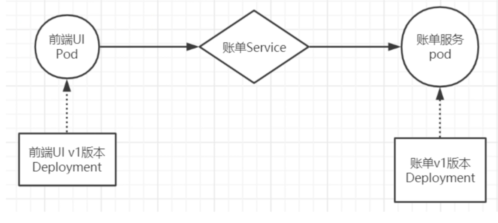
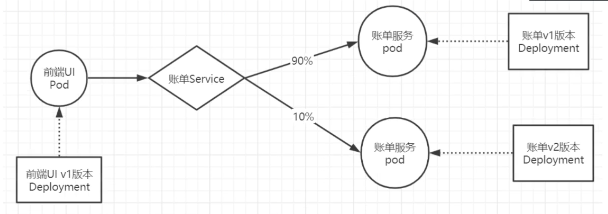
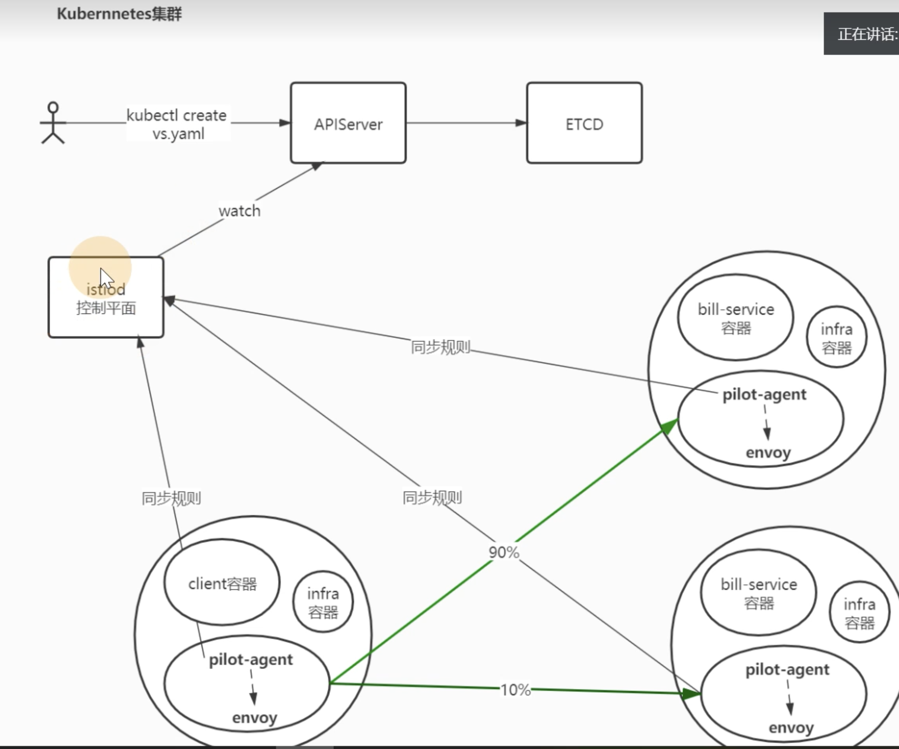
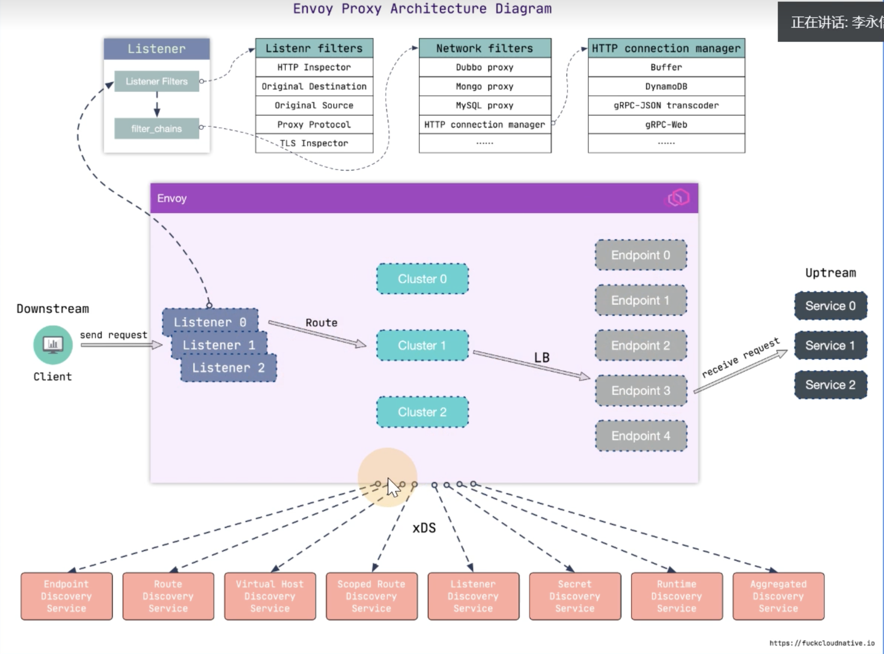
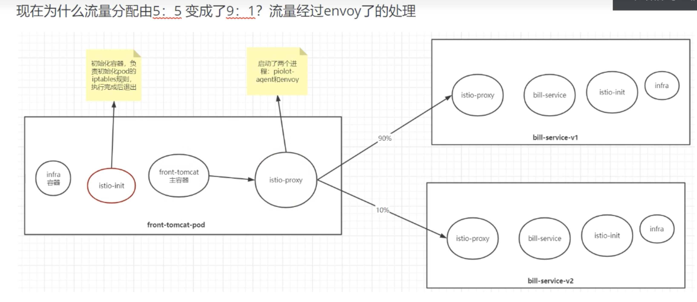

# 基于Istio实现微服务治理

> create by nohi 20230325

Service Mesh 服务网格


## 1 安装Istio

### 安装

* 下载列表[github](https://github.com/istio/istio/releases)

  > 20230325 本次下载 1.17 

  ```
  # 下载
  wget https://github.com/istio/istio/releases/download/1.17.1/istio-1.17.1-linux-amd64.tar.gz
  
  # 解压
  tar xzvf istio-1.17.1-linux-amd64.tar.gz
  cd istio-1.17.1/bin/
  
  # 拷贝系统命令PATH
  cp istioctl /bin/
  # 查看版本 
  [root@k8s-master bin]# istioctl version
  no running Istio pods in "istio-system"
  1.17.1
  
  # 增加自动补全
  cd istio-1.17.1/tools
  source istioctl.bash
  ```

### 安装插件

* [profile介绍](https://istio.io/latest/docs/setup/additional-setup/config-profiles/)

```
# 使用istioctl直接安装
$ istioctl install --set profile=demo --set components.cni.enabled=true
✔ Istio core installed
✔ Istiod installed
✔ Egress gateways installed
✔ Ingress gateways installed
✔ Installation complete
# 查看安装pod
$ kubectl -n istio-system get pod
NAME                                   READY   STATUS    RESTARTS   AGE
istio-egressgateway-774d6846df-kf8rm   1/1     Running   0          6m20s
istio-ingressgateway-69499dc-t7vtb     1/1     Running   0          6m20s
istiod-65dcb8497-n4lc4                 1/1     Running   0          6m47s


```

istio针对不同环境，提供了几种不同的初始化部署profile

```
# 查看提供的profile类型
$ istioctl profile list
Istio configuration profiles:
    ambient
    default
    demo
    empty
    external
    minimal
    openshift
    preview
    remote
# 获取kubernetes的yaml
$ istioctl manifest generate --set profile=demo > istio-kubernetes-manifest.yaml
```

### 卸裁

```
# 整体卸载
istioctl x uninstall --purge
istioctl manifest generate --set profile=demo | kubectl	delete -f -
```


## 2 快速入门

### 场景一

#### 模型图



#### 资源清单

`front-tomcat-dpl-v1.yaml`

```
apiVersion: apps/v1
kind: Deployment
metadata:
  labels:
    app: front-tomcat
    version: v1
  name: front-tomcat-v1
  namespace: istio-demo
spec:
  replicas: 1
  selector:
    matchLabels:
      app: front-tomcat
      version: v1
  template:
    metadata:
      labels:
        app: front-tomcat
        version: v1
    spec:
      containers:
      - image: consol/tomcat-7.0:latest
        name: front-tomcat
```

`bill-service-dpl-v1.yaml`

```
apiVersion: apps/v1
kind: Deployment
metadata:
  labels:
    service: bill-service
    version: v1
  name: bill-service-v1
  namespace: istio-demo
spec:
  replicas: 1
  selector:
    matchLabels:
      service: bill-service
      version: v1
  template:
    metadata:
      labels:
        service: bill-service
        version: v1
    spec:
      containers:
      - image: nginx:alpine
        name: bill-service
        command: ["/bin/sh", "-c", "echo 'this is bill-service-v1' > /usr/share/nginx/html/index.html; nginx -g 'daemon off;' "]
```

`bill-service-svc.yaml`

```
apiVersion: v1
kind: Service
metadata:
  labels:
    service: bill-service
  name: bill-service
  namespace: istio-demo
spec:
  ports:
    - name: http
      port: 9999
      protocol: TCP
      targetPort: 80
  selector:
    service: bill-service
  type: ClusterIP
```

#### 创建

```
# 创建命名空间
kubectl create namespace istio-demo
# 创建服务
kubectl apply -f .
```

#### 验证

```
$ kubectl -n istio-demo get po
NAME                               READY   STATUS    RESTARTS   AGE
bill-service-v1-57c4dcc8f5-z72b6   1/1     Running   0          5m17s
front-tomcat-v1-78f6d648cb-g2jg5   1/1     Running   0          3m40s

# 验证
$ kubectl -n istio-demo exec front-tomcat-v1-78f6d648cb-g2jg5 -- curl -s bill-service:9999
this is bill-service-v1
```


### 场景二

> 后台账单服务更新v2版本，前期规划90%的流量访问v1版本，导入10%的流量到v2版本

#### 模型图



#### 资源清单

新增`bill-service-dpl-v2.yaml`

```
apiVersion: apps/v1
kind: Deployment
metadata:
  labels:
    service: bill-service
    version: v2
  name: bill-service-v2
  namespace: istio-demo
spec:
  replicas: 1
  selector:
    matchLabels:
      service: bill-service
      version: v2
  template:
    metadata:
      labels:
        service: bill-service
        version: v2
    spec:
      containers:
      - image: nginx:alpine
        name: bill-service
        command: ["/bin/sh", "-c", "echo 'this is bill-service-v2 ' > /usr/share/nginx/html/index.html; nginx -g 'daemon off;' "]
```

安装

```
$ kubectl apply -f bill-service-dpl-v2.yaml
deployment.apps/bill-service-v2 created
```

#### 查看路由情况

```
# pod内 curl bill-service:9999
# 随机返回： this is bill-service-v1 this is bill-service-v2
# 路由默认0.5，见下方分析过程

# 根据服务名称访问
$ kubectl -n istio-demo get svc
NAME           TYPE        CLUSTER-IP      EXTERNAL-IP   PORT(S)    AGE
bill-service   ClusterIP   10.107.86.195   <none>        9999/TCP   2d9h
# pod 内访问 bill-service，实际是访问cluster-ip
/ # nslookup bill-service
Server:		10.96.0.10
Address:	10.96.0.10:53

Name:	bill-service.istio-demo.svc.cluster.local
Address: 10.107.86.195

# 查看iptables
$ iptables-save | grep 10.107.86.195
-A KUBE-SERVICES -d 10.107.86.195/32 -p tcp -m comment --comment "istio-demo/bill-service:http cluster IP" -m tcp --dport 9999 -j KUBE-SVC-PK4BNTKC2JYVE7B2
-A KUBE-SVC-PK4BNTKC2JYVE7B2 ! -s 10.224.0.0/16 -d 10.107.86.195/32 -p tcp -m comment --comment "istio-demo/bill-service:http cluster IP" -m tcp --dport 9999 -j KUBE-MARK-MASQ

# 查看svc，策略为0.5
$ iptables-save | grep KUBE-SVC-PK4BNTKC2JYVE7B2
:KUBE-SVC-PK4BNTKC2JYVE7B2 - [0:0]
-A KUBE-SERVICES -d 10.107.86.195/32 -p tcp -m comment --comment "istio-demo/bill-service:http cluster IP" -m tcp --dport 9999 -j KUBE-SVC-PK4BNTKC2JYVE7B2
-A KUBE-SVC-PK4BNTKC2JYVE7B2 ! -s 10.224.0.0/16 -d 10.107.86.195/32 -p tcp -m comment --comment "istio-demo/bill-service:http cluster IP" -m tcp --dport 9999 -j KUBE-MARK-MASQ
-A KUBE-SVC-PK4BNTKC2JYVE7B2 -m comment --comment "istio-demo/bill-service:http -> 10.224.2.176:80" -m statistic --mode random --probability 0.50000000000 -j KUBE-SEP-2N5D6YEYMYJU3FWT
-A KUBE-SVC-PK4BNTKC2JYVE7B2 -m comment --comment "istio-demo/bill-service:http -> 10.224.2.177:80" -j KUBE-SEP-4YJXLYWAOEZ73MAQ
```


#### Istio

```
istioctl kube-inject -f bill-service-dpl-v1.yaml | kubectl apply -f -
istioctl kube-inject -f bill-service-dpl-v2.yaml | kubectl apply -f -
istioctl kube-inject -f front-tomcat-dpl-v1.yaml | kubectl apply -f -
```

* 问题

  ```
  # pod CrashLoopBackOff
  $ kubectl -n istio-demo get pod
  NAME                               READY   STATUS                  RESTARTS        AGE
  bill-service-v1-57c4dcc8f5-z72b6   1/1     Running                 0               2d10h
  bill-service-v1-9f7cd4df7-wbqlf    0/2     Init:CrashLoopBackOff   5 (32s ago)     3m43s
  bill-service-v2-7c47794965-xf7n7   1/1     Running                 0               2d10h
  bill-service-v2-7cb677fc95-s8j4m   0/2     Init:CrashLoopBackOff   10 (2m3s ago)   28m
  front-tomcat-v1-78f6d648cb-g2jg5   1/1     Running                 0               2d10h
  front-tomcat-v1-8fb6f7db8-ggzmr    0/2     Init:CrashLoopBackOff   10 (109s ago)   28m
  
  # 查看pod日志，一直显示等待pod init
  # 最后通过crictl logs  <dockercontainerid> 查看出错误原因
  # Command error output: xtables parameter problem: iptables-restore: unable to initialize table 'nat'
  # 通过 修改 istio-iptables.conf && reboot
  cat /etc/modules-load.d/istio-iptables.conf
  br_netfilter
  nf_nat
  xt_REDIRECT
  xt_owner
  iptable_nat
  iptable_mangle
  iptable_filter
  ```

  实现流量分发，需要解决以下问题

  * 让访问账单服务的流量按照我们期望比例，其实是路由规则 -> 如何定义此规则
  * 如何区分两个版本的服务 

`bill-service-destnation-rule.yaml`

```
apiVersion: networking.istio.io/v1alpha3
kind: DestinationRule
metadata: 
  name: dest-bill-service
  namespace: istio-demo
spec:
  host: bill-service
  subsets:
  - name: v1
    labels:
      version: v1
  - name: v2
    labels: 
      version: v2
```

`bill-service-virtualservice.yaml`

```
apiVersion: networking.istio.io/v1alpha3
kind: VirtualService
metadata: 
  name: vs-bill-service
  namespace: istio-demo
spec:
  hosts: 
  - bill-service
  http:
  - name: bill-service-route
    route:
    - destination:
        host: bill-service
        subset: v1
      weight: 90
    - destination:
        host: bill-service
        subset: v2
      weight: 10
```

### 服务网格细节剖析

执行的操作

* 使用istioctl为pod注入了sidecar
* 创建了virtualservice和destinationrule







#### 工作原理

* 用户端，通过创建服务治理的规则(VirtualService、DestinationRule等资源类型)，存储到ETCD中
* istio控制平面中的Pilot服务监听上述规则，转换成envoy可读的规则配置，通过xDS接口同步给各envoy
* envoy通过xDS获取最新的配置后，动态reload，进而改变流量转发的策略

问题

	* istio中envoy的动态配置是什么格式
	* 在istio的网络内，font-tomcat访问到bill-service，流量的流向是怎么样的？

问题1

每个envoy进程启动时，会在127.0.0.1启动监听商品15000端口

```
$ kubectl -n istio-demo exec  -it front-tomcat-v1-8fb6f7db8-tpx4p -c istio-proxy -- 
bash
# curl localhost:15000/help
# curl localhost:15000/config_dump
```

问题2

```
$ kubectl -n istio-demo exec  -it front-tomcat-v1-8fb6f7db8-tpx4p -c front-tomcat -- 
bash
# curl bill-service:9999
```





```
20230328 istio后续视频暂停
继续SpringCloud服务部署K8S内容
```

