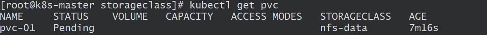
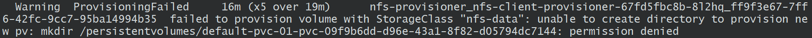
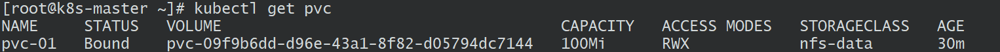

## 创建StorageClass

> :point_right:  [参见](https://www.cnblogs.com/yangsh123/p/17099250.html)


```
[root@k8s-master efk]# kubectl get storageClass
NAME                 PROVISIONER           RECLAIMPOLICY   VOLUMEBINDINGMODE   ALLOWVOLUMEEXPANSION   AGE
nfs-data             nfs-provisioner       Delete          Immediate           true                   2d7h
nfs-data-dev         nfs-provisioner-dev   Delete          Immediate           true                   2d4h
nfs-storage-harbor   nohi.com/harbor       Delete          Immediate           true                   37h
nfs2                 nohi.com/nfs2         Delete          Immediate           true                   2d1h


## nfs-data 为本页内容创建，namespace为default
## nfs-data-dev 为namespace=dev
## nfs-storage-harbor namespace=harbor
## nfs2 namespace=nfs-provisioner
```


因为StorageClass可以实现自动配置，所以使用StorageClass之前，我们需要先安装存储驱动的自动配置程序，

而这个配置程序必须拥有一定的权限去访问我们的[k](https://so.csdn.net/so/search?q=kubernetes&spm=1001.2101.3001.7020)ubernetes集群(类似dashboard一样，必须有权限访问各种api，才能实现管理)。

### 1. 设置存储分配器的权限

创建nfs-client-provisioner-authority.yaml文件，

创建Service Account.这是用来管控NFS provisioner在k8s集群中运行的权限

```
apiVersion: v1
kind: ServiceAccount
metadata:
  name: nfs-client-provisioner
  # replace with namespace where provisioner is deployed
  namespace: default
---
kind: ClusterRole
apiVersion: rbac.authorization.k8s.io/v1
metadata:
  name: nfs-client-provisioner-runner
rules:
  - apiGroups: [""]
    resources: ["persistentvolumes"]
    verbs: ["get", "list", "watch", "create", "delete"]
  - apiGroups: [""]
    resources: ["persistentvolumeclaims"]
    verbs: ["get", "list", "watch", "update"]
  - apiGroups: ["storage.k8s.io"]
    resources: ["storageclasses"]
    verbs: ["get", "list", "watch"]
  - apiGroups: [""]
    resources: ["events"]
    verbs: ["create", "update", "patch"]
---
kind: ClusterRoleBinding
apiVersion: rbac.authorization.k8s.io/v1
metadata:
  name: run-nfs-client-provisioner
subjects:
  - kind: ServiceAccount
    name: nfs-client-provisioner
    # replace with namespace where provisioner is deployed
    namespace: default
roleRef:
  kind: ClusterRole
  name: nfs-client-provisioner-runner
  apiGroup: rbac.authorization.k8s.io
---
kind: Role
apiVersion: rbac.authorization.k8s.io/v1
metadata:
  name: leader-locking-nfs-client-provisioner
  # replace with namespace where provisioner is deployed
  namespace: default
rules:
  - apiGroups: [""]
    resources: ["endpoints"]
    verbs: ["get", "list", "watch", "create", "update", "patch"]
---
kind: RoleBinding
apiVersion: rbac.authorization.k8s.io/v1
metadata:
  name: leader-locking-nfs-client-provisioner
  # replace with namespace where provisioner is deployed
  namespace: default
subjects:
  - kind: ServiceAccount
    name: nfs-client-provisioner
    # replace with namespace where provisioner is deployed
    namespace: default
roleRef:
  kind: Role
  name: leader-locking-nfs-client-provisioner
  apiGroup: rbac.authorization.k8s.io
```

### 2. 创建NFS自动存储分配器

创建nfs-client-provisioner.yaml文件

创建NFS provisioner.有两个功能,一个是在NFS共享目录下创建挂载点(volume),另一个则是建了PV并将PV与NFS的挂载点建立关联

注意镜像需要用比较新的，不然会报错：`unexpected error getting claim reference: selfLink was empty, can't make reference`

如果报错后不要尝试修改kube-apiserver.yaml文件，不然注意：千万不要使用以下方式来解决selfLink的问题，k8s1.24.0版本默认是true,不支持修改为false,否则apiserver会启动失败！

```
# nfs-client-provisioner.yaml
apiVersion: apps/v1
kind: Deployment
metadata:
  name: nfs-client-provisioner
spec:
  replicas: 1
  strategy:
    type: Recreate
  selector:
    matchLabels:
      app: nfs-client-provisioner
  template:
    metadata:
      labels:
        app: nfs-client-provisioner
    spec:
      serviceAccountName: nfs-client-provisioner
      containers:
        - name: nfs-client-provisioner
          # image: quay.io/external_storage/nfs-client-provisioner:latest
          image: easzlab/nfs-subdir-external-provisioner:v4.0.1
          volumeMounts:
            - name: nfs-client-root
              mountPath: /persistentvolumes
          env:
            # 存储分配器名称
            - name: PROVISIONER_NAME
              value: nfs-provisioner
            # NFS服务器地址，设置为自己的IP
            - name: NFS_SERVER
              value: 10.0.0.203
            # NFS共享目录地址
            - name: NFS_PATH
              value: /mnt/truenas/share/nfs/nfs1
      volumes:
        - name: nfs-client-root
          nfs:
            # 设置为自己的IP
            server: 10.0.0.203
            # 对应NFS上的共享目录
            path: /mnt/truenas/share/nfs/nfs1
```

### 3. 创建StorageClass

创建nfs-storage-class.yaml文件

创建StorageClass.负责建立PVC并调用NFS provisioner进行预定的工作,并让PV与PVC建立管理

```
apiVersion: storage.k8s.io/v1
kind: StorageClass
metadata:
  name: nfs-data
# 存储分配器的名称
# 对应“nfs-client-provisioner.yaml”文件中env.PROVISIONER_NAME.value
provisioner: nfs-provisioner
# 允许pvc创建后扩容
allowVolumeExpansion: True
parameters:
  # 资源删除策略，“true”表示删除PVC时，同时删除绑定的PV
  archiveOnDelete: "true"
```

### 4. 集中部署

```
kubectl apply -f nfs-client-provisioner-authority.yaml
kubectl apply -f nfs-client-provisioner.yaml
kubectl apply -f nfs-storage-class.yaml
kubectl get pods,storageclass
```

### 5.创建PVC指定storageclass

04-pvc-01.yaml

```
apiVersion: v1
kind: PersistentVolumeClaim
metadata:
  name: pvc-01
spec:
  accessModes:
  - ReadWriteMany
  storageClassName: nfs-data  ##指定storageclass的名称
  resources:
    requests:
      storage: 100Mi
      
# 执行
kubectl create -f 04-pvc-01.yaml
```

### 解决PVC一直处在pending状态



```
[root@k8s-master ~]# kubectl describe pvc pvc-01
```



 可以看到说的是无法创建目录，权限被拒绝

```
[root@k8s-master ~]# chmod -R 777 /data
```

稍等片刻



 可以看到已经创建成功

###  6. 创建测试Pod查看是否部署成功

```
# estpod.yaml
apiVersion: v1
kind: Pod
metadata:
  name: pvc-01-alpine
spec:
  containers:
  - name: alpine
    image: alpine
    args:
    - sh
    - -c
    - "touch /mnt/SECCESS && exit || exit 1"
    volumeMounts:
    - name: pvc
      mountPath: /mnt
  volumes:
  - name: pvc
    persistentVolumeClaim:
      claimName: pvc-01 ## 这是上面创建的pvc
```

这时就可以查看在/data/nfs目录下是否会多出一个目录，并且新多出的目录下会出现SECCESS这个文件

### 7. 关于StorageClass回收策略对数据的影响

如果`storageClass`对象中没有指定`archiveOnDelete`参数或者值为`true`，表明需要删除时存档，即将`oldPath`重命名，命名格式为`oldPath`前面增加`archived-`的前缀

Delete模式：需配合archiveOnDelete一起使用

　　当archiveOnDelete为true，删除PVC时，PV和NAS文件只是被重命名，不会被删除

　　当archiveOnDelete为false，删除PVC时，PV和NAS文件会被真正删除。

Retain模式：删除PVC的时候，PV和NAS文件系统不会被删除，需要您手动删除

如果数据安全性要求高，推荐使用Retain方式以免误删数据

```
  archiveOnDelete: "false"  
  reclaimPolicy: Delete   #默认没有配置,默认值为Delete
  reclaimPolicy: Retain   ## 
```

设置为Retain模式

```
apiVersion: storage.k8s.io/v1
kind: StorageClass
metadata:
  name: nfs-data

# 存储分配器的名称
# 对应“nfs-client-provisioner.yaml”文件中env.PROVISIONER_NAME.value
provisioner: nfs-provisioner

# 允许pvc创建后扩容
allowVolumeExpansion: True

parameters:
  #archiveOnDelete: "false"
reclaimPolicy: Retain
```