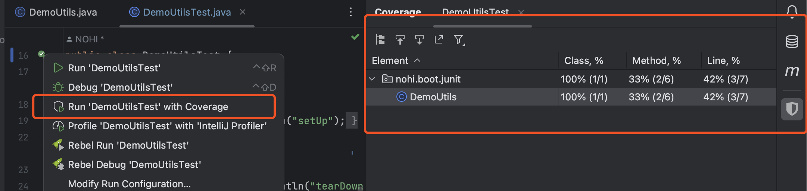
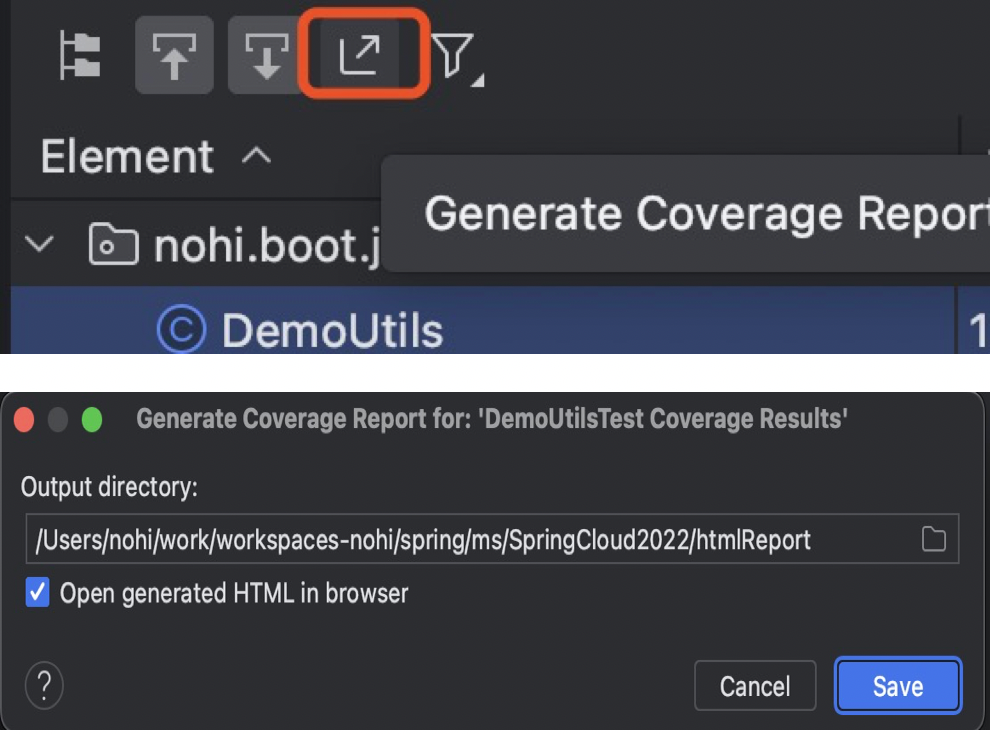
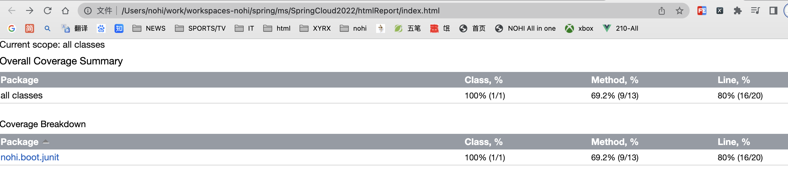
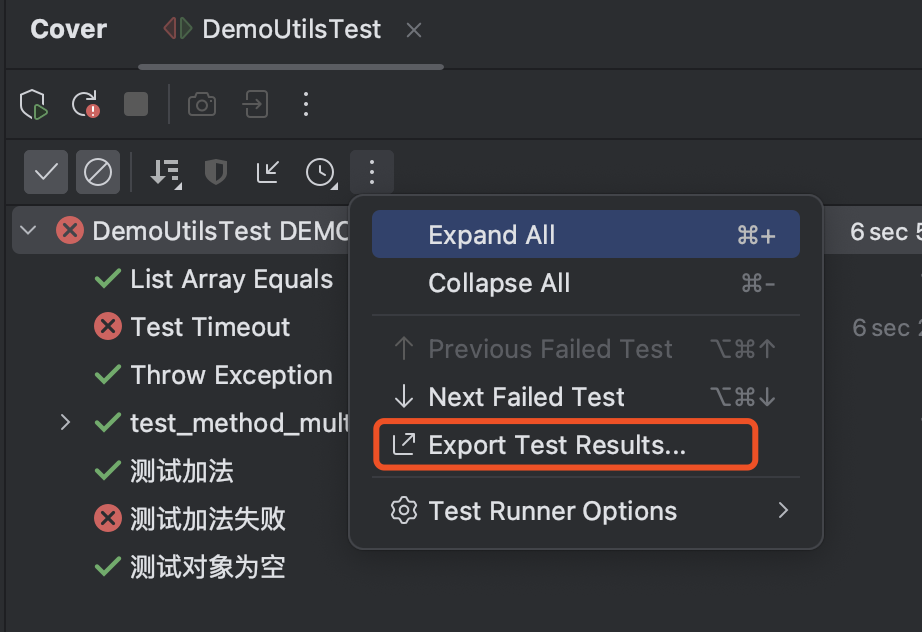
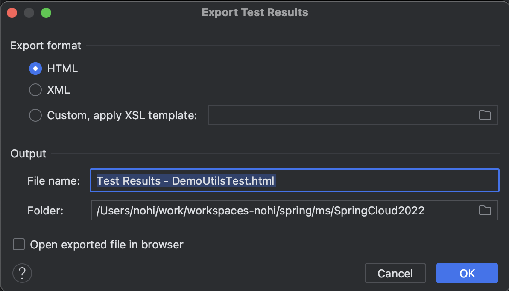
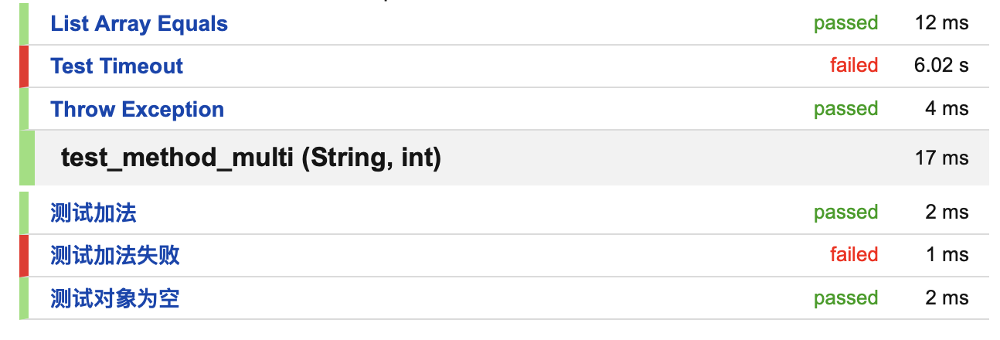
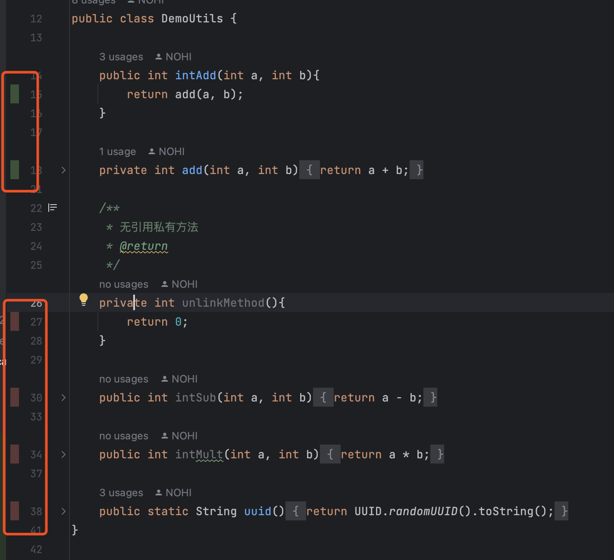
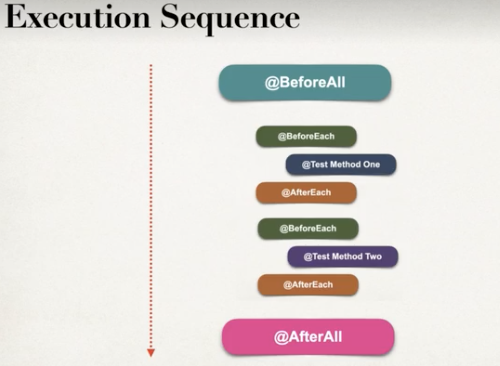
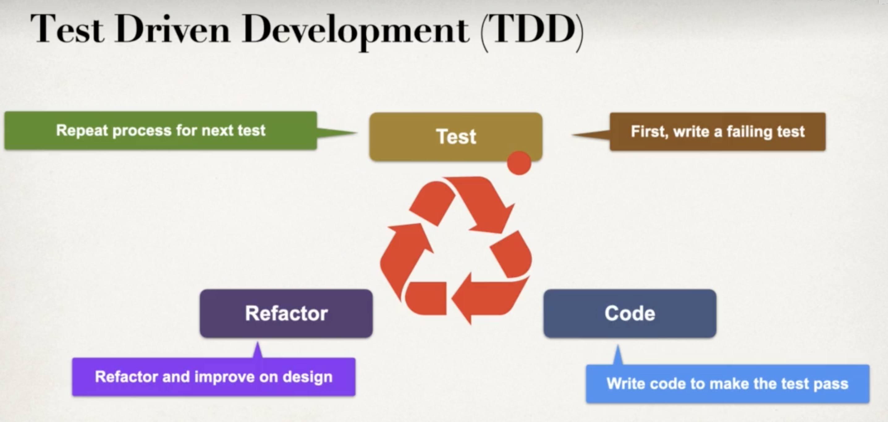
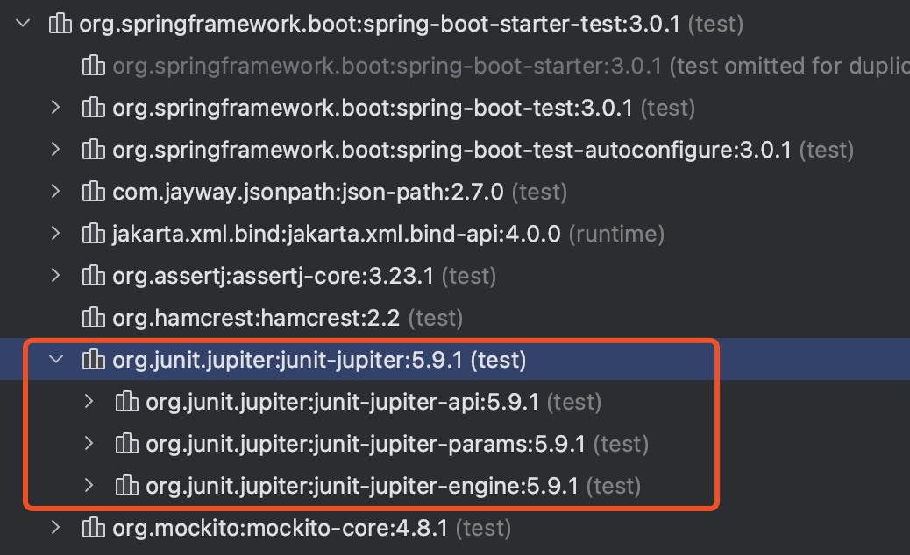

# SpringBoot 测试

> create by nohi 20230106
>
> :video_camera: 视频：[Udemy 高分付费课程](https://www.bilibili.com/video/BV1XP4y1Y7H6?p=5&spm_id_from=pageDriver&vd_source=9004ce053a52d5930f71e230579961e7)
>
> :video_camera:[单元测试详解-SpringBootTest和Mock测试](https://www.bilibili.com/video/BV1DD4y1j7xb/?spm_id_from=333.337.search-card.all.click&vd_source=9004ce053a52d5930f71e230579961e7)   :spiral_notepad: [笔记](https://blog.csdn.net/sinat_41900036/article/details/128551507?csdn_share_tail=%7B%22type%22%3A%22blog%22%2C%22rType%22%3A%22article%22%2C%22rId%22%3A%22128551507%22%2C%22source%22%3A%22sinat_41900036%22%7D)
>
> 个人项目代码
>
> :anchor: [代码](https://github.com/thisisnohi/SpringCloud2022/tree/feature-demo/JunitTest)  SpringCloud2022/JunitTest

## 1 概念

### 什么是单元测试

* 什么是单元？

* 可独立执行

* 速度较快

  

## 2 基础单元测试

### 依赖maven

```
<dependency>
    <groupId>org.junit.jupiter</groupId>
    <artifactId>junit-jupiter</artifactId>
    <version>5.9.1</version>
    <scope>test</scope>
</dependency>
```

* demo

  ```
  public class A01Utils {
      public int intAdd(int a, int b){
          return a + b;
      }
  }
  ```

  ```
  A01Utils u = new A01Utils();
  Assertions.assertEquals(6, u.intAdd(1,5), "1+5 must equals 6");
  Assertions.assertNotEquals(5, u.intAdd(1,5), "1+5 must not equals 5");
  ```

### 执行步骤

* set up
* Execute
* Assert

```java 
@Test
public void testEqualsAndNotEquals() {
  // set up
  DemoUtils demoUtils = new DemoUtils();
  int expected = 6;
  // execute
  int actual = demoUtils.intAdd(2, 4);
  // assert
  Assertions.assertEquals(expected, actual, "2+4 must be 6");
}
```

### 单元测试覆盖率

* 执行时选择Run xxx with coverage
* 运行结束后出现覆盖率情况



* 导出覆盖率报告

  

  html报告

  

* 导出测试结果报告

  

  

  

* 源码右显示命中情况




### JUnit Assertions

`org.junit.jupiter.api.Assertions`

* assertEquals

* assertNotEquals

* assertNull

* assertNotNull

* assertTrue

* assertFalse

* assertInstanceOf

* assertSame

* isGreater

* assertArrayEquals

* assertIterableEquals

* assertThrows

  ```
  @Test
      @DisplayName("Throw Exception")
      public void testThrowException() {
          DemoUtils demoUtils = new DemoUtils();
          Assertions.assertThrowsExactly(Exception.class, () -> { demoUtils.throwException(-1); }, "-1 < 0 throw Exception");
          Assertions.assertDoesNotThrow(() -> { demoUtils.throwException(1); }, "should not throw Exception");
      }
  ```

* assertTimeoutPreemptively

  ```
  
  ```

  

### JUnit 生命周期函数

| @BeforeAll  | 在当前类的所有测试方法之前执行。 注解在静态方法上。 此方法可以包含一些初始化代码。 | Junit4 ：@BeforeClass |
| ----------- | ------------------------------------------------------------ | --------------------- |
| @BeforeEach | 在每个测试方法之前执行。 注解在非静态方法上。 可以重新初始化测试方法所需要使用的类的某些属性。 | Junit4:@Before        |
| @AfterEach  | 在每个测试方法之后执行。 注解在非静态方法上。 可以回滚测试方法引起的数据库修改。 | Junit4:@After         |
| @AfterAll   | 在当前类中的所有测试方法之后执行。 注解在静态方法上。 此方法可以包含一些清理代码。 | Junit4:@AfterClass    |

* 执行顺序

  

### Customer Display Name

* `@DisplayName `可以给 测试类 或者 测试方法来自定义显示的名称。可以支持 空格、特殊字符，甚至是 emoji。

* `@DisplayNameGenerator`

  | DisplayNameGenerator | Behavior                             | Example                                                      |
  | -------------------- | ------------------------------------ | ------------------------------------------------------------ |
  | Standard             | 默认的，没什么变化                   | test_display_ok() -> test_display_ok()                       |
  | Simple               | 针对没有参数的方法，去除掉尾部的括号 | test_display_ok() -> test_display_ok                         |
  | ReplaceUnderscores   | 把下划线 ‘_’ 替换成空格              | test_display_ok() -> test display ok                         |
  | IndicativeSentences  | class + method name                  | test_diaplay_ok() -> DisplayNameGeneratorTest , test_diaplay_ok() |

* `Parameterized Tests`

  可参数化的测试，我们可以用 `ParameterizedTest` 来自定义设置 DisplayName,这种时候就不需要用 `DisplayName`或者 `DisplayNameGenerator`

   @ParameterizedTest(name = "#{index} - Test with {0} and {1}")

### 方法排序

> [13.JUnit5 执行顺序](https://www.zhihu.com/zvideo/1574353816069242880)

* OrderAnnotation 
* DisplayName
* Random
* MethodName

```
按DisplayName排序
@TestMethodOrder(MethodOrderer.DisplayName.class)
```


## 3 单元测试报告

> :anchor: [代码](https://github.com/thisisnohi/SpringCloud2022/tree/feature-demo/JunitTest)  SpringCloud2022/JunitTest

### Maven Surefile Plugin

```xml
<build>
  <plugins>
    <plugin>
      <groupId>org.apache.maven.plugins</groupId>
      <artifactId>maven-surefire-plugin</artifactId>
      <version>3.0.0-M5</version>
    </plugin>
  </plugins>
</build>
```

* 运行

  ```
  mvn clean test
  # 如果run0, 则说明mvn无法识别单元测试，需要引入surefire plugin
  # [ERROR] Tests run: 8, Failures: 2, Errors: 0, Skipped: 0
  ```

  * 跳过test

    ```
    mvn clean package -DskipTests=true
    ```

### 创建单元测试报告

```xml
<build>
  <plugins>
    <plugin>
      <groupId>org.apache.maven.plugins</groupId>
      <artifactId>maven-surefire-report-plugin</artifactId>
      <version>3.0.0-M5</version>
      <executions>
      	<execution>
        	<phase>test</phase>
          <goals>
          	<goal>report</goal>
          </goals>
        </execution>
      </executions>
      <!-- 忽略失败的单元测试，继续mvn其他命令，如：package -->
      <configuration>
        <testFailureIgnore>true</testFailureIgnore>
      </configuration>
    </plugin>
  </plugins>
</build>
```

```333shell
# site 添加网站资源如图版、css...
# -DgenerateReports=false  不覆盖已有的HTML报告
mvn site -DgenerateReports=false
# 生成报告 target/site/surefire-report.html
mvn surefire-report:report 
```

###  忽略失败单元测试

```xml
<build>
  <plugins>
    <plugin>
      <groupId>org.apache.maven.plugins</groupId>
      <artifactId>maven-surefire-plugin</artifactId>
      <version>3.0.0-M5</version>
      <!-- 忽略失败的单元测试，否则不生成单元测试报告 -->
      <configuration>
        <testFailureIgnore>true</testFailureIgnore>
      </configuration>
    </plugin>
  </plugins>
</build>
```

### 显示@DisplayName

```xml
<plugin>
        <groupId>org.apache.maven.plugins</groupId>
        <artifactId>maven-surefire-plugin</artifactId>
        <version>3.0.0-M5</version>
        <configuration>
          <testFailureIgnore>true</testFailureIgnore>
          <statelessTestsetReporter
                  implementation="org.apache.maven.plugin.surefire.extensions.junit5.JUnit5Xml30StatelessReporter">
            <!-- 显示@DisplayName -->
            <usePhrasedTestCaseMethodName>true</usePhrasedTestCaseMethodName>
          </statelessTestsetReporter>
        </configuration>
      </plugin>
```


###  Java代码覆盖率工具Jacoco

> Java Code Coverage

* pom.xml

  ```xml
  <plugin>
    <groupId>org.jacoco</groupId>
    <artifactId>jacoco-maven-plugin</artifactId>
    <version>0.8.7</version>
  
    <executions>
      <execution>
        <id>jacoco-prepare</id>
        <goals>
          <goal>prepare-agent</goal>
        </goals>
      </execution>
  
      <execution>
        <id>jacoco-report</id>
        <phase>test</phase>
        <goals>
          <goal>report</goal>
        </goals>
      </execution>
    </executions>
  </plugin>
  ```

* `mvn clean test`

  ```
  Loading execution data file .../JunitTest/target/jacoco.exec
  # 报告目录
  target/site/jacoco/index.html
  ```

## 4 单元测试-继续

### Conditional Tests

* `@Disabled` and `@EnabledOnOs`

  ```java
  @Test
  @Disabled("Don't run until JIRA #123 is resolved")
  void basicTest() {
    // execute method and perform asserts
  }
  
  @Test
  @EnabledOnOs(OS.MAC)
  void testForMacOnly() {
    // execute method and perform asserts
  }
  
  @Test
  @EnabledOnOs({OS.MAC, OS.WINDOWS})
  void testForMacAndWindowsOnly() {
    // execute method and perform asserts
  }
  ```

* `@EnabledOnJre` `@EnabledForJreRange`

  ```java
  @EnabledOnJre(JRE.JAVA_17)
  @EnabledForJreRange(min=JRE.JAVA_13, max=JRE.JAVA_18)
  ```

* `@EnabledIfSystemProperty`

  ```java
  @EnabledIfEnvironmentVariable(named="LUV2CODE_ENV", matches="DEV")
  @EnabledIfSystemProperty(named="LUV2CODE_SYS_PROP", matches="CI_CD_DEPLOY") 
  ```

### TDD(Test Driven Development)

1. writer a failing test
2. write code to make the test pass
3. refactor the code
4. repeat the process



* FizzBuzz

  输入数字，按以下规则打印

  ```
  可以被3整除，打印Fizz
  可以被5整除，打印Buzz
  可以被3和5同时整除，打印FizzBuzz
  其他打印相应数据
  ```

  ```java
  @TestMethodOrder(MethodOrderer.OrderAnnotation.class)
  public class FizzBuzzTest {
  
      @Test
      @DisplayName("被三整除")
      @Order(1)
      void testDivisibleByThree(){
          String expect = "Fizz";
          assertEquals(expect, FizzBuzz.compute(3), "3可被三整除，返回Fizz");
      }
      @Test
      @DisplayName("被5整除")
      @Order(2)
      void testDivisibleByFivee(){
          String expect = "Buzz";
          assertEquals(expect, FizzBuzz.compute(5), "3可被三整除，返回Fizz");
      }
  
      @Test
      @DisplayName("被3和5整除")
      @Order(3)
      void testDivisibleByThreeANDFive(){
          String expect = "FizzBuzz";
          assertEquals(expect, FizzBuzz.compute(15), "可被3和5整除，返回FizzBuzz");
      }
  
      @Test
      @DisplayName("无法被3和5整除")
      @Order(4)
      void testNotDivisibleByThreeANDFive(){
          String expect = "1";
          assertEquals(expect, FizzBuzz.compute(1), "无法被3和5整除");
      }
  }
  ```

### `ParameterizedTest`参数化测试

> https://doczhcn.gitbook.io/junit5/index/index-2/parameterized-tests

`@ValueSource`

`@CsvSource`

`@CsvFileSource`

`@EnumSource`

`@MethodSource`

```java
@TestMethodOrder(MethodOrderer.OrderAnnotation.class)
public class FizzBuzzTest {

    @Test
    @DisplayName("被三整除")
    @Order(1)
    void testDivisibleByThree() {
        String expect = "Fizz";
        assertEquals(expect, FizzBuzz.compute(3), "3可被三整除，返回Fizz");
    }

    @Test
    @DisplayName("被5整除")
    @Order(2)
    void testDivisibleByFivee() {
        String expect = "Buzz";
        assertEquals(expect, FizzBuzz.compute(5), "3可被三整除，返回Fizz");
    }

    @Test
    @DisplayName("被3和5整除")
    @Order(3)
    void testDivisibleByThreeANDFive() {
        String expect = "FizzBuzz";
        assertEquals(expect, FizzBuzz.compute(15), "可被3和5整除，返回FizzBuzz");
    }

    @Test
    @DisplayName("无法被3和5整除")
    @Order(4)
    void testNotDivisibleByThreeANDFive() {
        String expect = "1";
        assertEquals(expect, FizzBuzz.compute(1), "无法被3和5整除");
    }

    @DisplayName("CsvSource")
    @ParameterizedTest(name = "value={0},expect={1}")
    @CsvSource({"1, 1", "2, 2", "3, Fizz", "4, 4", "5, Buzz", "6, Fizz", "15, FizzBuzz"})
    @Order(5)
    void testWithCsvSource(int value, String expect) {
        assertEquals(expect, FizzBuzz.compute(value));
    }

    @DisplayName("CsvFileSource")
    @ParameterizedTest(name = "value={0},expect={1}")
    @CsvFileSource(resources = "/small-test-data.csv")
    @Order(6)
    void testWithCsvFileSource(int value, String expect) {
        assertEquals(expect, FizzBuzz.compute(value));
    }
}
```

## 5 SpringBoot单元测试

> :anchor: [代码](https://github.com/thisisnohi/SpringCloud2022/tree/feature-demo/SpringBootTest)  SpringCloud2022/SpringBootTest

### 需要解决的问题

* 访问Spring Appication Context
* Spring 依赖注入
* 访问application.properties等配置的属性
* Mock数据：web,data,Rest API..

#### 支持

`@SpringBootTest`

* maven

  ```xml
  <dependency>
    <groupId>org.springframework.boot</groupId>
    <artifactId>spring-boot-starter-test</artifactId>
    <scope>test</scope>
  </dependency>
  ```

    * 依赖

      

   * `mvn dependency:tree`

#### 代码

* SpringBootTestApplication

  ```
  package nohi.boot;
  
  import lombok.extern.slf4j.Slf4j;
  import nohi.boot.models.CollegeStudent;
  import org.springframework.boot.SpringApplication;
  import org.springframework.boot.autoconfigure.SpringBootApplication;
  import org.springframework.context.annotation.Bean;
  import org.springframework.context.annotation.Scope;
  
  /**
   * TEST
   * @author NOHI
   * @date 2023/1/12 13:47
   */
  @Slf4j
  @SpringBootApplication
  public class SpringBootTestApplication {
  
  	public static void main(String[] args) {
  		SpringApplication.run(SpringBootTestApplication.class, args);
  	}
  
  	@Bean(name = "collegeStudent")
  	@Scope(value = "prototype")
  	CollegeStudent getCollegeStudent() {
  		log.info("==>getCollegeStudent");
  		return new CollegeStudent();
  	}
  }
  ```

* Test

  > 不同包下运行
  >
  > 需要：*@SpringBootTest(classes* *= SpringBootTestApplication.class)* 否则报错

  ```java 
  package nohi.demo;
  
  import nohi.boot.models.CollegeStudent;
  import nohi.boot.models.Student;
  import org.junit.jupiter.api.Assertions;
  import org.junit.jupiter.api.DisplayName;
  import org.junit.jupiter.api.Order;
  import org.junit.jupiter.api.Test;
  import org.springframework.beans.factory.annotation.Autowired;
  import org.springframework.boot.test.context.SpringBootTest;
  
  /**
   * 不同包下的测试
   */
  @SpringBootTest
  @DisplayName("SrpingBoot单元测试,不同包下运行测试")
  class SpringBootTestApplicationTests {
  	@Autowired
  	CollegeStudent collegeStudent;
  
  	@Autowired
  	Student student;
  
  	@Test
  	@DisplayName("测试Bean获取，根本不运行")
  	@Order(1)
  	void testGetBean(){
  		Assertions.assertNotNull(collegeStudent, "CollegeStudent 不应为空");
  		Assertions.assertNotNull(student, "CollegeStudent 不应为空");
  	}
  }
  ```

## 6 Mockito and SpringBoot

* mock框架
  * Mockito： spring-boot-starter-test 自带
  * EasyMock
  * JMockit

### DAO Mock

> @Mock @InjectMocks

```java
package nohi.boot.demo.dao;

import lombok.extern.slf4j.Slf4j;
import nohi.boot.SpringBootTestApplication;
import nohi.boot.demo.dao.TbUserMapper;
import nohi.boot.demo.entity.TbUser;
import nohi.boot.demo.service.TbUserService;
import org.junit.jupiter.api.Assertions;
import org.junit.jupiter.api.BeforeEach;
import org.junit.jupiter.api.DisplayName;
import org.junit.jupiter.api.Test;
import org.mockito.InjectMocks;
import org.mockito.Mock;
import org.mockito.Mockito;
import org.springframework.boot.test.context.SpringBootTest;

/**
 * <h3>SpringCloud2022</h3>
 *
 * @author NOHI
 * @description <p>Mock Dao</p>
 * @date 2023/05/21 21:45
 **/
@Slf4j
@SpringBootTest(classes = SpringBootTestApplication.class)
public class MockDaoTest {
    TbUser firstUser;
    @Mock
    private TbUserMapper mapper;
    @InjectMocks
    private TbUserService service;

    @BeforeEach
    public void beforeEach() {
        log.info("==>beforeEach");
        firstUser = TbUser.builder().build();
        firstUser.setId(1);
        firstUser.setName("NOHI");
        firstUser.setSex("MAN");
        firstUser.setPwd("********");
        firstUser.setEmail("thisisnohi@163.com");
    }

    @DisplayName("When & Verify")
    @Test
    public void modkDao() {
        Mockito.when(mapper.selectById(1)).thenReturn(firstUser);
        TbUser user = mapper.selectById(1);
        Assertions.assertNotNull(user, "User[1] not null");
        Assertions.assertEquals("NOHI", user.getName(), "User[1].name === NOHI");

        /** 验证mapper.selectById是否被执行 **/
        Mockito.verify(mapper).selectById(1);
        // 以下方法未执行，注释去除后，验证报错
        //Mockito.verify(mapper).selectList(null);
        /** 验证mapper.selectById执行次数 **/
        Mockito.verify(mapper, Mockito.times(1)).selectById(1);
        Mockito.verify(mapper, Mockito.times(0)).selectList(null);
    }
}
```


### MockBean

> org.mockito.Mock -> org.springframework.boot.test.mock.mockito.MockBean
>
> org.mockito.InjectMocks -> org.springframework.beans.factory.annotation.Autowired

```java
@MockBean
private TbUserMapper mapper;
@Autowired
private TbUserService service;
```


## 7 Mock 异常

> 承接上类

```java
@DisplayName("测试异常验证")
@Test
@Order(2)
public void throwRuntimeError() {
  Mockito.doThrow(new RuntimeException("TEST")).when(mapper).insert(null);

  /** 新增正常对象不报错 **/
  Assertions.assertDoesNotThrow(() -> {
    service.add(firstUser);
  });

  /** 新增空对象报错 **/
  TbUser nullObj = null;
  Assertions.assertThrows(RuntimeException.class, () -> {
    service.add(nullObj);
  });
}

@DisplayName("测试不同场景")
@Test
@Order(3)
public void testMocks() {
  Mockito.doThrow(new RuntimeException("TEST")).when(mapper).insert(null);

  Mockito.when(mapper.insert(firstUser)).thenThrow(new RuntimeException("NOHI")).thenReturn(1);

  /** 新增对象报错 **/
  Assertions.assertThrows(RuntimeException.class, () -> {
    service.add(firstUser);
  });

  /** 正常返回 **/
  Assertions.assertEquals(1, service.add(firstUser));
}
```

## 8 Reflection

非public 类、方法 无法调用、修改值

Spring提供`ReflectionTestUtils` get/set 非public字段，执行非public 方法

* `ReflectionTestUtils.*setField*(studentOne, "id", 1);`
* `ReflectionTestUtils.*getField*(studentOne, "id")`
* `ReflectionTestUtils.*invokeMethod*(studentOne, "getFirstNameAndId")`

```java 
@DisplayName("访问私有属性")
@Test
public void getPrivateField() {
  assertEquals(1, ReflectionTestUtils.getField(studentOne, "id"));
}

@DisplayName("访问私有方法")
@Test
public void invokePrivateMethod() {
  assertEquals("Eric 1",
               ReflectionTestUtils.invokeMethod(studentOne, "getFirstNameAndId"),
               "Fail private method not call");
}
```


## 9 Mock数据初始化


### mock初始化

```java 
@Slf4j
@SpringBootTest(classes = SpringBootTestApplication.class)
@DisplayName("数据库初始化")
public class MockJdbcInitTest {

    static int id = 10000;

    @Autowired
    JdbcTemplate jdbcTemplate;

    @Autowired
    private TbUserService service;


    @BeforeEach
    public void beforeEach() {
        log.info("===>beforeEach ===> 准备参数");
        jdbcTemplate.execute("INSERT INTO `t_user` VALUES (" + (id + 1) + ", '张三', '男', 'aaaa', '12314@qq.com');");
        jdbcTemplate.execute("INSERT INTO `t_user` VALUES (" + (id + 2) + ", '李四', '男', 'aaaa', '12314@qq.com');");
        jdbcTemplate.execute("INSERT INTO `t_user` VALUES (" + (id + 4) + ", '王五', '男', 'aaaa', '12314@qq.com');");
        jdbcTemplate.execute("INSERT INTO `t_user` VALUES (" + (id + 5) + ", '赵六', '男', 'aaaa', '12314@qq.com');");
        jdbcTemplate.execute("INSERT INTO `t_user` VALUES (" + (id + 6) + ", '宋七', '男', 'aaaa', '12314@qq.com');");
    }

    @AfterEach
    public void afterEach(){
        log.info("===>afterEach ===> 清理现场");
        jdbcTemplate.execute("delete from t_user where id >" + id);
    }

    /**
     * 查询初始化数据
     */
    @DisplayName("查询初始化数据")
    @Test
    public void getInitData() {
        TbUser tbUser = service.queryById(id + 1);
        Assertions.assertNotNull(tbUser, (id+1) + " must exists");
    }
}
```

### SpringBoot初始化

```yaml
spring:
  datasource:
    driver-class-name: org.h2.Driver
    #url: jdbc:h2:mem:test  内存模式，数据不会持久化
    #    url:jdbc:h2:~/test  嵌入模式，数据文件存储在用户目录test开头的文件中
    #    url:jdbc:h2:tcp//localhost/〜/test 远程模式，访问远程的h2 数据库
    # 如果需要数据本地化，则改成 file 方式
    #jdbc:h2:file: ${HOME}/data/sqlite3/testDB;AUTO_SERVER=TRUE;DB_CLOSE_DELAY=-1
    url: jdbc:h2:~/data/sqlite3/test
    username: sa
    password: 123456
  h2:
    console:
      path: /h2-console
      enabled: true
  sql:
    init:
      # 初始化表
			schema-locations: classpath:db/01_ddl.sql
			# 初始化数据
      data-locations: classpath:db/02_data.sql
      mode: always
      continue-on-error: true
```

### `@sql`

> spring提供

```java 
@DisplayName("@sql初始化数据")
@Sql("/db/02_data_20000.sql")
@Test
public void sqlInit() {
  Map<String, Object> map = new HashMap<>();
  map.put("idMin", 20000);
  List<TbUser> list = service.selectByExample(map);
  Assertions.assertEquals(5, list.size(), "id >= 20000 数据量为5");
}
```

## 10 MVC Controller

Spring Testing Support

* Mock object for web, REST API..
* MockMvc
* Spring MVC  request/response
* 容器支持

步骤

* `@AutoConfigureMockMvc`注释添加
* `MockMvc`
* 调用请求
* 定义预期结果
* 判断结果

### MockMvc

```java 
@DisplayName("WEB Controller测试")
@TestMethodOrder(MethodOrderer.OrderAnnotation.class)
@SpringBootTest
@AutoConfigureMockMvc
public class UserControolerMockMvc {

    @Autowired
    private UserController helloController;

    @Autowired
    private MockMvc mockMvc;

    @DisplayName("controller是否为空")
    @Test
    public void testNotNull() {
        Assertions.assertThat(helloController).isNotNull();
    }

    @DisplayName("MVC返回值测试")
    @Test
    public void controllerRespMsg() throws Exception {
        this.mockMvc.perform(MockMvcRequestBuilders.get("/hello/spring"))
                .andDo(MockMvcResultHandlers.print())
                // 返回状态是否正确
                .andExpect(MockMvcResultMatchers.status().isOk())
                .andExpect(MockMvcResultMatchers.content().string("Hello spring"));
    }

    @DisplayName("MVC返回页面")
    @Test
    public void controllerRespPage() throws Exception {
        // 调用
        MvcResult mvcResult = this.mockMvc.perform(MockMvcRequestBuilders.get("/"))
                .andDo(MockMvcResultHandlers.print())
                // 返回状态是否正确
                .andExpect(MockMvcResultMatchers.status().isOk()).andReturn();

        ModelAndView modelAndView = mvcResult.getModelAndView();
        ModelAndViewAssert.assertViewName(modelAndView, "/index");
    }
}
```

### MockHttpServletResponse

```java 
@BeforeAll
public static void setup() {
  request = new MockHttpServletRequest();
  request.addParameter("name", "张三");
  request.addParameter("sex", "男");
  request.addParameter("mail", "zs@163.com");
}

@DisplayName("MVC返回JSON")
@Test
public void addUserTest() throws Exception {
  // 调用
  MockHttpServletResponse mvcResult = this.mockMvc.perform(
    MockMvcRequestBuilders.post("/user/add")
    .contentType(MediaType.APPLICATION_JSON)
    .characterEncoding("UTF-8")
    .param("name", request.getParameterValues("name"))
    .param("sex", request.getParameterValues("sex"))
    .param("mail", request.getParameterValues("mail"))
  )
    .andDo(MockMvcResultHandlers.print())
    // 返回状态是否正确
    .andExpect(MockMvcResultMatchers.status().isOk())
    .andReturn().getResponse();
  mvcResult.setCharacterEncoding("UTF-8");
  log.info("mvcResult:{}", mvcResult.getContentAsString());
}
```


## 11 DAO 事务

```java 
package nohi.boot.demo.service;

import nohi.boot.demo.entity.TbUser;
import org.junit.jupiter.api.AfterEach;
import org.junit.jupiter.api.BeforeEach;
import org.junit.jupiter.api.DisplayName;
import org.junit.jupiter.api.Test;
import org.springframework.beans.factory.annotation.Autowired;
import org.springframework.boot.test.context.SpringBootTest;
import org.springframework.test.annotation.Rollback;
import org.springframework.transaction.annotation.Transactional;

import java.util.ArrayList;
import java.util.HashSet;
import java.util.List;
import java.util.Set;

/**
 * <h3>SpringBootTest</h3>
 *
 * @author NOHI
 * @description <p></p>
 * @date 2023/01/13 13:07
 **/
@SpringBootTest
@DisplayName("Service测试")
class TbUserServiceTest {

    @BeforeEach
    void setUp() {
    }

    @AfterEach
    void tearDown() {
    }

    @Autowired
    TbUserService userService;

    @Test
    @DisplayName("查询所有User数据")
    public void queryAll() {
        userService.queryAll().forEach(System.out::println);
    }

    /**
     * 批量插入数据-不回滚
     */
    @Test
    @DisplayName("批量插入数据-不回滚")
    public void add() {
        List<TbUser> users = new ArrayList<>();
        for (int i = 0; i < 15; ++i) {
            TbUser user = TbUser.builder().id(i + 1).name("test" + i).sex(i % 2 == 0 ? "男" : "女").pwd("aaaa").email("123" + i + "@qq.com").build();
            users.add(user);
        }
        users.forEach(System.out::println);
        userService.add(users);
    }

    /**
     * 批量插入数据-回滚
     */
    @Test
    @Transactional
    @DisplayName("批量插入数据-回滚")
    public void batchInserAndRollback() {
        List<TbUser> users = new ArrayList<>();
        for (int i = 0; i < 5; ++i) {
            TbUser user = TbUser.builder().id(i + 11).name("test" + i).sex(i % 2 == 0 ? "男" : "女").pwd("aaaa").email("123" + i + "@qq.com").build();
            users.add(user);
        }
        users.forEach(System.out::println);
        userService.add(users);

        // 打印所有数据
        userService.queryAll().forEach(System.out::println);
    }

    @Test
    public void queryByIds() {
        userService.queryByIds(Set.of(1, 2, 3));
        userService.queryByName("test1").forEach(System.out::println);
        userService.queryByName2("test1").forEach(System.out::println);
        TbUser user = userService.queryById(TbUser.builder().id(2).build());
        System.out.println(user);
        userService.queryByNameMap("test1").forEach(System.out::println);
        System.out.println(userService.count());
    }

    @Test
    public void query() {
        userService.queryAll().forEach(System.out::println);
        userService.queryByName("test1").forEach(System.out::println);
        userService.queryByName2("test1").forEach(System.out::println);
        TbUser user = userService.queryById(TbUser.builder().id(2).build());
        System.out.println(user);
        userService.queryByNameMap("test1").forEach(System.out::println);
        System.out.println(userService.count());
    }

    @Test
    public void delete() {
        TbUser user = TbUser.builder().id(2).build();
        userService.deleteById(user);

        userService.deleteBy("name", "test15");

        userService.deleteByIds();

    }

    @Test
    public void change() {
        TbUser user1 = TbUser.builder().name("蔡徐坤").build();
        userService.changeBy(user1, "sex", "男");

        user1.setName("蔡徐坤2");
        userService.changeUserById(user1);
    }
}
```


